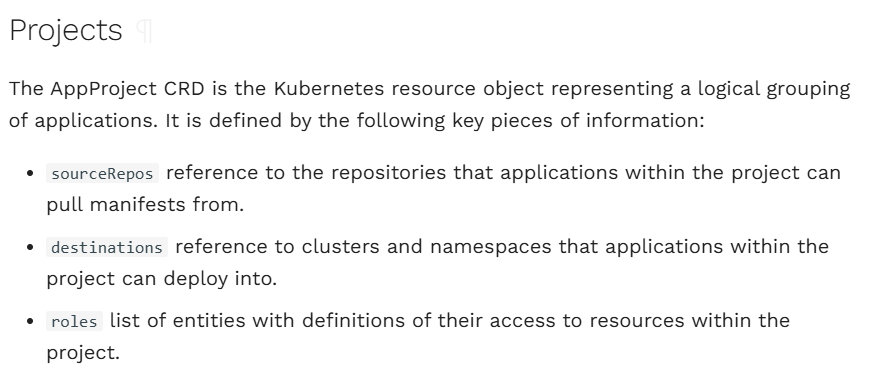
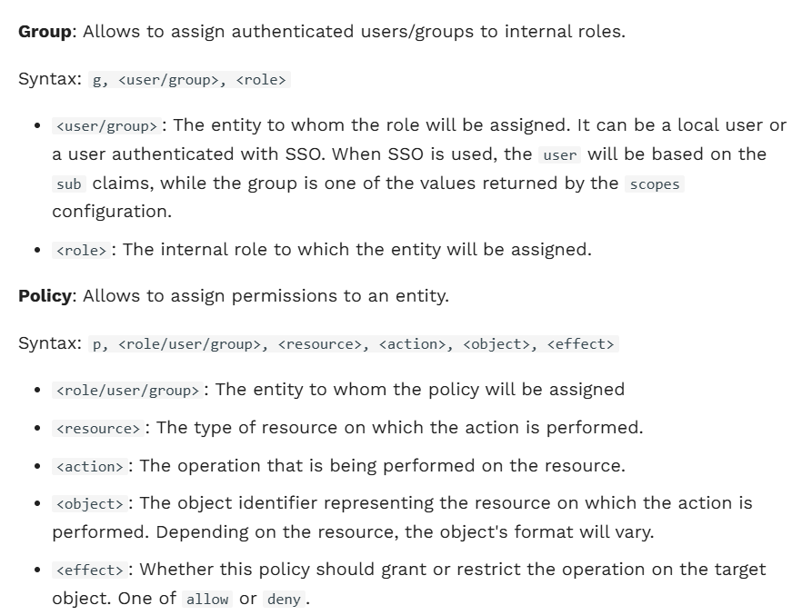
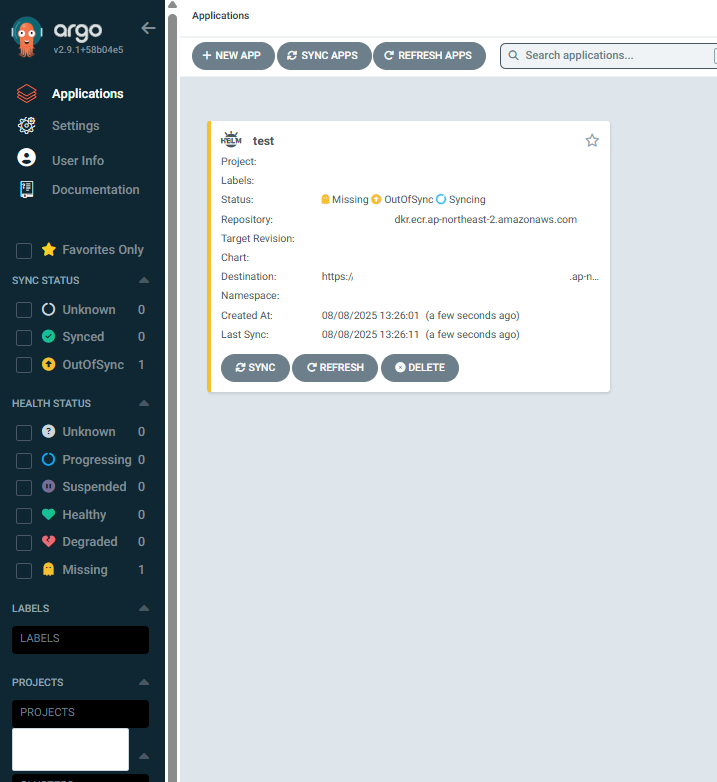

ArgoCD는 GitOps 기반의 강력한 CD 도구지만


여러 팀이나 사용자가 하나의 ArgoCD를 공유하는 환경이라면 권한 관리가 중요해진다.


우리 프로젝트도 규모가 커지면서, 동일한 클러스터 환경 내에 서로 다른 프로젝트에 대해서 개발하고 운영하는 인력들이 생겼다.


그들은 정해진 프로젝트에 대한 컨트롤만 할 수 있어야하기 때문에 ArgoCD RBAC을 조정할필요가 있었다.


argocd-rbac-cm 내에 단 몇 줄로도 권한 제어가 가능하지만 AppProject CRD를 .yaml 작성하여 배포하면서 구성해보기로 한다.


### AppProject 구성





기본적으로 다음과 같은 spec을 가지고 있고, 각 요소에 대해서 간단하게 살펴보면


1.  sourceRepos  

&nbsp;   : 애플리케이션 manifest가 위치할 수 있는 Git 저장소를 제한한다. (github, ECR 등)

2.  destinations  

&nbsp;   : 특정 프로젝트의 애플리케이션이 배포될 수 있는 cluster, namespace를 지정한다.

3.  roles  

&nbsp;   : policy를 정의하고 user, group 별로 세밀한 권한을 부여할 수 있다.


이외에도 clusterResourceWhitelist, namespaceResourceWhiteList 그리고 namespaceResourceBlacklist 등이 있다.


최종적으로 구성할 AppProject는 다음과 같다.


```

apiVersion: argoproj.io/v1alpha1

kind: AppProject

metadata:

&nbsp; name: test-project

&nbsp; namespace: argocd

spec:

&nbsp; sourceRepos:

&nbsp; - '123456789.dkr.ecr.ap-northeast-2.amazonaws.com'

&nbsp; destinations:

&nbsp; - server: 'https://1234ABCD.sk1.ap-northeast-2.eks.amazonaws.com'

&nbsp; roles:

&nbsp;   - name: test-full-access

&nbsp;     policies:

&nbsp;       - p, proj:test-project:test-full-access, applications, *, *, allow

&nbsp;     groups:

&nbsp;       - test-group

```


### ArgoCD RBAC 설정


ArgoCD RBAC은 ArgoCD 리소스에 대한 액세스를 제한할 수 있도록하는 기능이다.





그리고, role 이 아닌 `g, <user>, <group>` 의 사용으로도 적용이 되어 아래와 같이 하였다.


```

apiVersion: v1

kind: ConfigMap

metadata:

&nbsp; name: argocd-rbac-cm

&nbsp; namespace: argocd

data:

&nbsp; policy.csv: |

&nbsp;   g, user1, test-group

&nbsp;   g, user2, test-group

```


### ArgoCD UI에서 애플리케이션 생성


AppProject와 RBAC을 구성했으면, 이제 해당 권한을 가진 유저로 접속하여 Application을 생성한다.





또한, 실제로 다른 PROJECTS 목록이 보이지 않고 그 안에 존재할 애플리케이션이 없는 것을 확인할 수 있다.


### 느낀점


AppProject는 UI에서 생성하는 것이 좋은 것 같다. yaml로 관리해야한다면, 작성하기보다는 ui에서 생성하고 crd 파일을 추출하는 것이 낫겠다.


꼭 구성해야하는 어쩔 수 없는 상황이 아니라면, 아래와 같이 쓰는 것이 더 편할 수 있곘다.


```

&nbsp;   p, role:role-name, applications, *, proj-name/*, allow

&nbsp;   p, role:role-name, logs, *, proj-name/*, allow

&nbsp;   p, role:role-name, exec, *, proj-name/*, allow

&nbsp;   p, role:role-name, projects, *, proj-name, allow

&nbsp;   p, role:role-name, certificates, get, *, allow

&nbsp;   p, role:role-name, clusters, get, {ClusterEP}, allow

&nbsp;   p, role:role-name, repositories, *, *, allow


&nbsp;   # role-name

&nbsp;   g, user1, role:role-name

```


참고자료


-   [https://argo-cd.readthedocs.io/en/stable/user-guide/projects/](https://argo-cd.readthedocs.io/en/stable/user-guide/projects/)

-   [https://argo-cd.readthedocs.io/en/stable/operator-manual/declarative-setup/](https://argo-cd.readthedocs.io/en/stable/operator-manual/declarative-setup/)

-   [https://argo-cd.readthedocs.io/en/stable/operator-manual/rbac/#rbac-model-structure](https://argo-cd.readthedocs.io/en/stable/operator-manual/rbac/#rbac-model-structure)

