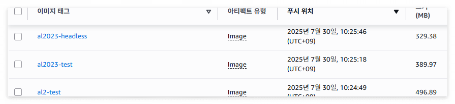
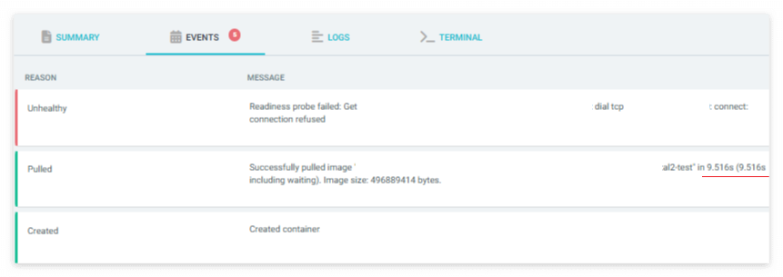
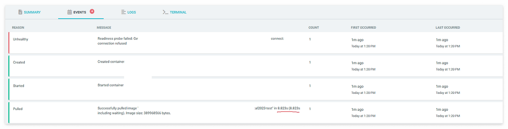
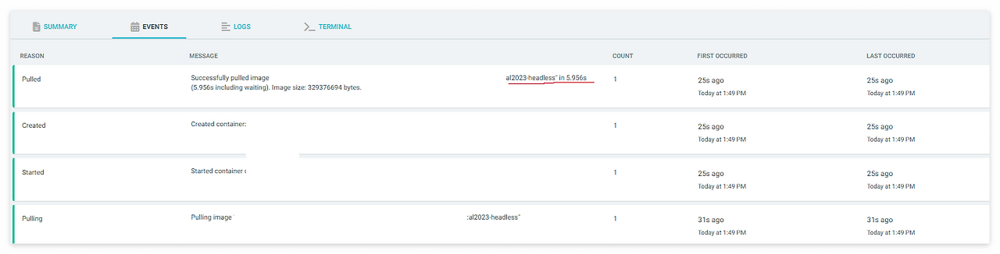
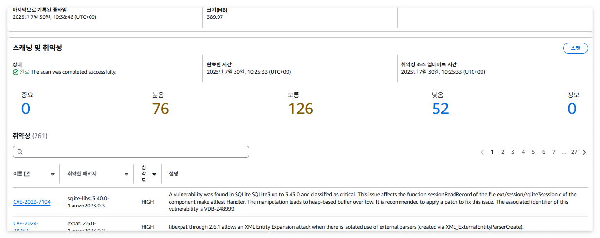
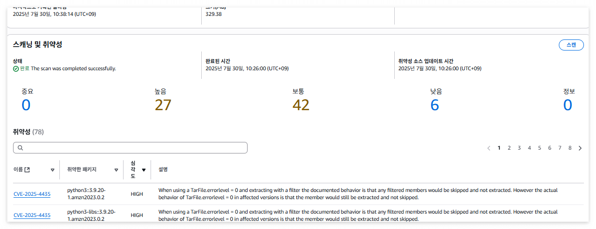

# 목적


-   AL2 → AL2023으로 변경하면서 서비스에 이상이 없으면서 최소한의 amazon corretto BASE IMAGE를 사용하기 위함.


## 컨테이너 BASE IMAGE의 변경


1.  Scale-out 타겟이 되는 주요 서비스를 대상으로 컨테이너를 구성한다.

2.  amazoncorretto:17의 al2, al2023, al2023-headless 세 가지로 구분하여 base image를 두고 컨테이너 이미지를 생성한다.

3.  Node의 Layer 제거를 위해 노드를 항상 새로 생성하고 최초로 구동 된 Pod가 되도록 한다.(노드는 AL2023 노드)

&nbsp;   -   EKS 노드에는 기본적으로 containerd라는 컨테이너 런타임이 설치되어 있다. Pod가 이미지를 풀링할 때 containerd를 통해 이루어지며, containerd는 이미지 레이어 캐싱 기능을 가지고 있다. al2, al2023, al2023-headless와 같이 서로 다른 BASE IMAGE를 사용해도, 겹치는 레이어(Linux OS 기본 레이어, 공통 유틸리티)가 있다면 containerd에 의해 캐시될 수 있다.

&nbsp;   -   노드 내의 `/var/lib/containerd` 경로 이하의 `io.containerd.content.v1.content/blobs/sha256` 및 `io.containerd.snapshotter.v1.overlayfs/snapshots/` 에 대한 캐시가 남아있지 않아야 정확한 테스트가 가능함.


### 테스트 방법


미리 만들어둔 컨테이너 이미지 3개를 배포하는 ArgoCD Application을 생성하고  

karpenter를 통해서 테스트하는 Pod들의 스케줄링에 따라 노드가 생성될 수 있도록 했다.  

아래와 같이 requirements 설정과 taint & toleration을 적용한다.


**karpenter**


```

&nbsp;   spec:

&nbsp;     taints:

&nbsp;     - key: "karpenter.sh/single-pod-node"

&nbsp;       effect: "NoSchedule"

&nbsp;     requirements:

&nbsp;     - key: "test-type"

&nbsp;       operator: "In"

&nbsp;       values: ["image-pull-test"]

```


**Pod**


```

&nbsp; nodeSelector:

&nbsp;   test-type: image-pull-test

&nbsp; tolerations:

&nbsp; - key: "karpenter.sh/single-pod-node"

&nbsp;   operator: "Exists"

&nbsp;   effect: "NoSchedule"

```


### Image 크기


**amazoncorretto**





→ headless의 경우, 이미지 크기가 대략 38% 감소한다.


### Image pull 시간







-   al2: 9.516s

-   al2023: 8.823s

-   al2023-headless: 5.956s


→ headless가 기존 al2에 비해 37% 빠른 이미지 Pulling 속도를 보인다. (컨테이너 Image 크기와 어느정도 비례)


### 컨테이너 이미지 스캔 시 취약점






→ 불필요한 라이브러리나 패키지가 적은 headless가 훨씬 적은 모습


※ 추가로, al2 노드 위에서 실행 시키면 al2 이미지가 Pulling 속도가 빨랐다.

