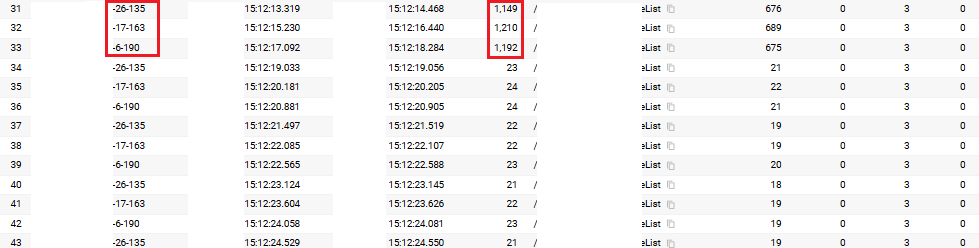

#### 배경

우리 프로젝트는 여름과 겨울 시즌마다 대규모 이벤트를 진행한다.
이벤트의 예약 재고는 한정되어 있으며, 예약이 열리는 시각에 모든 사용자가 동시에 접근하기 때문에
관련 서비스는 모든 사용자에게 동등하고 빠른 응답을 제공해야 한다.


그러나 이벤트 오픈 직후, 위와 같은 현상이 발생했다.
이벤트 대응을 위해 새롭게 생성된 Pod들이 API를 최초로 호출할 때 CPU 사용량이 급격히 상승하고,
이에 따른 응답 지연(latency) 이 발생했다.

고객에게 동일한 서비스 품질을 제공하기 위해, 이러한 초기 지연 현상을 해결할 필요가 있었다.

#### 초기 지연의 원인 분석

우리 애플리케이션은 Spring Boot 프레임워크 기반으로, 아래와 같은 원인으로 초기 지연이 발생한다.

1. JIT(Just-In-Time) 컴파일러 동작

	* JVM은 바이트 코드를 네이티브 코드로 변환하기 위해 실행 중 수집된 프로파일링 정보를 활용한다.
	* 이 정보가 충분히 쌓이면 최적화된 코드를 생성하여 코드 캐시에 저장하고 이후에는 빠르게 실행할 수 있다.
	* 하지만 최초 실행 시에는 컴파일이 완료되지 않아 인터프리터 방식으로 동작하여 성능이 낮다.

2. 클래스 로딩 지연

	* JVM은 애플리케이션 실행 시 모든 클래스를 한 번에 로드하지 않는다.
	* 필요한 시점(API 호출 등)에 해당 클래스를 로드하기 때문에, 최초 요청 시 클래스 로딩 지연이 발생할 수 있다.
	* 즉, JIT 컴파일 및 클래스 로딩으로 인해 최초 호출 시에만 CPU가 급증하고 응답이 느려지는 현상이 나타난다.

#### Warm-up 구성

이를 해결하기 위해 애플리케이션 기동 시 특정 API를 미리 호출(warm-up) 하여
JIT 최적화와 클래스 로딩을 사전에 수행하도록 했다.

```
@Component
public class WarmupRunner implements ApplicationRunner {
    
    @Value("${server.port:8080}")
    private int serverPort;
    
    @Override
    public void run(ApplicationArguments args) throws Exception {
        try {
            Thread.sleep(1000);
            
            RestTemplate restTemplate = new RestTemplate();
            
            String url = String.format(
                "http://localhost:%d/api",
                serverPort
            );
            
            HttpHeaders headers = new HttpHeaders();
            headers.set("accept", "*/*");
            headers.set("customer-id", "123456");
            
            HttpEntity<String> entity = new HttpEntity<>(headers);
            
            restTemplate.exchange(url, HttpMethod.POST, entity, String.class);
            
            System.out.println("API warm-up completed successfully!");
            
        } catch (Exception e) {
            System.err.println("Warm-up failed, but application will continue: " + e.getMessage());
        }
    }
}
```

#### Warmup 적용 확인




#### K8s와의 연계

만약 Warm-up 완료 후에만 트래픽을 받도록 제어해야 하는 경우,
Kubernetes의 readinessProbe와 연동할 수도 있다.

* Spring Actuator의 HealthIndicator 인터페이스를 구현하여
  Warm-up 실행 상태를 Health 상태로 반영할 수 있다.

* Warm-up이 성공적으로 완료되면 ready 상태로 변경하고,
  그렇지 않으면 unready 상태로 유지하도록 구성한다.

이 방식을 적용하면, Pod이 완전히 준비된 이후에만 트래픽을 수신하게 되어
보다 안정적인 서비스 운영이 가능하다.