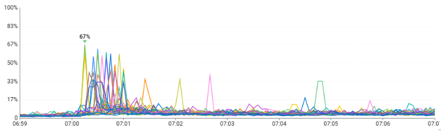

#### 배경

우리 프로젝트는 여름, 겨울마다 대규모 이벤트를 진행한다.

이벤트의 예약 재고는 한정적이고 예약이 열리는 시간이 따로 정해져있기 때문에

관련 서비스는 예약이 열리는 시간에 모든 사용자에게 동등하며 빠른 응답을 줄 필요가 있다.

이벤트 오픈 후 위와 같은 현상이 일어났다.

이벤트 대응을 위해 스케줄로 새로 생성된 Pod들에 대한 API 최초 요청 시 CPU가 급증하고 지연까지 발생한다.

SpringBoot 프레임워크 기반 애플리케이션으로

원인은 아래와 같은 것들이 있다.

 - 메서드 최적화(JIT Compilation)
 - 빈 초기화(Spring Context Initialization)
 - 캐시 빌드(Cache Warm-up)
 - SessionFactory 준비(Hibernate / JPA)
 - GC Warm-up

우리는 고객들에게 동등한 서비스 경험을 제공할 책임이 있기 때문에 이를 개선해야한다.

#### Warmer 구성

#### K8s와의 연계

웜업 기능이 완료된 후 트래픽을 받아야하는 조건이 있는 경우엔
K8s probe 설정과 연동하는 것도 가능하다.

Spring Actuator 의 HealthIndicator 인터페이스를 구현해서
warmer 실행 결과에 따라 health 상태를 변경하는 로직을 추가하여 readinessProbe에 통합할 수 있다.
