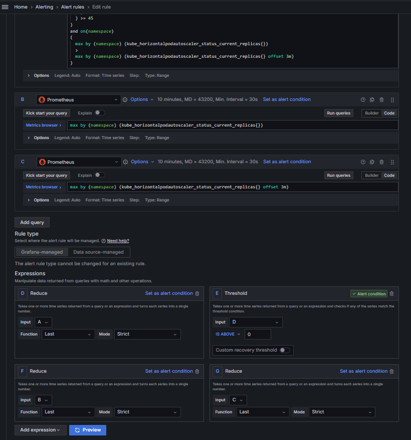
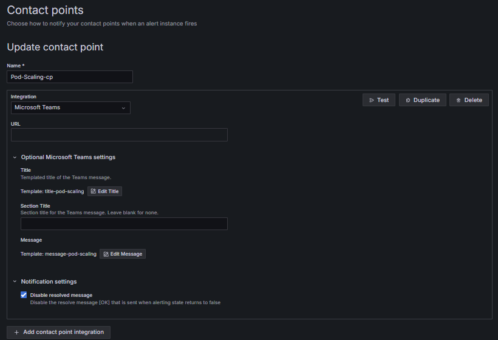
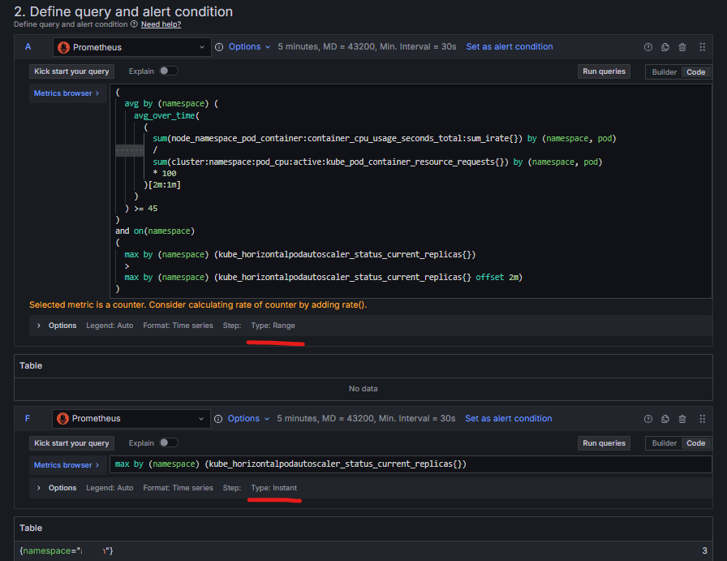

### 목표

* Pod Scale out이 발생했을 때 팀 내 메신저로 알림을 받는 프로세스가 필요하다.

### 최종 쿼리 및 설명

```
# Query A (CPU + HPA)
(
  avg by (namespace) (
    avg_over_time(
      (
        sum(node_namespace_pod_container:container_cpu_usage_seconds_total:sum_irate{}) by (namespace, pod)
        /
        sum(cluster:namespace:pod_cpu:active:kube_pod_container_resource_requests{}) by (namespace, pod)
        * 100
      )[2m:1m]
    )
  ) > 45
)
and on(namespace)
(
  max by (namespace) (kube_horizontalpodautoscaler_status_current_replicas{})
  >
  max by (namespace) (kube_horizontalpodautoscaler_status_current_replicas{} offset 2m)
)
```

<b>Options</b>
 - Time Range: now-5m to now
 - Interval: 30s

<b>Evaluation behavior</b>
 - evaluated every 30s (더 빠른 감지)
 - Pending period 0s (즉시 알림)

<b>[트리거 조건]</b>
알림이 발생하는 조건:
네임스페이스의 평균 CPU 사용률이 45%를 초과하면서, 동시에 해당 네임스페이스의 HPA가 최근 2분 내에 파드를 증가시킨 경우

<b>[평가 주기]</b>
매 30초마다 조건 평가
조건 충족 시, 즉시 알림 발생

<b>[데이터 수집 범위]</b>
최근 5분간의 데이터를 30초 간격으로 수집하여 평가
필요 데이터: 2분(avg_over_time) + 2분(offset) = 4분
 - Time Range: now-5m to now
 - Interval: 30s

### Grafana Alert rule 설정

1. Define query and alert condition



* B, C 쿼리는 각각 Alert을 받았을 때 template message에 파드 개수의 현황을 보여주기 위한 쿼리이다. 또한, 해당 값은 Time Series 값이므로, Reduce expression을 적용해야한다.


2. Set evalutation behavior & Configure labels and notifications


* 조건 충족되는 즉시 알림을 받기 위한 Pending period 0s 설정

* Alert state if no data or all values are null 설정은 <b>Normal</b>로 설정한다. 그렇지 않으면 불필요한 알림이 오게된다.

3. Notification Template


4. Contact Point



* Resolved에 대한 것은 일단 설정하지 않는다. 

※ why? 많은 Resolved로 인해 필요한 알람들이 밀려날 것이라 (이 부분에 대한 고려도 필요)

4. Configure notification message


* Custom annotation name and content에 다음과 같이 설정한다.
  - current_replicas: {{ index $values "F" }}
  - previous_replicas: {{ index $values "G" }}
  - 각각은, 위에서 설정한 추가 쿼리에 대한 reduce 값이다.

※ 참고로, <b>Range</b>로 하는 경우엔 reduce가 필요하고 reduce를 두지 않고 특정 시점에 대한 값만 가져올 것이면 <b>Instant</b>로 설정해도 동일한 결과를 나타낸다.
