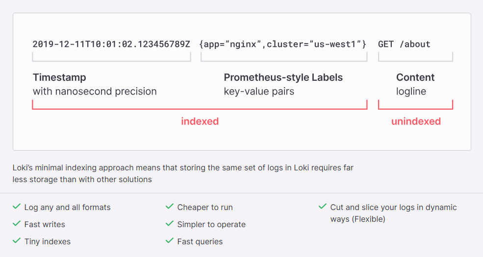

### Loki 도입 및 배경

#### Loki?

* Grafana Labs에서 개발한 오픈 소스 로그 집계 시스템으로, 클라우드 환경에서 로그를 수집, 저장, 조회하는 데 사용되며 Prometheus와 유사한 구조를 가진다.

#### Loki 특징
 
* 전체 로그를 인덱싱하는 대신 메타 정보만 인덱싱하여 저장 공간을 절약가능하다.
* PromQL과 비슷한 LogQL이라는 쿼리 언어를 통해 로그를 효율적으로 검색할 수 있다.
* 수평 확장성과 고가용성을 갖춘 멀티테넌트 로그 집계 시스템이다.

#### Loki 도입 배경

* `1999-12-31 23:59:59,001INFO [domain:test][LogAspect][123456][http-nio-1234-exec-7] [RESPONSE][getTestIdByUserId]->DATA[<200 OK OK,GetTestIdDTO(testId=2025yyk),[resultCode:"1234", resultMessage:"%A0%B1%C2%D3"]>]->(123ms)`

* 현재 우리 시스템은 HTTP Status Code와 별도로 resultCode라는 내부 상태 코드를 사용하고있다. 이로 인해 HTTP Status Code가 200(성공)이더라도 resultCode를 통해 서비스 내부적으로는 실패 응답을 반환하는 경우가 존재한다.
* 그런데, 문제는 기존 APM 도구들이 HTTP Status Code만을 기준으로 에러를 감지하기 때문에, 실제로는 비즈니스 로직상 실패한 요청임에도 불구하고 HTTP 200 응답으로 인해 정상 처리된 것으로 분류되어 모니터링에서 누락되고 있었다.

#### Loki를 선택한 이유

* `resultCode` 기반의 로깅 시스템을 구축하여 문제 상황 발생 시 실시간 알림을 통해 사내 메신저로 전송하는 체계가 필요했다.
이에, 주요 애플리케이션 로깅 도구 3가지를 검토해보았다.

1. Elasticsearch (ELK Stack)
2. Grafana Loki
3. Splunk

##### 기술적 특징 분석

* Grafana Loki는 ELK Stack 대비 '라벨 기반 빠른 필터링 → 로그 내용 검색' 방식이 장점이라고 한다.
   ```
   # 1단계: 라벨로 빠른 필터링
   {service="nginx", env="prod"} 
   # 2단계: 로그 내용 검색
   |= "GET /api/users"
   ```
* 그러나 우리의 요구사항은 로그 내용의 resultCode 값을 직접 분석하는 것이므로, 사실상 Loki의 핵심 장점이 크게 활용되지는 않기 때문에 기능적 관점에서는 ELK Stack이 더 적합할 수 있었다.
* 그럼에도 Loki를 선택한 결정적 이유는 다음과 같았다.
  * 비용 효율성: S3를 스토리지로 활용하여 운영 비용 절감
  * 기존 인프라와의 원활한 통합: 이미 구축된 Prometheus + Grafana 모니터링 스택과의 자연스러운 연동, Fluent Bit 시스템과의 연계를 위한 설정이 간단
  * 러닝 커브: PromQL과 유사한 LogQL의 직관적인 쿼리 언어로 로그 검색과 분석이 용이

---

### 참고

* https://grafana.com/blog/2018/12/12/loki-prometheus-inspired-open-source-logging-for-cloud-natives/#loki
