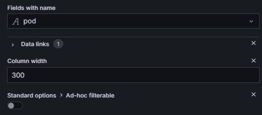
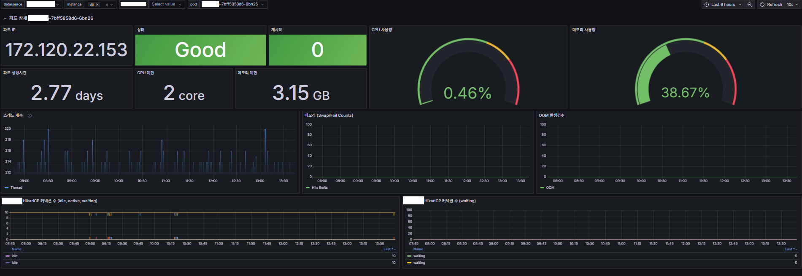

## 전체

Pod의 주요 상태들을 나타내는 패널을 구성한다.

 

## 세부 설정들

### 0. 공통

* 최대한 많은 정보를 한 눈에 담기위해 패널의 visualization은 <b>Table</b>로 구성한다.
* 각 지표들의 Query와 Override를 정리한다.
* 각 Query의 threshold는 예시로 보여주기 위한 값일 뿐이다.

#### Queries

* 각 패널 Query의 Options은 Format: Table, Type: Instant

#### Transformations

* 1 - Join by field (OUTER/pod)
* 2 - Organize fields by name

#### Panel Options

* Decimals: 1
  * 대부분의 수치들이 %이고 소수점 첫째 자리까지만 표현한다.

### 1. CPU 

#### PrometheusRule

* kube-prometheus-stack을 배포하면 기본적으로 다양한 prometheusRule 들이 배포가 된다.
* 이 안에는 자주 사용하는 주요 쿼리를 단순화하고 재사용할 수 있게끔한다.(recording)
* [공식 문서](https://github.com/prometheus-community/helm-charts/blob/main/charts/kube-prometheus-stack/templates/prometheus/rules-1.14/k8s.rules.container_cpu_usage_seconds_total.yaml)

#### 1-1. CPU 평균

<b>Query</b>
```
sum(node_namespace_pod_container:container_cpu_usage_seconds_total:sum_irate{namespace=~"$namespace"}) by (namespace, pod)
/ sum(cluster:namespace:pod_cpu:active:kube_pod_container_resource_requests{namespace=~"$namespace"}) by (namespace, pod) * 100
```

<b>Override</b>


#### 1-2. CPU 최대

<b>Query</b>
```
max_over_time(
  (sum(node_namespace_pod_container:container_cpu_usage_seconds_total:sum_irate{namespace=~"$namespace"}) by (pod) / sum(cluster:namespace:pod_cpu:active:kube_pod_container_resource_limits{namespace=~"$namespace"}) by (pod))[5m:1m]
) * 100
```

<b>Override</b>


### 2. Memory

<b>Query</b>
```
sum(
    container_memory_working_set_bytes{cluster="$cluster", namespace=~"$namespace", container!="", image!=""}
  * on(namespace,pod)
    group_left(workload, workload_type) namespace_workload_pod:kube_pod_owner:relabel{cluster="$cluster", namespace!~"kube-system", namespace=~"$namespace", workload=~"$deployment", workload_type=~"$type"}
) by (pod)
/sum(
    kube_pod_container_resource_requests{job="kube-state-metrics", cluster="$cluster", namespace=~"$namespace", resource="memory"}
  * on(namespace,pod)
    group_left(workload, workload_type) namespace_workload_pod:kube_pod_owner:relabel{cluster="$cluster", namespace!~"kube-system", namespace=~"$namespace", workload=~"$deployment", workload_type=~"$type"}
) by (pod) * 100
```

<b>Override</b>


### 3. HikariCP

#### 3-1. HikariCP 최대

<b>Query</b>
```
max by (pod) (hikaricp_connections_max{namespace=~"$namespace"})
```

#### 3-2. HikariCP 사용률

<b>Query</b>
```
round(avg by (pod) (hikaricp_connections_active{namespace=~"$namespace"}) / avg by (pod) (hikaricp_connections_max{namespace=~"$namespace"}) * 100, 0.1)
```

<b>Override</b>


### 4. Pod

#### 4-1. Pod Detail

<b>Override</b>



* Data links
  * /d/{uid}/{dasbhoard}?var-pod=${__value.raw}&var-namespace=${__data.fields.namespace}



* 메인 대시보드에서 표현하기엔 deep 한 내용들을 보여주는 Pod detail dashboard 예시

#### 4-2. Pod namespace

* Data Link들을 구성하는 데에 있어 namespace를 필요로하는 경우가 있다.

* 때문에, namespace가 존재하는 기존 쿼리에서 추가로 구성될 수 있도록 한다.
  나는, CPU 평균을 구할 때 by (pod) → by (namespace, pod)로 바꾸어서 구성했다.

### 5. ETC

- 그 외 필요한 것은 차차 추가해보도록 한다.