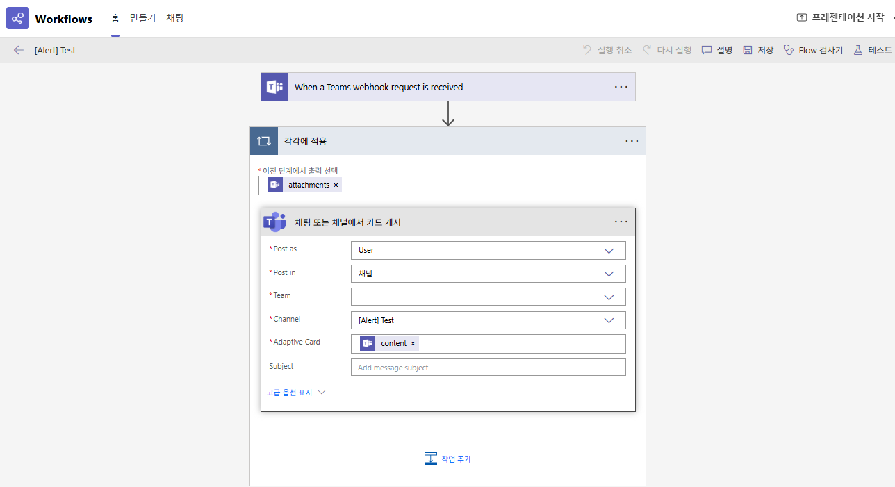

1. 목표
* Pod 별 CPU Utilization이 60%, 80% 넘는 경우 각각 Warning, Critical 알림을 받는다.
* Prometheus Rule이 구성에는 더 쉽겠지만.. 팀 내부적인 이유로 Grafana Alert rule을 활용해본다.

2. 쿼리 및 알람 조건 정의
A:
```
(
  rate(container_cpu_usage_seconds_total{namespace=~"$namespace", container!="POD",container!=""}[3m]) * 100
) > 60
and on(pod, namespace) 
(
  (time() - kube_pod_created{}) > 600
)
```

B: Reduce (Last)
C: Threshold (Input: B, IS ABOVE: 0)

※ **Reduce Last를 사용하는 경우 Time Range를 꼭 설정해주어야 한다.


why?: 대부분의 Query의 결과는 time series인데, Grafana에서 Alert rule을 생성할 때
time series로의 threshold를 Alert condition 으로 두려고하면 
`You cannot use time series data as an alert condition, consider adding a reduce expression.` 에러가 발생한다. 
따라서 time series 데이터를 단일 값으로 변환하는 reduce expression을 추가해야 한다. 
Grafana에서는 시계열 데이터의 여러 데이터 포인트를 하나의 값으로 집계해야만 threshold와 비교할 수 있기 때문이다.

근데 이제 이 reduce가 감지하는 범위가 넓은 범위로 인한 Time Range에 걸리면 Firing이 계속 유지되는 경험을 할 수 있다.
알고보면 당연한데 이 설정때문에 다른거 다 만들어놓고 한참을 헤맸다..

3. Evaluation behavior

* evaluation 1m 이하로

* pending period: 즉시(None or 0s)

4. Label, Notification 구성

* Label은 title과 message에 들어갈 namespace: {{ $labels.namespace }}와 severity: Warning or Critical 설정한다.

* Notification Templates

템플릿은 대충 다음과 같다. (개선이 조금도 되지않은 임시버전)


```
{{ define "pod.title" }}
  [{{ .CommonLabels.severity | title }}][{{ .CommonLabels.pod }}][CPU] - ({{ .Status | title }})
{{ end }}
```

```
{{ define "teams-pod-message" }}
{{ range .Alerts }}
🔸 **Pod 정보:** 🔸
- **Pod:** {{ .Labels.pod }}
- **Namespace:** {{ .Labels.namespace }}
- **Severity:** {{ .Labels.severity }}

**요약**
- {{ if eq .Labels.severity "Warning" }}1분간 CPU 사용량 60% 초과{{ else if eq .Labels.severity "Critical" }}1분간 CPU 사용량 80% 초과{{ else }}CPU 사용량 임계값 초과{{ end }}


**조치 방법**
- ArgoCD 접속 후, maxReplicas 상향 조정
{{ end }}
{{ end }}
```

* Contact point

위 템플릿들을 title, message로 지정하고 webhook은 microsoft teams webhook을 설정한다.

5. Microsoft Teams 설정



6. K6를 통한 부하 및 결과 확인


