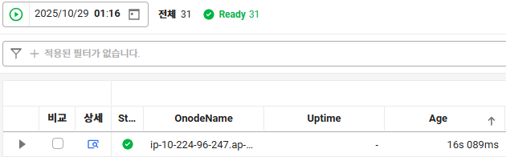

#### 상황

주기적인 Batch 서비스의 호출로 인해 특정 Namespace의 Pod의 CPU가 급증한다.

01:15:30 컨테이너별 CPU 사용량이 급증하였다는 알람이 발생했다.

01:14:15 ~ 01:15:45 실제로 해당 Namespace CPU 평균이 우리의 HPA 임계치를 넘어 Scale-out 조건을 충족하였다.

실제로 01:14:43에 HPA에 의해 3 to 4로 ReplicaSet을 업데이트한 모습

그런데 의아한 것은 HPA에 대한 알람이 오지 않았다.

#### 개선

가용한 노드가 없어, 프로비저닝되는 시간이 필요했고
Alert rule에 적용한 Query의 [2m:1m] range window 2분이 충분하지 못해 감지하지 못했다.

노드 프로비저닝 시간을 고려한 시간 구간을 2m -> 3m으로 늘려주었다.

#### ETC

사실 잠시 배치성에 의한 것으로 알람을 받지 않는 것이 노이즈 개선일 수는 있지만

일단은 인지하는 것이 우선이기 때문에 모든 알람을 일단 받는다는 주의다.