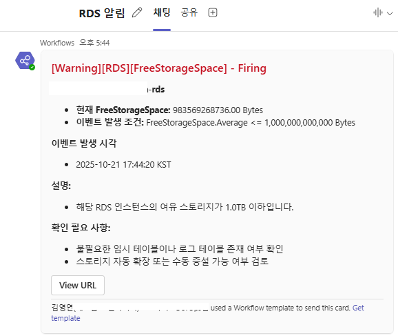

### 목표

* MySQL 엔진의 Database에 대해서 FreeStorageSpace 가 부족한 경우 알람을 받도록 한다.


### Grafana Alert 설정

#### Define query and alert condition


Cloudwatch Metrics Insights를 활용한다.

```
SELECT AVG(FreeStorageSpace) 
FROM "AWS/RDS" 
WHERE DBInstanceIdentifier = 'mysql-rds'
GROUP BY DBInstanceIdentifier
```

1시간마다 체크하며 발생 즉시 알람을 보내고 데이터 포인트는 많지 않아도 될 것 같아 아래와 같이 설정하였다.

<b>Options</b>
 - Time Range: now-1h to now (1시간)
 - Max data points: 1000
 - Interval: 1h
 - Period: 1h
 
<b>Expressions</b>


* Reduce는 Query period가 1h이므로, Last
* Threshold는 'IS BELOW' 1000000000000 (1 TB)로 설정한다.

#### Set evaluation behavior

 

<b>Evaluation behavior</b>
 - evaluated every 1h
 - Pending period 0s (즉시 알림)


#### Notification Template


<b>Title</b>
```
{{ define "title-rds-storage" }}
  [Warning][RDS][FreeStorageSpace] - {{ .Status | title }}
{{ end }}
```

<b>Message</b>
```
{{ define "message-rds-storage" }}
{{- $a := index .Alerts 0 -}}

{{ range .Alerts }}
**{{ .Labels.DBInstanceIdentifier }}**
- **현재 FreeStorageSpace:** {{ .Values.B | printf "%.2f" }} Bytes
- **이벤트 발생 조건:** FreeStorageSpace.Average <= 1,000,000,000,000 Bytes

{{ end }}
**이벤트 발생 시각** 
- {{ $a.StartsAt | tz "Asia/Seoul" | date "2006-01-02 15:04:05 KST" }}

**설명:**
- 해당 RDS 인스턴스의 여유 스토리지가 1.0TB 이하입니다.

**확인 필요 사항:**
- 불필요한 임시 테이블이나 로그 테이블 존재 여부 확인  
- 스토리지 자동 확장 또는 수동 증설 가능 여부 검토  

{{ end }}
```

#### 운영 환경 알람 수신 확인(Microsoft Teams)

