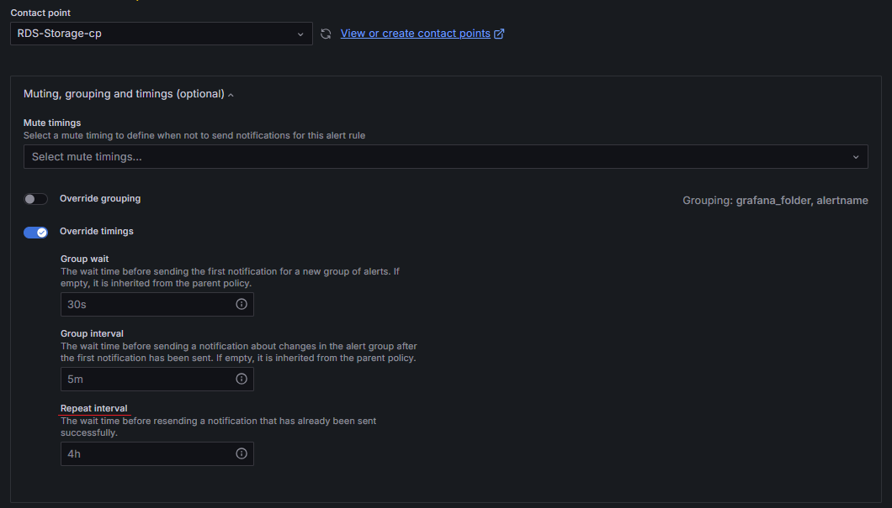

### 배경

알람이 4시간마다 Firing되어 오는 상황으로 알람 채널에 노이즈를 만들어 실제 알람을 찾아보기 어렵다.

#### 관련있는 설정

1. Grafana Alert 평가 주기 (Evaluation interval)

 * Evaluate every 1h + Pending period (os)
 
 * 위 설정으로 인해 1시간마다 조건을 평가하고 만족되는 즉시 Firing 상태로 전환한다.

2. Notification policy의 재알림 주기 (Repeat interval)

  

 * 이미 firing 중인 알람이 있을 때, 같은 알림을 주기적으로 다시 보내는 간격을 의미한다.(default: 4h)

#### 동작 방식

Evalutation: 4h, Repeat: 5h 인 경우에 10:00에 Firing으로 알람이 왔다고 가정하면

14:00 Repeat 10:00 시점 평가되었던 Firing 값을 기반으로 알람을 발송한다.(재발송)
15:00 Evaluate 알람 상태를 재평가하고 여전히 만족 시 Firing, 그렇지 않으면 Resolved
18:00 Repeat 15:00 시점 평가된 값(Firing or Resolved) 값을 기반으로 알림 발송 여부를 결정한다.