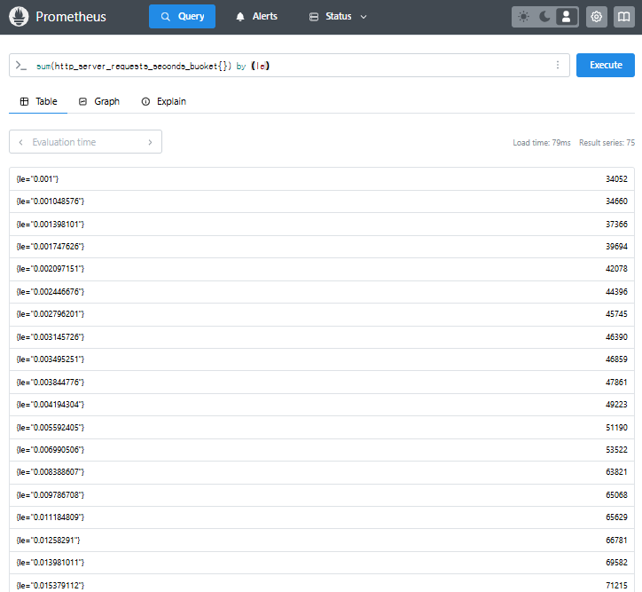
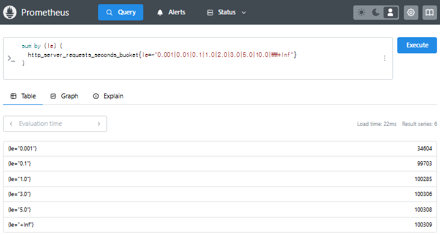

#### 구성 요소 표현 방법

* 트랜잭션
 - `http_server_requests_seconds_count / http_server_requests_seconds_sum`
 - Spring Boot Micrometer에서 자동 수집되는 HTTP 요청 메트릭

* 응답시간
 - `http_server_requests_seconds_count`
 - 요청별 latency를 구간(bucket)별로 ㅈ비계한 히스토그램 메트릭
 
* Heatmap X축(시간)
 - `time()`
 - 트랜잭션 종료시간에 해당
 
* Heatmap Y축(응답시간)
 - Prometheus 히스토그램의 bucket 경계
 - latency 범위 구간 (0.1s, 0.3s, 1s 등)
 
* 색상(빈도)
 - `count_over_time()` or `rate()`
 - 각 구간에서 발생한 요청 수를 표현
 
#### Micrometer 히스토그램 활성화

Spring Boot Actuator의 Micrometer metrics 기능에서
메트릭의 분포를 Heatmap 같은 시각화에 적합한 형태로 기록하기 위해 사용하는 설정값

* `application.yml` 인 경우,
	```
	management:
	  metrics:
		distribution:
		  percentiles-histogram:
			http.server.requests: true
		  slo:
			http.server.requests: 100ms,300ms,500ms,1s,2s,5s
		  minimum-expected-value:
			http.server.requests: 10ms
		  maximum-expected-value:
			http.server.requests: 10s
	```

* 파라미터 스토어의 경우
  * /config/application/management.metrics.distribution.slo.http.server.requests
  * /config/application/management.metrics.distribution.percentiles-histogram.http.server.requests
  * /config/application/management.metrics.distribution.minimum-expected-value.http.server.requests
  * /config/application/management.metrics.distribution.maximum-expected-value.http.server.requests
  
 
위 설정을 통해 Prometheus에 다음과 같은 메트릭이 생긴다.

```
http_server_requests_seconds_bucket{le="0.1",...}
http_server_requests_seconds_bucket{le="0.3",...}
...
http_server_requests_seconds_count
```

#### Grafana heatmap 패널 구성

* le란?
  * less than or equal to 라는 뜻으로 해당 요청의 처리 시간이 이 값 이하인 요청의 누적 개수를 의미한다.
  
  
  * 구간별로 분포를 계산한다고 하면 아래와 같이 통계 낼 수도 있을 것 같다.
  
	* 응답 시간에 따른 요청 개수는 0.001 이하는 34604개, 0.1 ~ 0.001 사이는 99703-34604개, 그리고 5초를 넘는 것은 1개임을 알 수 있다.
 
* `sum by (le) (rate(http_server_requests_seconds_bucket[1m]))`
  * `rate()`: 초당 요청 발생률 계산
  * `sum by (le)`: latency 구간(le)별 집계
  * `[1m]`: 1분 간격 슬라이딩 윈도우
 
1. 세로줄 패턴 (Lock 대기 -> 동시 종료)
 - 여러 요청이 비슷한 시점에 동시에 종료됨
 - latency(응답시간)는 제각각 -> 다양한 bucket(le)이 동시에 spike 발생
 - 원인: DB Lock, Thread Block, 동시 자원 경합

 - 쿼리 예시 
   ```
   count_values("le", sum by (le) (rate(http_server_requests_seconds_bucket[1m]))) > 3 and on() sum(rate(http_server_requests_seconds_bucket[1m])) > 50
   ```
 - 결과 예시: {le="6.999962236073906"}  45
 - 쿼리 설명
   1. `http_server_requests_seconds_bucket`: Micrometer가 생성하는 HTTP 요청 지연시간(bucket형 메트릭)
   즉, `http_server_requests_seconds_bucket{le="1"}`은 1초 이하로 끝난 요청 수의 누적값이다.
   2. 이를 `count_values("le", sum by (le)) > 3`으로 한 것은 응답 시간이 0.3초, 0.5초, 1초 등 다양한 bucket에서 동시에 발생하여 latency가 다양한 구간에 분포되는 것 처럼 보이는지를 보기 위함.(불균일, 세로 형태)
   3. `sum(rate(http_server_requests_seconds_bucket[1m])) > 100`는 전체 요청량이 초당 100건 이상일 때만 평가한다. (트래픽이 너무 적을 때는 노이즈로 무시한다.)
  
 
 