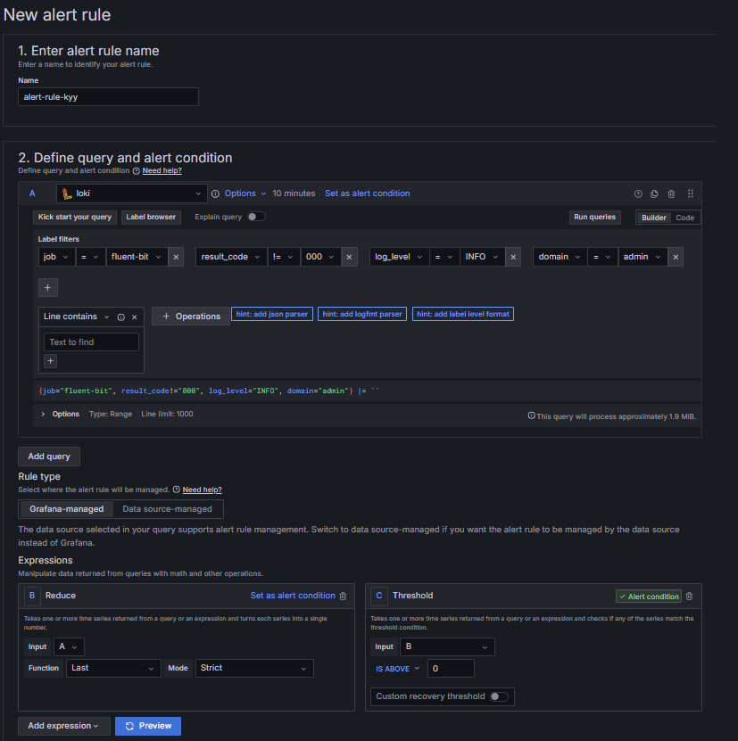
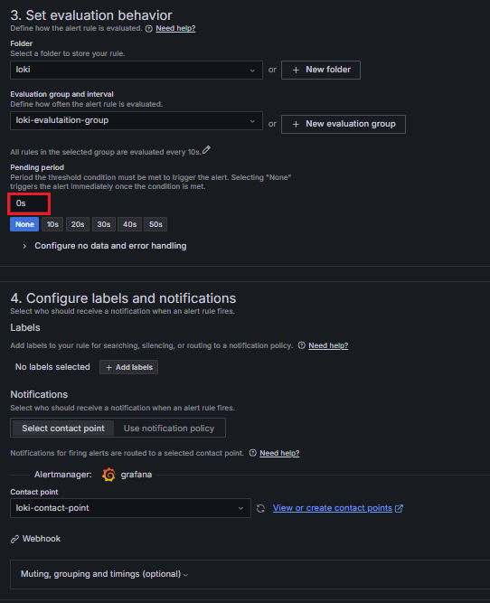

### Logging에 따른 알림 설정 방법

* Grafana Alert를 활용한 로깅 알림 설정 가이드

#### Grafana 알람 생성

* Grafana 접속 후, Alerting → Alert rules → New alert rule

#### Query 및 Alert Condition 설정

<b>Query</b>
* Alert rule 이름 지정
* Datasource: loki
* Label filters와 Operations을 적절히 이용하여 알람을 받고자하는 Case를 설정해준다.
    * count_over_time: 시간 범위 내 로그 개수(그 외 설정)

#### Alert Condition 설정

<b>Alert Condition</b>
→ 기본적으로 두 가지 Expressions이 구성된다.

* Reduce
    * 쿼리나 표현식에서 반환된 하나 이상의 시계열을 가져와 각 시계열을 단일 숫자로 변환한다.
* Threshold
    * 쿼리나 표현식에서 반환된 하나 이상의 시계열을 가져와서 시계열 중 임계값 조건과 일치하는 것이 있는지 확인

#### Evaluation behavior 및 Notification 설정

<b>Evalutation behavior</b>

* Folder
    * Alert rule을 저장할 폴더를 지정
* Evaluation group and interval
    * 규칙을 평가할 interval을 지정하고, 동일한 group 내의 alert rule들은 동일한 interval 동안 평가된다.
* Pending period
    * 알림이 실행되기 전, 임계값 조건이 충족되어야 하는 기간을 지정한다.

<b>Notification</b>

* 알림을 받을 대상(Contact point)을 선택한다. 없는 경우, View or create contact points

#### Contact point 생성

* Integration
    * Microsoft Teams, Slack, Email 등
* URL
    * Webhook, URL, Address 등
* 해당 Endpoint가 정상인지 확인을 위해, 꼭 Test를 하도록 한다.
    

### 실제 조건에 따른 알림 예시

