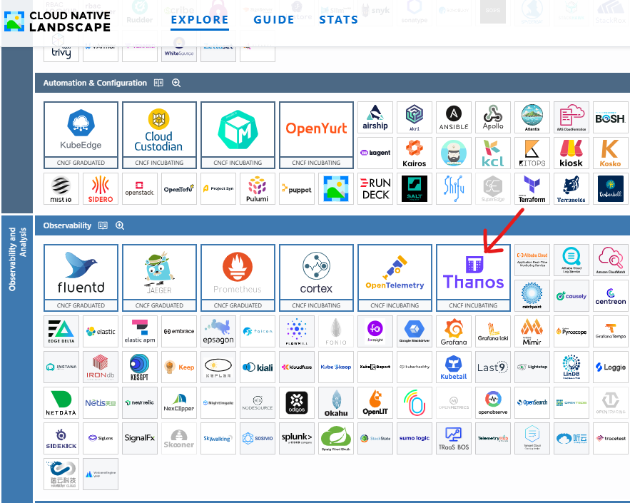

[배경]
AL2 -> AL2023으로 전환했고
기존에 프로메테우스를 HA 구성을 하지 않았던 우리 프로젝트의 경우
새로운 노드가 기존 노드 및 볼륨의 zone과 다르게되면
PVC가 붙지않아서 pod가 계속해서 pending이 된다.
이를 해결하기 위해서는 다양한 방법이 있겠지만
항상 CNCF Landscape를 고려해서 기술을 도입하기 때문에

현 시점에선 Object Storage로서 Thanos를 활용하는 것이 좋아보인다.

---

프로메테우스는 단일 노드 시스템으로 설계되어 클러스터링 구조를 직접 지원하지 않는다.
때문에 '확장성'과 '고가용성'에 일부 보완이 필요하다.

1. 확장성
 - 단일 노드에서 모든 메트릭을 처리하려 할 때, 노드의 자원이 고갈되어 성능 저하를 초래할 수 있다.
  => 외부 스토리지 연결의 필요

2. 고가용성 문제
 - 단일 노드에서 발생하는 장애나 다운타임이 생겨 프로메테우스 서버가 내려가면 그 시간 동안 메트릭을 수집할 수 없다.
 - Amazon EBS CSI Driver 를 통한 EBS를 사용해도 단일 노드에만 가능하다. (또한 AZ 일치까지 해야함)
  => 이를 방지하기 위해 HA 구성하게 되고, 데이터 정합성을 보장할 수 있어야 함.

위 내용을 해결하기 위한 도구가 Thanos

---

Thanos
 - 프로메테우스의 확장성과 고가용성을 개선하기 위한 시스템