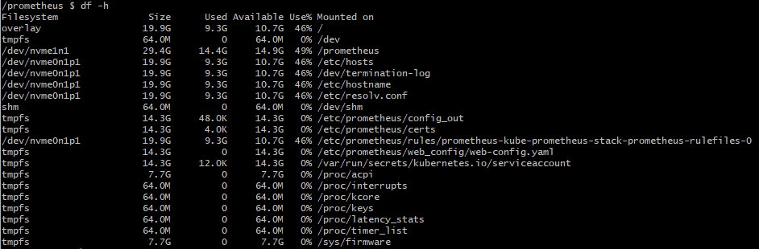

### 목적

Prometheus의 주요 개념들을 이해한다.
이후, 실제 프로젝트 환경의 성능 개선과 Thanos를 통한 확장을 목표로 한다.

### 주요 개념

1. Metric: Prometheus가 수집하는 측정 단위 (e.g., container_cpu_usage_seconds_total)
2. Label: Metric에 부가적인 속성을 부여하는 key-value 쌍 (e.g., namespace="kube-system")
3. Sample: metric의 시점별 측정값 (timestamp + value)
4. Time Series: 동일한 metric + label 조합으로 구성된 연속적인 sample 들의 집합
5. Cardinality: 고유한 시계열의 개수 (metric + label 조합의 유니크 수)

#### 1. 시계열(Time Series)

 * 프로메테우스의 모든 데이터는 시계열 형태로 저장된다.
  즉, <b>시간</b>과 <b>값</b>의 쌍으로 구성되며, metric(수집 대상) + label(메타데이터) 조합이 완전히 동일하면 같은 시계열로 간주한다.
  ```
  http_requests_total{method="GET", status="200", endpoint="/"} -> 하나의 시계열
  http_requests_total{method="POST", status="500", endpoint="/login"} -> 또 다른 시계열
  ```
  따라서, 시계열의 개수는 <b>고유한 metric + label 조합의 수</b> 이다.

  * 전체 시계열 수 확인
    `$ prometheus_tsdb_head_series`: 현재 메모리에 적재된 시계열 수
	
	
  * 메트릭별 시계열 수 확인(top 20)
    `$ topk(20, count by (__name__)({__name__!=""}))`
	

#### 2-1. Cardinality

 * 유니크한 시계열의 개수(데이터의 고유한 값의 개수)
  같은 메트릭이라도 label 값이 많을수록 시계열이 늘어나게된다.
  ```
  metrics_name{pod="pod1", status="200"}
  metrics_name{pod="pod2", status="200"}
  metrics_name{pod="pod3", status="500"}
  ```
  위와 같은 경우, Cardinality가 3이다.

 * Prometheus는 모든 시계열의 메타데이터를 메모리에 상주시킨다. 따라서 카디널리티가 증가하면 메모리, CPU, 스토리지 자원에 직접적인 영향을 미친다.

#### 2-2. Cardinality 관련 통계

Prometheus API(`/api/v1/status/tsdb`)를 통해 카디널리티 및 메모리 관련 세부 통계를 확인할 수 있다.


| 항목                              | 설명              |
| ------------------------------- | --------------- |
| **headStats.numSeries**         | 현재 시계열 총 개수     |
| **seriesCountByMetricName**     | 메트릭별 시계열 수      |
| **labelValueCountByLabelName**  | Label별 값의 다양성   |
| **memoryInBytesByLabelName**    | Label별 메모리 점유량  |
| **seriesCountByLabelValuePair** | Label 쌍별 시계열 개수 |

혹은 Grafana에서 Default 대시보드로도 추이를 확인 가능하다.


#### 2-3. High Cardinality 개선 방법

* 내용이 많아 따로 정리한다.(Link)

#### 3. Memory
 프로메테우스 메모리는 크게 두 영역으로 나뉜다.
 
 1. Cardinality Memory
  저장하는 것: 시계열 메타데이터(Label 조합)
  예시
  ```
  http_requests_total{job="api", instance="server1", method="GET"}
  http_requests_total{job="api", instance="server2", method="POST"}
  ```
  특징: 시계열 수와 Label 조합이 많을수록 메모리 증가

 2. Ingestion Memory
  저장하는 것: 실제 데이터 포인트(value + timestamp), Scrape로 수집한 샘플들
  예시
  ```
  # Scrape가 15초인 경우
  15:00:00 -> 값: 100
  15:00:15 -> 값: 105
  15:00:30 -> 값: 108
  ```
  특징: 시간이 지나면 안축되어 디스크로 이동

 ※ 참고 사이트: https://www.robustperception.io/how-much-ram-does-prometheus-2-x-need-for-cardinality-and-ingestion/

#### 4. 자원 사용량 및 저장소 관리

1. Storage (PVC) 사용량
   
 * 디스크 포화의 경우 retention 기간이 길거나, scrape interval이 짧을 수 있음

2. 보존 주기(retention) 설정 확인
 
 ```
 $ kubectl get sts -n monitoring prometheus-kube-prometheus-stack-prometheus -o yaml | grep retention
        - --storage.tsdb.retention.time=7d
        - --storage.tsdb.retention.size=25GiB
 ```

 * 보존 기간이 길면 로컬 디스크 감당이 되지 않기 때문에 Thanos의 Object Storage 백엔드가 필요해진다.
 * PVC가 local stroage면 노드 장애 시 데이터 유실 리스크가 존재 -> Thanos로 이중화