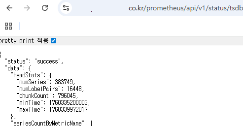

### 배경

<b>스타벅스 사이렌 오더 Observability 시스템 구축</b>

1. AWS PVC 이슈
 HA 구성을 하지 않으며 PVC를 사용한 우리 프로젝트의 경우, 새로운 노드로의 마이그레이션이 필요한 경우 노드 및 볼륨의 Zone에 차이가 생기는 경우 PVC가 붙을 수 없어 관련 Pod 들이 모두 Pending이 되게 된다.

2. 시스템의 확장
 앞으로 우리의 Logs, Metrics, Traces를 담당할 주요 시스템의 데이터가 유실되는 등 불완전성을 갖고있다면 이는 개선되어야 할 부분일 것이다.
 미래 상황을 고려하여 고가용성 + 확장성있는 시스템 구성이 필요하다.


현 시점에선 Object Storage로서 Thanos를 활용하는 것이 좋아보인다.

#### Prometheus 상태 점검

1. 자원 사용량 관점
 - Prometheus Pod CPU: 73m, Memory: 1908Mi
 - Storage (PVC) 사용량
   
 * 메모리 과다한 경우, 데이터 수집량이 많거나 label cardinality 가능성
 * 디스크 포화의 경우, retention 기간이 길거나, scrape interval이 짧을 수 있음

2. 메트릭 수집량

 - 시계열 데이터 수
 

3. 저장소 및 보존 주기(retention) 설정 확인
 
 ```
 $ kubectl get sts -n monitoring prometheus-kube-prometheus-stack-prometheus -o yaml | grep retention
        - --storage.tsdb.retention.time=7d
        - --storage.tsdb.retention.size=25GiB
 ```

 * 보존 기간이 길면 로컬 디스크 감당이 되지 않기 때문에 Thanos의 Object Storage 백엔드가 필요해진다.
 * PVC가 local stroage면 노드 장애 시 데이터 유실 리스크가 존재 -> Thanos로 이중화

#### Thanos의 필요성

프로메테우스는 단일 노드 시스템으로 설계되어 클러스터링 구조를 직접 지원하지 않는다.
때문에 '확장성'과 '고가용성'에 일부 보완이 필요하다.

1. 확장성
 - 단일 노드에서 모든 메트릭을 처리하려 할 때, 노드의 자원이 고갈되어 성능 저하를 초래할 수 있다.
  => 외부 스토리지 연결의 필요

2. 고가용성 문제
 - 단일 노드에서 발생하는 장애나 다운타임이 생겨 프로메테우스 서버가 내려가면 그 시간 동안 메트릭을 수집할 수 없다.
 - Amazon EBS CSI Driver 를 통한 EBS를 사용해도 단일 노드에만 가능하다. (또한 AZ 일치까지 해야함)
  => 이를 방지하기 위해 HA 구성하게 되고, 데이터 정합성을 보장할 수 있어야 함.

위 내용을 해결하기 위한 도구가 Thanos

### PoC


멀티클러스터에서도 활용 가능한 Prometheus 환경을 구성하고싶다.

1. kube-prometheus-stack에 Thanos Sidecar를 구성한다.
