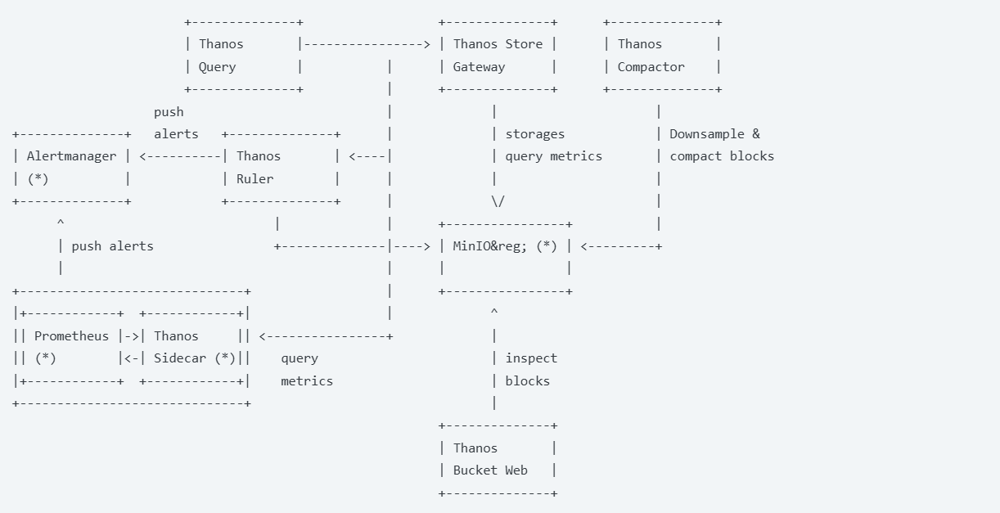

### Thanos 주요 기능

출처 - [thanos.io](thanos.io)

* Golobal Query View
  * 다수의 prometheus 서버들과 클러스터들에 걸친 질의를 지원한다.

* Unlimited Retention
  * Public cloud의 객체 저장소를 포함한 다양한 저장소에 메트릭을 저장할 수 있게 되었고 데이터 보관주기의 제약이 없어졌다.

* Prometheus Compatible
  * Prometheus의 인터페이스와 거의 완벽하게 호환되는 API를 제공하여 기존 Prometheus 환경에 쉽게 적용가능하다.

* DownSampling & Compaction
  * 데이터의 시간주기별 데이터를 생성하여 통합데이터 조회의 성능을 높히고 데이터별 상세 저장주기 설정을 통해 저장소를 효율적으로 활용할 수 있다.

### Thanos 구성 요소(Architecture)

위는 살짝 복잡해서 bitnami에서 제공하는 아래 사진으로 아키텍처 파악을 했다.

출처 - [bitnami](https://artifacthub.io/packages/helm/bitnami/thanos)

#### 사이드카

Thanos Sidecar는 Prometheus와 같은 Pod 내에서 함께 실행되는 프로세스
Prometheus 데이터를 외부 오브젝트 스토리지(S3 등)에 업로드하고,
Thanos Query 등이 StoreAPI를 통해 Prometheus 메트릭을 조회할 수 있도록 연결하는 역할을 한다.

* 주요 기능

 1. 데이터 업로드 (Object Storage 백업)
  - Prometheus가 생성하는 TSDB 블록(2시간 단위)을 주기적으로 Object Storage에 업로드
  - Prometheus의 로컬 보존 기간을 짧게 유지하면서도, 장기 보관 및 통합 쿼리가 가능
 2. 데이터 조회 (Store API 제공)
  - Prometheus의 Remote Read API 위에 Thanos Store API를 구현
  - Thanos Query가 Prometheus 데이터를 시계열 소스로 활용 가능
 3. 리로더 (Reloader)
  - Prometheus 설정파일 또는 Rule 변경을 감지하여, `--web.enable-lifecycle` 플래그 활성 시 Prometheus를 자동으로 reload

* 중요한 포인트
 
 1-1. Prometheus는 완전한 Stateless가 아니다.
  - Prometheus는 수집한 메트릭을 로컬 디스크에 TSDB 형태로 저장한다. (`--storage.tsdb.path`)
  - 2시간마다 이 데이터를 block 파일로 만들어 디스크에 쓴다. 즉, 메모리 기반이 아니라 파일 기반 저장소를 사용하는 것으로 디스크가 사라지면 데이터도 사라진다.
  - Sidecar도 2시간짜리 블록 파일을 외부 Object Storage로 업로드하지만, 현재 메모리에서 수집 중인 데이터는 업로드할 수 없다. 
  - 때문에 갑자기 Prometheus 죽거나 재시작하면 최근 2시간 이내의 데이터가 손실된다.
 
 1-2. 때문에 영구적인 스토리지를 구성하거나 remote_write 기능을 활용한다. (
  

* 참고 문서
[Thanos 구성 요소](https://thanos.io/tip/thanos/quick-tutorial.md/#components)

[사이드카 구성 요소 설명서](https://thanos.io/tip/components/sidecar.md/)

[DEVOCEAN](https://devocean.sk.com/blog/techBoardDetail.do?ID=163458&/1000)

