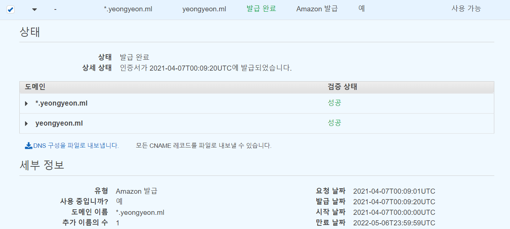

ACM에서는 Amazon 발행 SSL/TLS 인증서에 대한 관리형 갱신을 제공합니다. 즉, ACM이 인증서를 자동으로 갱신하거나 (DNS 유효성 검사를 사용하는 경우) 만료가 다가오면 전자 메일 알림을 보냅니다. 이러한 서비스는 공용 및 개인 ACM 인증서 모두에 대해 제공됩니다.

인증서는 다음 고려 사항에 따라 자동 갱신이 가능합니다.

- Elastic Load Balancing 또는 CloudFront 와 같은 다른 AWS 서비스와 연결된 경우 자격이 있습니다.
- 발급되거나 마지막으로 갱신된 이후 내보내진 경우 자격이 있습니다.
- ACM으로 호출하여 발급된 사설 인증서인 경우 자격이 있습니다.[`RequestCertificate`](https://docs.aws.amazon.com/acm/latest/APIReference/API_RequestCertificate.html)API*및*다른 AWS 서비스와 내보내거나 연결할 수 있습니다.
- 에서 발급된 사설 인증서인 경우 자격이 있습니다.[관리 콘솔](https://docs.aws.amazon.com/ko_kr/acm/latest/userguide/gs-acm-request-private.html) *및*다른 AWS 서비스와 내보내거나 연결할 수 있습니다.
- ACM 사설 CA를 호출하여 발급된 사설 인증서인 경우 자격이 없습니다.[`IssueCertificate`](https://docs.aws.amazon.com/acm-pca/latest/APIReference/API_IssueCertificate.html)API.
- [가져온](https://docs.aws.amazon.com/ko_kr/acm/latest/userguide/import-certificate.html) 경우 자격이 없습니다.
- 이미 만료된 경우 자격이 없습니다.

https://docs.aws.amazon.com/ko_kr/acm/latest/userguide/managed-renewal.html