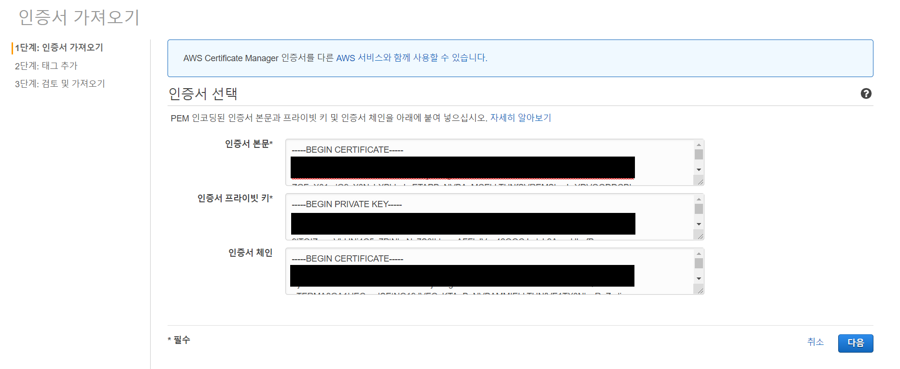
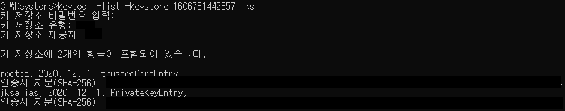
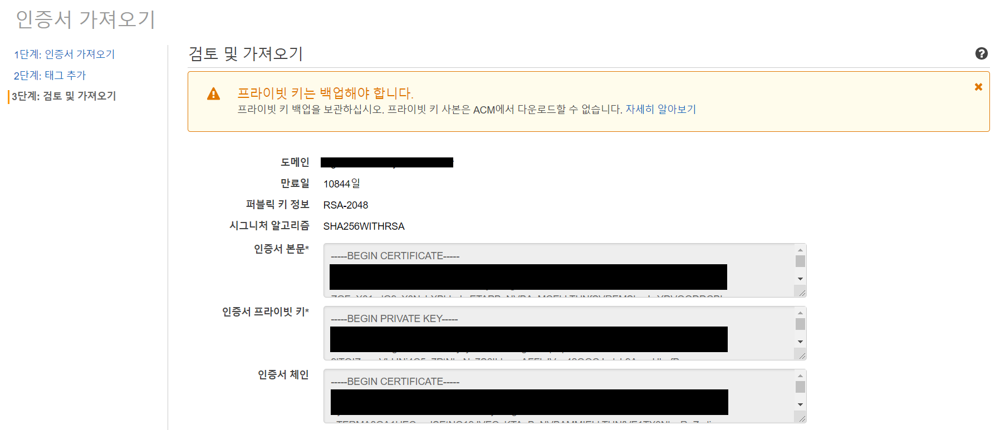
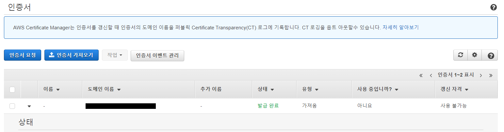

[개요]

인증업체를 통해 Keystore 파일을 받아와서 인증서를 적용하는 방식을 사용하는 고객사가 있을 수 있다. 
 자체 서명된 SSL 인증서를 ACM으로 가져오기 위해선 해당 인증서와 프라이빗 키를 제공해야 하며, 서명된 인증서일 경우 인증서 체인도 포함해야 한다. 
 따라서, SSL 암호화를 위해 쓰이는 Key 들을 모아 놓은 파일인 KeyStore가 지원하는 타입 중 기본적으로 쓰이는 Java KeyStore (JKS)로부터 pem 파일을 추출하여 이를 ACM 사설 인증서로 가져오는 방법을 작성하였음.

##### 1. keytool로 jks 파일에서 pkcs12 형태로 키를 추출

* KeyStore 기반의 인증서와 키를 관리할 수 있는 도구인 Keytool을 이용하여 JKS에서 '공개키 암호화 표준'인 pkcs12 형태로 추출한다.

* JKS 파일 경로 및 JKS 파일 패스워드로 대상 pkcs12 파일 명 및 패스워드 지정.

  `keytool -importkeystore -srckeystore {JKS 파일명}.jks -srcstoretype JKS -destkeystore {pkcs12 파일명}.p12 -deststoretype PKCS12`

  

* 이때, 기존 keystore와 동일한 패스워드를 지정해야 한다.

##### 2. OpenSSL로 pkcs12를 pem으로 변환

* Windows OpenSSL 설치

  * https://sourceforge.net/projects/openssl/files/latest/download 다운로드 후, 압축 해제.
  * ‘내 PC’ - ‘속성’ - ‘고급 시스템 설정’ - ‘고급’ - ‘환경 변수’
  * '시스템 변수’ – ‘Path’ 편집 후 ‘새로 만들기’ – OpenSSL bin 경로 추가.

  

  * '환경 변수' 탭에서 시스템 변수 새로 만들기
    * 변수 이름 : OPENSSL_CONF
    * 변수 값 : {OpenSSL 경로}\bin\openssl.conf

  

* p12 파일을 가지고, openssl을 통해 pem 형태로 변환할 수 있다.

  * OpenSSL을 이용하여 인증서 파일 추출.

    `openssl pkcs12 -in {pkcs12 파일명}.p12 -nokeys -out {인증서 파일명}.pem`

    

  * OpenSSL을 이용하여 Key 파일 추출.

    `openssl pkcs12 -in {pkcs12 파일명}.p12 -nocerts -nodes -out {key 파일명}.pem`

    

##### 3. ACM 인증서 가져오기

* 인증서 발급회사마다 제공하는 파일이 조금씩 다른데, 현재 인증서의 경우 OpenSSL 명령어를 입력하면 프라이빗 키 파일(`***_key.pem`) + 인증서 본문과 체인이 결합된 파일(`***_crt.pem`)으로 제공되므로 인증서 본문과 체인을 분리하여 'ACM 인증서 가져오기'에 활용하면 된다.

* 프라이빗키(`***_key.pem`), 인증서 본문(`***_crt.pem`), 인증서 체인(`***_chain.pem`) 파일 형태로 제공된다면 각각의 내용을 입력해주면 된다.
* ACM 인증서 가져오기

* 인증서 본문 및 체인 (`***_crt.pem`)

  

  * `keytool -list -keystore {JKS 파일명}` 명령어를 통해 인증서 목록 확인

  * PrivateKeyEntry 인증서 지문의 별칭(위에선 jksalias) 을 인증서 본문(`***_crt.pem`) 에서 찾아서 “----BEGIN CERTIFICATE----" 부터 “----END CERTIFICATE----" 까지의 내용을 삽입.

* 인증서 프라이빗 키 (`***_key.pem`)
  * “----BEGIN PRIVATE KEY----" 부터 “----END PRIVATE KEY----" 까지의 내용을 삽입.

* 검토 및 가져오기

  

* 인증서 발급 완료

  

