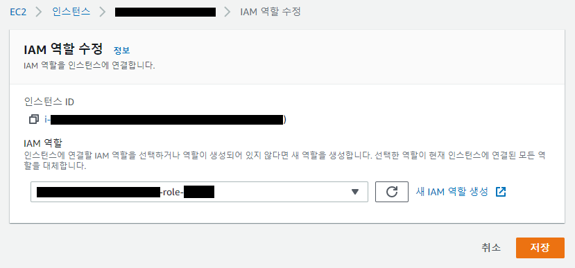

##### aws cli 를 사용하는 쉘 스크립트를 사용하려는 경우 aws cli2 버전과 iam role을 인스턴스에 적용시켜야 한다.

0. IAM 역할 생성
   * EC2 - AmazonEC2ReadOnlyAccess를 가진 역할을 하나 생성한다.
     이후 아래의 정책 두개를 생성해서 연결.
     * AMI 정책 : **EC2** 서비스 허용
     * Autoscale 정책 : **EC2 AutoScaling** 쓰기 허용

1. IAM 역할 등록



2. AWS CLI 2 버전 설치 
   (https://docs.aws.amazon.com/ko_kr/cli/latest/userguide/install-cliv2-linux.html)

   ```
   curl "https://awscli.amazonaws.com/awscli-exe-linux-x86_64.zip" -o "awscliv2.zip"
   unzip awscliv2.zip
   sudo ./aws/install
   aws --version
   ```

   * ./aws/install 해서 설치된 경로를 확인해야한다.
   
3. 쉘 스크립트를 서버에 배치
   `sudo chmod 755 LC_ASG_update.sh`
   `sudo chown user:user LC_ASG_update.sh`

4. LC_ASG_update.sh

   ```shell
   #!/bin/bash
   
   # Region (Seoul)
   Region="ap-northeast-2"
   
   # Get Instance ID, Script on Target Server
   INSTANCE_ID=$(curl http://169.254.169.254/latest/meta-data/instance-id)
   
   # Get AMI Name
   INSTANCE_Name=$(/usr/local/bin/aws ec2 describe-instances --instance-ids $INSTANCE_ID --region $Region --query 'Reservations[].Instances[].Tags[?Key==`Name`].Value[]' --output text)
   LC_ASG_Name="$INSTANCE_Name-LC_ASG"
   
   # DATE
   DATE=$(date +%Y%m%d%H%M%S)
   
   # AMI Name
   AMI_NAME="$LC_ASG_Name-$DATE"
   AMI_DESCRIPTION="$LC_ASG_Name-$DATE-$INSTANCE_ID"
   
   # Creates an image (AMI) of the EC2 instance
   #if [[ -z "$Instance_state" ]]; then
   printf "Requesting AMI for instance $INSTANCE_ID...\n"
   /usr/local/bin/aws ec2 create-image --instance-id $INSTANCE_ID --name $AMI_NAME --description $AMI_DESCRIPTION --region $Region --no-reboot
   #fi
   
   if [ $? -eq 0 ]; then
           printf "AMI request complete!\n"
   fi
   
   # Creates Tags of the Snapshot and AMI
   sleep 300
   
   AMI_NAME="$LC_ASG_Name-$DATE"
   AMI_ID=$(/usr/local/bin/aws ec2 describe-images --region $Region --owner self --query "Images[?Name =='$AMI_NAME'].[ImageId]" --output text)
   
   # AMI Tag Create
   /usr/local/bin/aws ec2 create-tags --resources $AMI_ID --tags Key=Name,Value=$LC_ASG_Name-$DATE --region $Region
   sleep 5
   
   # snapshot Tag Create
   Tag_array=($(/usr/local/bin/aws ec2 describe-images --image-ids $AMI_ID --region $Region --output text --query 'Images[*].BlockDeviceMappings[*].Ebs.SnapshotId'))
   
   for (( i=0; i<${#Tag_array[@]}; i++ ))
   do
           echo "Tagging snapshot: ${Tag_array[$i]}"
           /usr/local/bin/aws ec2 create-tags --resources ${Tag_array[$i]} --tags Key=Name,Value="$AMI_NAME" --region $Region
   done
   
   ##### Start LaunchConfigurations create and ASG update #####
   aws ec2 describe-images --region $Region --image-ids $AMI_ID --query 'Images[].BlockDeviceMappings[]' --output json > webblock.json
   
   echo "--------------------------------------------------------------"
   echo "$DATE"
   echo "--------------------------------------------------------------"
   
   # Create launch configuration's userdata
   
   cat <<EOF > userdata.txt
   #!/bin/bash
   # 시작 구성의 userdata를 입력
   EOF
   
   if [ x$AMI_ID != x ]; then
           printf " Requesting AutoScaling Launch Configuration for $AMI_ID ...\n"
   
           # Create Autoscaling Launch Configuration
           AS_LC_NAME="시작 구성 이름"
           # --- Modify ---
           KEY="키페어 이름"
           #IAM_PROF="blank"
           # --- Modify ---
           SG="보안그룹1 보안그룹2"
           #SG="sg-01234 sg-56789"
           # --- Modify ---
           aws autoscaling create-launch-configuration --region $Region --launch-configuration-name $AS_LC_NAME --key-name $KEY --image-id $AMI_ID --instance-type 인스턴스타입 --associate-public-ip-address --security-groups $SG --instance-monitoring Enabled=false --user-data file:///home/ec2-user/userdata.txt --block-device-mappings file:///home/ec2-user/webblock.json
   
           if [ $? -eq 0 ]; then
   
                   printf " AutoScaling Launch Configuration created !\n"
   
                           # Update Autoscaling Group
                           ASG_NAME="오토스케일링 그룹 명" #Edit Line
                           aws autoscaling update-auto-scaling-group --region $Region --auto-scaling-group-name $ASG_NAME --launch-configuration-name $AS_LC_NAME
   
                           # Check Resources
                           if [ $? -eq 0 ]; then
   
                           printf " AutoScaling Group Update Completed !\n"
   
   
                           ASG_NAME_Check=$(aws autoscaling describe-auto-scaling-groups --region $Region --query "AutoScalingGroups[?AutoScalingGroupName =='$ASG_NAME'].[AutoScalingGroupName]" --output text)
                           LC_NAME_CHECK=$(aws autoscaling describe-launch-configurations --region $Region --query LaunchConfigurations"[?LaunchConfigurationName =='$AS_LC_NAME'].[LaunchConfigurationName]" --output text)
                           ASG_AMI_ID=$(aws autoscaling describe-launch-configurations --region $Region --query LaunchConfigurations"[?LaunchConfigurationName =='$AS_LC_NAME'].[ImageId]" --output text)
                           ASG_AMI_NAME=$(aws ec2 describe-images --region $Region --owner self --query "Images[?ImageId =='$ASG_AMI_ID'].[Name]" --output text)
   
                           printf " AutoScaling Group Name : $ASG_NAME_Check \n"
                           printf " AutoScaling Launch Configuration Name : $LC_NAME_CHECK \n"
                           printf " AutoScaling AMI Name : $ASG_AMI_NAME($ASG_AMI_ID) \n"
   
                           fi
   
                   else
                           echo " Failed to Create AutoScaling Launch Configuration "
           fi
   
   else
       echo " AMI is not exist"
   fi
   
   echo " "
   
   
   ```

   

   

   