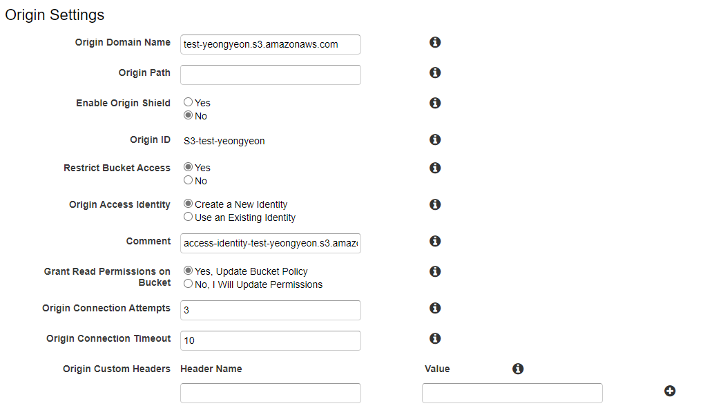
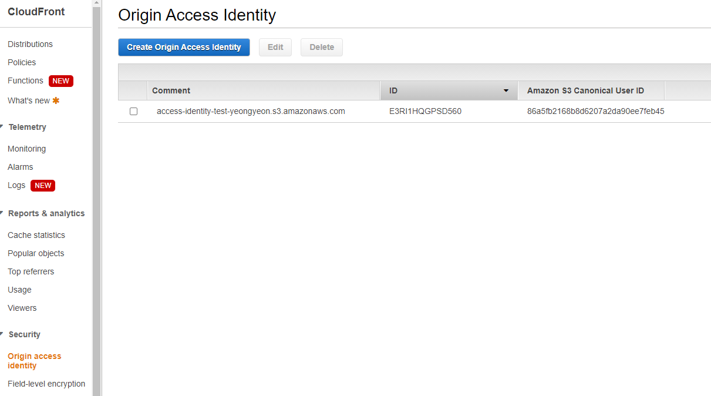
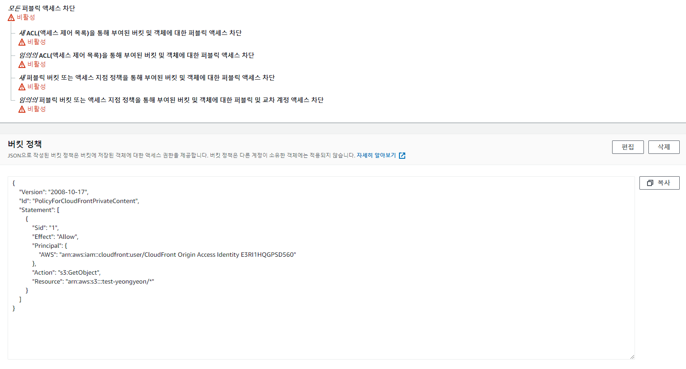

참고 : https://aws.amazon.com/ko/premiumsupport/knowledge-center/cloudfront-access-to-amazon-s3/

* Restrict Bucket Access : Yes
* Origin Access Identity : 새로 생성하거나, 미리 생성해 둔 OAI 생성
* Grant Read Permissions on Bucket : Yes, Update Bucket Policy 선택하여 `s3:GetObject`에 대한 OAI 액세스 권한을 부여

* OAI의 ID를 이후 S3 정책에 등록할 것.

* S3 버킷 정책이 등록된 모습
* OAI에서 버킷에 대한 액세스를 금지하는`"Effect": "Deny" ` 구문이 있는지 검토
* OAI가 아닌 소스에서 버킷으로 액세스를 허용하는 ` "Effect": "Allow"` 구문이 있는지 검토

