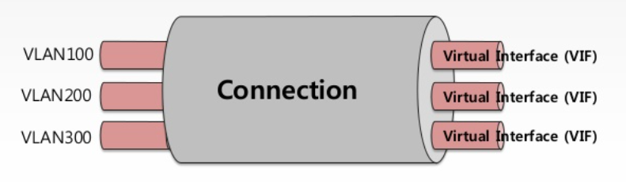
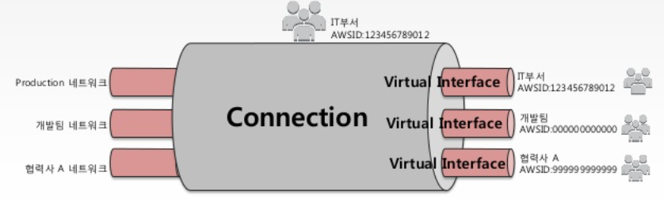
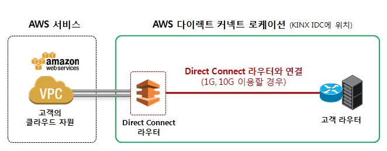
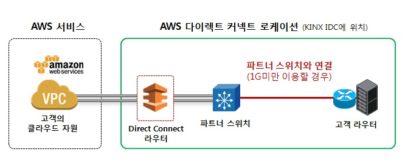
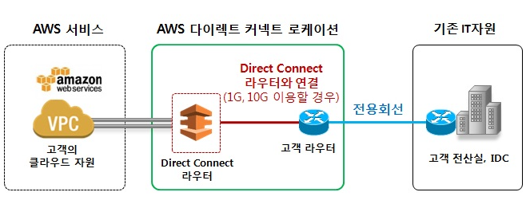

#### Direct Connect (DX) 개념

* 고객의 기존 IT 자원과 AWS 간에 인터넷이 아닌 전용 네트워크로 연결하여 데이터를 송수신할 수 있는 상품.

#### Connection & Virtual Interface

* Connection : 물리 인터페이스

* Virtual Interface : Connection 중 논리 인터페이스를 나타냄, 각각 고유햔 VLAN ID를 가짐.

  

  * Connection을 가진 AWS 계정에서 다른 AWS 계정에 VIF를 제공하는 것이 가능.

  

#### AWS Direct Connect Location

* Direct Connect를 제공하기 위해 라우터 등의 각종 장비를 구성한 물리적 IDC
* Driect Connect를 이용하기 위해선 Direct Connect Location에 위치한 라우터와 물리적으로 연결되어야 함.
* 대한민국 로케이션은 KINX IDC에 구성되어 있음.

#### AWS Direct Connect Partner

* AWS는 자체 파트너 프로그램 (AWS Partner Network, APN)을 운영
* AWS 다이렉트 커넥트를 이용하려면 반드시 파트너의 지원이 필요

#### 장점

1. 대역폭 및 성능 향상
2. 일관된 성능 및 지연(Latency)
3. Traffic 비용 절감

#### 구성 방식

고객의 기존 IT 자원이 어디 있냐에 따라 두 가지로 구분

1. AWS 다이렉트 커넥트 로케이션과 동일한 IDC에 있는 경우

   * Direct Connect 라우터와 연결 (1G, 10G 포트 속도로 Direct Connect 이용할 경우)

     

   * 파트너 스위치와 연결 (1G 미만 포트속도로 Direct Connect 이용할 경우)

     

2. 다른 IDC 에 있는 경우

   * 전용회선을 통한 두 지점 간 연결이 필요

     

위 방식들 모두 Cross-connect를 요청해야 한다.

* Cross-connect
  * 데이터센터 내에서 고객의 장비와 다른 사업자의 장비간에 데이터 송수신이 필요할 경우 두 지점을 물리적인 회선으로 연결해주는 서비스

* BGP (Border Gateway Protocol)
  * Direct Connect 라우터와 고객 라우터는 BGP를 통해 통신, 즉 서로 데이터를 주고 받는다.

