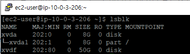
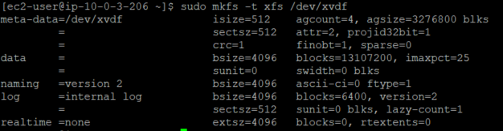
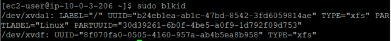
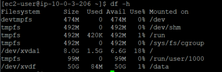

### Task

서버에 볼륨 -> Linux에 50GB / SSD 범용 / Linux 디바이스 : /dev/sdf, /dev/sdp는 임의로 / Linux 하드 확인하는 명령어

1. 볼륨 포맷 / 볼륨 종류
2. 포맷 이후 마운트 확인
3. 서버 Reboot 하면 아마 mount가 풀릴 것.
4. 서버 재시작 해도 mount가 유지되도록 하드가.
   /etc/fstab root device volume 붙어서 올라옴 보통. 여기에 추가시키면 Server가 여기를 읽으면 서 올라오면서 재시작되면서 자동으로 올라올 것.

### EBS 볼륨

##### Amazon EBS는 Ec2 인스턴스에 사용할 수 있는 블록 수준 스토리지 볼륨을 제공.

* 내구성이 있는 블록 수준 스토리지 디바이스이며 인스턴스를 연결하는 것이 가능.
* 볼륨을 인스턴스에 연결하면 물리적 하드 드라이브처럼 사용할 수 있다.

* 볼륨 유형
  * SSD 지원 볼륨 : 작은 I/O 크기의 읽기/쓰기 작업을 자주 처리하는 트랜잭션 워크로드에 최적화(IOPS).
  * HDD 지원 볼륨: 대용량 스트리밍 워크로드에 최적화되어 있음, IOPS보다는 처리량이 성능 측정 기준.


* /dev/sdf

### EBS 볼륨을 Linux에서 포맷 및 탑재

* 연결된 볼륨은 아직 탑재되지 않은 /dev/xvdf 이다. (lsblk 명령어에서 /dev/ 생략)



* ``` $ lsblk ```
* Linux 하드 확인.

* 볼륨에 파일 시스템이 있는지 확인. 
* 새 볼륨은 원시 블록 디바이스이므로 볼륨을 탑재하고 사용하기 전에 해당 볼륨에서 파일 시스템을 생성해야 한다.


* file -s 명령을 사용하면 파일 시스템 유형 등의 디바이스 정보를 확인할 수 있다.</br>
  -> data만 표시된다면, 디바이스에는 파일 시스템이 없으며 사용자가 직접 생성해야 한다.



* ``` $ sudo mkfs -t xfs /dev/xvdf ```

* 빈 볼륨이 있다면, **mkfs -t** 명령을 이용해 볼륨에서 파일 시스템을 생성.
  * 이미 데이터가 있는 볼륨(스냅샷에서 생성된 볼륨)
  * mkfs.xfs이 발견되지 않는 경우 XFS 도구를 설치 한다.
    * ``` $ sudo yum install -y xfsprogs ```

* ``` $ sudo mkdir /data ```
  * **mkdir** 명령을 사용하여 볼륨에서 사용할 탑재 지점 디렉터리를 생성합니다.</br>
    마운트 포인트는 파일 시스템 트리에 볼륨이 위치하고 볼륨을 마운트한 후 파일을 읽고 쓰는 위치.
* ``` $ sudo mount /dev/xvdf /data ```
  * 이전 단계에서 생성한 디렉터리에 볼륨을 탑재합니다.


* 마운트 포인트가 /data로 설정됨을 확인.

---

### 재부팅 후에도 연결된 볼륨을 자동으로 탑재

* /etc/fstab 파일에 추가한다.



1. **blkid** 명령을 사용하여 디바이스의 UUID를 찾는다.
   * ``` $ sudo blkid ```
2. ``` $ sudo vi /etc/fstab ```


3. 디바이스를 지정된 탑재 지점에 탑재한다.
   * 필드는 blkid가 반환하는 UUID 값, 탑재 지점, 파일 시스템, 권장하는 파일 시스템 옵션.


4. 디바이스 탑재를 해제하고 /etc/fstab에서 모든 파일 시스템을 탑재한다.




