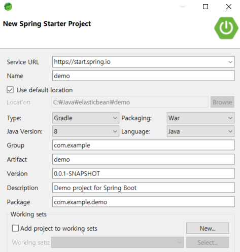
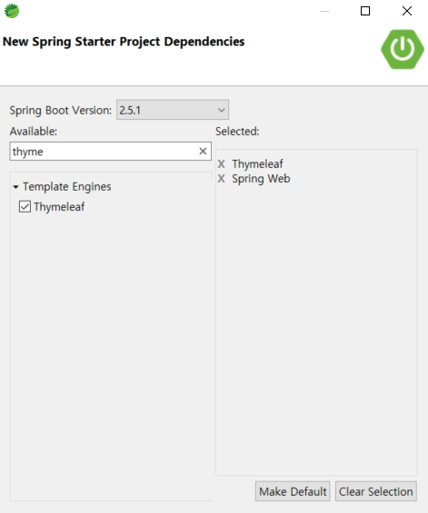

1. Spring 프로젝트 생성

   * War로 배포할 것

   

   

   * Controller와 .html 파일 생성

     

     ```html
     <!DOCTYPE html>
     <html lang="ko" xmlns:th="http://www.thymeleaf.org">
     <head>
     	<meta charset="UTF-8">
     	<title>SpringBoot</title>
     </head>
     <body>Hello World!!
     </body>
     </html>
     ```

   * War 파일 생성

     * 추후 jenkins에서 build 후 생성 된 war 파일을 쉽게 검색하기 위해 생성되는 파일명을 `application.war` 로 변경한다.

     ```
     bootWar { 
     	archiveFileName = 'application.war' 
     }
     ```

     * `build.gradle` 에 코드를 추가한다.

   * ㅇ

   * ㅇ

   * ㅇ

   * 

2. 