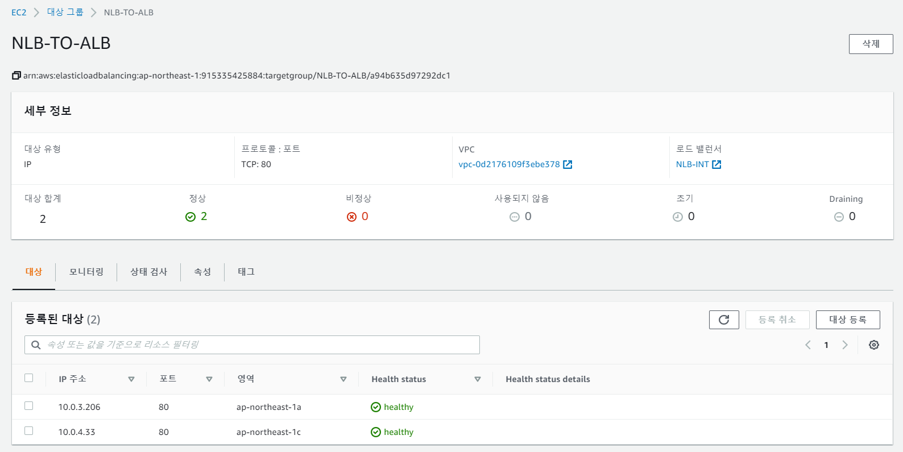
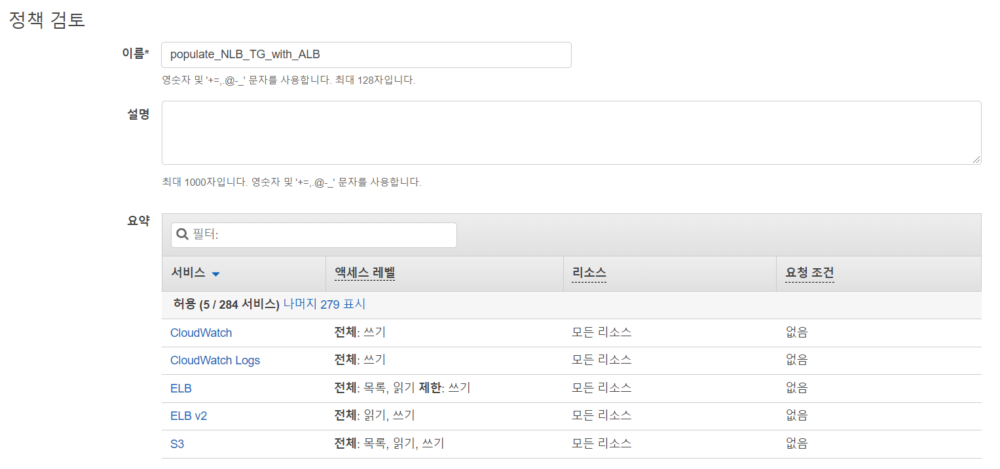
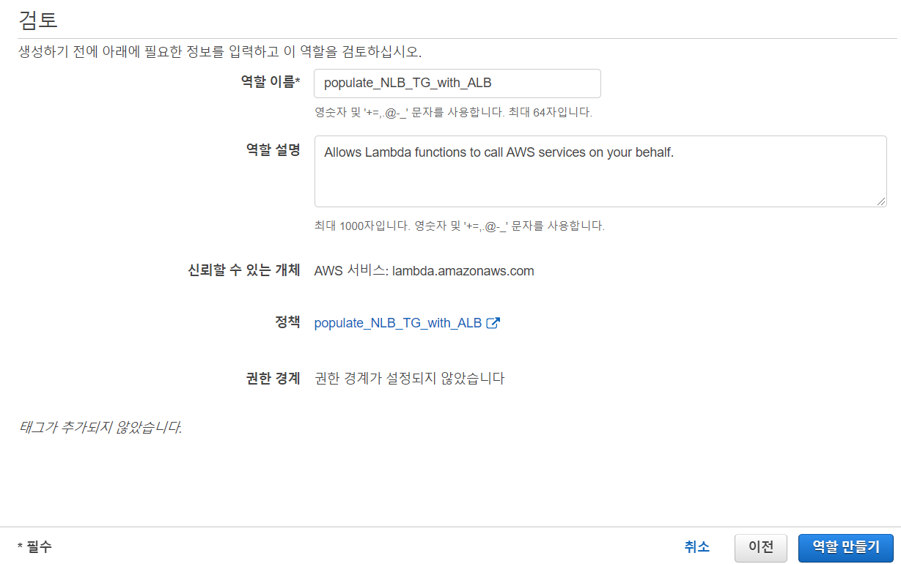
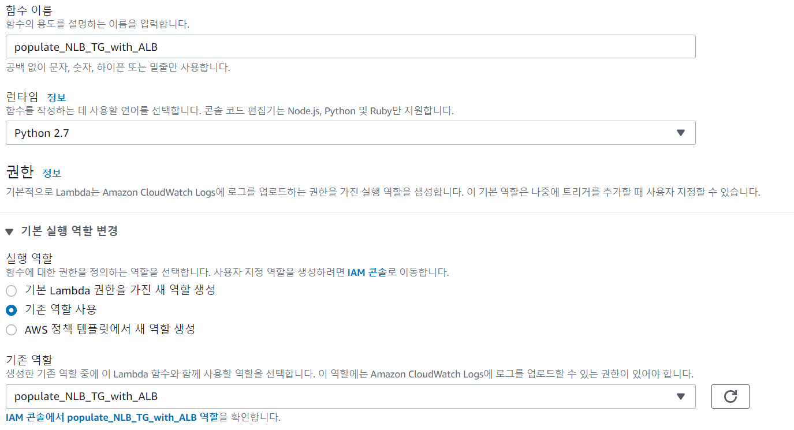
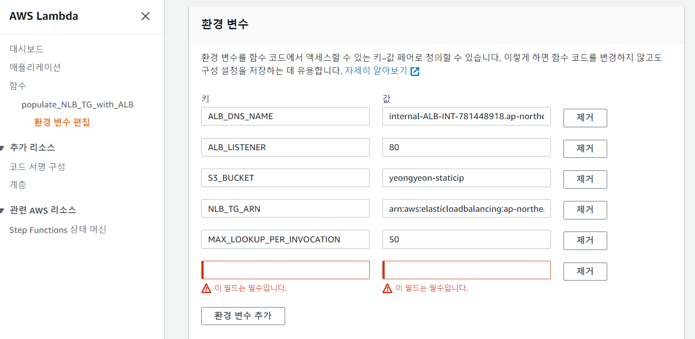
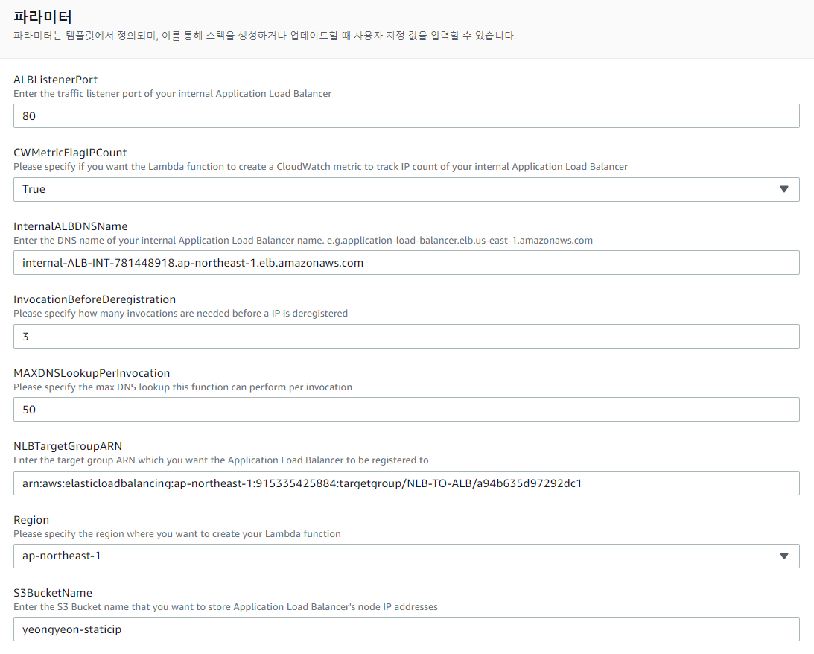
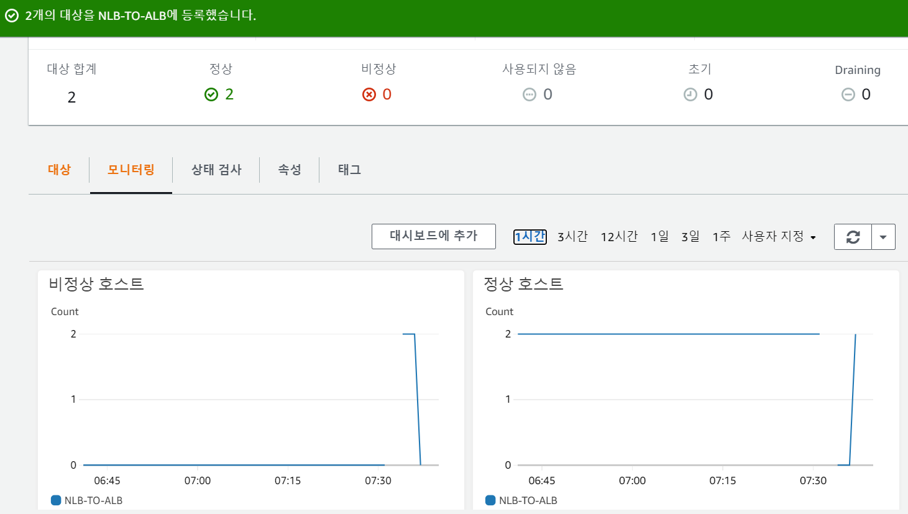

#### ALB에 고정 IP를 사용하는 방법

 	1. ALB 앞 단에 NLB를 두고, ALB의 IP 주소가 변경되는 것을 Lambda 함수가 확인하여 변경 시 NLB의 Target IP를 지속적으로 업데이트
 	2. AWS Global Accelerator를 사용하여 애플리케이션 엔드 포인트에 대한 고정 진입점 역할을 하는 방법

이 중 1번 과정으로 생성한다.

참고 자료 : *https://aws.amazon.com/ko/blogs/korea/using-static-ip-addresses-for-application-load-balancers/* 

#### 구성 방법

1. NLB에 트래픽을 받아 내부 ALB로 넘기는 TCP 리스너를 생성. ALB는 TLS 처리를 하고 HTTP 헤더를 검사한 후 Rule에 기반하여 요청을 인스턴스, 서버, 컨테이너들로 구성된 대상 그룹에 라우팅한다.
2. AWS Lambda 함수는 ALB의 IP 주소들이 바뀌는 것을 감시하고 있다가 NLB의 대상 그룹에 업데이트하여 동기화 한다.
3. 고정 IP로 쉽게 방화벽에 화이트 리스팅하여 ALB의 장점을 활용한다.

이 솔루션은 AWS 관리 콘솔을 이용하거나, CloudFormation 템플릿을 이용한다. 

CloudFormation은 https://s3.amazonaws.com/exampleloadbalancer-us-east-1/blog-posts/static-ip-for-application-load-balancer/template_poplulate_NLB_TG_with_ALB.json

Lambda는 https://s3.amazonaws.com/exampleloadbalancer-us-east-1/blog-posts/static-ip-for-application-load-balancer/populate_NLB_TG_with_ALB.zip

에서 받는다.

---

### 1. AWS 관리 콘솔로 설정하는 법

#### 사전 준비

1. ALB, NLB를 같은 가용 영역안에 생성.

   * 클라이언트가 VPC 안에 있다면 내부 NLB, 이외엔 외부 NLB를 준비.
     * 외부 NLB인 경우 Elastic IP를 미리 두 개 할당.
   * NLB 대상 그룹은 IP 주소 기반으로 생성. 대상 그룹의 프로토콜을 TCP로 지정. (추후 Lambda 함수가 이 대상그룹에 ALB의 주소를 등록)
   * 내부 ALB 생성. (HTTPS 처리)

   1. ALB 대상그룹에 EC2 (서비스 할 WEB or WAS)

   2. NLB 타겟 그룹에 ALB 넣기

   

   

2. ALB IP 주소 등의 정보를 담을 S3 버킷을 준비.

3. IAM 역할을 준비

#### STEP 1 : IAM 정책 생성

#### STEP 2 : IAM 역할 만들기

#### STEP 3 : Lambda 함수 만들기

#### STEP 4 : Lambda 함수 설정

* Lambda 함수를 생성하여 ZIP 파일을 업로드

#### STEP 5 : Lambda 환경변수 설정

- ALB_DNS_NAME : ALB의 전체 DNS이름 (FQDN)
- ALB_LISTENER : ALB의 리스너의 통신 포트
- S3_BUCKET : Lambda 함수의 실행 간에 변경을 추적하기 위한 버킷
- NLB_TG_ARN : NLB의 대상그룹의 ARN
- MAX_LOOKUP_PER_INVOCATION : 실행 시 DNS 조회 최대 횟수. 기본 값은 CloudFormation 템플릿에서 50으로 설정
- INVOCATIONS_BEFORE_DEREGISTRATION : IP 주소가 등록해지 되기 위해 필요한 실행 횟수. 기본 값은 CloudFormation 템플릿에서3회
- CW_METRIC_FLAG_IP_COUNT : IP주소 카운트를 위한 CloudWatch 지표 컨트롤 플래그. 기본 값은CloudFormation 템플릿에서 ‘true’

이후 진행 과정은 추후 작성.(CloudFormation 방식이 더 나은 듯)

#### Lambda 함수 작업 과정

1. ALB에서 쓰이는 IP 주소들을 DNS 쿼리로 알아온 뒤 S3 버킷에 결과(NEW IP LIST)를 업로드
2. [describe-target-health](https://docs.aws.amazon.com/cli/latest/reference/elbv2/describe-target-health.html) API 액션으로 현재 NLB에 등록된 IP 주소들의 리스트(REGISTERED LIST)를 가져옴
3. 이전의 IP 주소 리스트(OLD LIST)를 다운로드함. 만약에 이번이 첫 Lambda 함수의 실행이라면 IP 주소 리스트는 비어있음
4. NEW LIST를 Lambda 함수의 CloudWatch Logs 로그스트림에 출력함. 이는 ALB에서 쓰이던 IP 주소들을 찾는데 쓰일 수 있음
5. 첫 실행에서 만들어졌던 내부 ALB IP주소들의 갯수를 추적하는 CloudWatch 지표를 업데이트 함 이 지표는 얼마나 많은 IP주소들이 그 동안 변경되었는지 보여줌. CW_METRIC_FLAG_IP_COUNT를 ‘false’로 설정하여 비활성화 시킬 수 있음. 여기에 ALB의 IP주소가 20개에서 24개, 그 다음에는 28개로 변하는 것을 보여주는 CloudWatch 지표의 예제가 있음.
6. OLD LIST나 REGISTERED LIST에 있는 것을 제외한 NEW LIST에 있는 IP 주소들을 NLB에 등록함.
7. OLD LIST 중 NEW LIST에 없는 IP주소들은 등록해지함.

---

### 2. AWS CloudFomation을 사용하여 설정하기

템플릿 : https://s3.amazonaws.com/exampleloadbalancer-us-east-1/blog-posts/static-ip-for-application-load-balancer/template_poplulate_NLB_TG_with_ALB.json

템플릿이 생성하는 AWS 리소스

* Lambda 함수
* Lambda 함수에서 사용되는 IAM 정책과 역할
* CloudWatch Event

1. CloudFormation 스택 생성

   

2. NLB IP를 제대로 잘 잡는지 테스트

   

   * 기존에 ALB IP로 잡아두었던 타겟들을 deregister 하고 ALB IP와 다른 IP를 삽입하였더니 unhealty를 탐지하고 바로 활성화된 ALB IP를 찾아 등록해준 모습.

