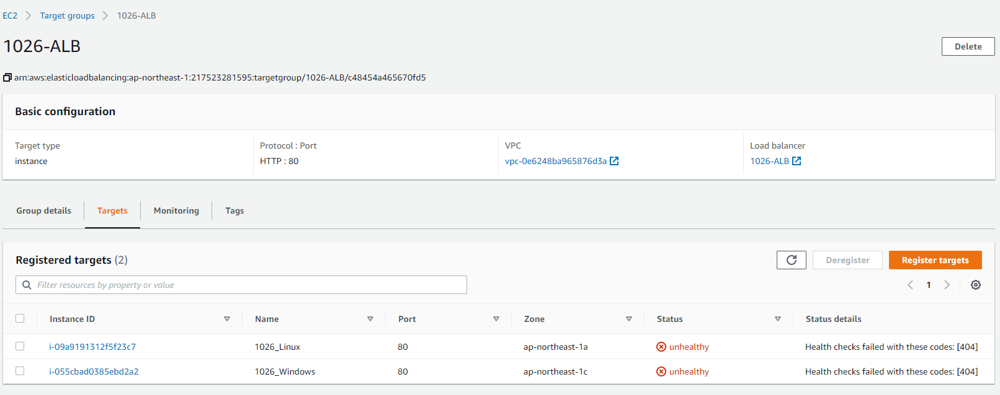
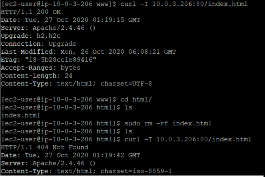

#### Task

* Target - healthy 경로 변경 후 (healthy 잘 떨어 지는지?)

* ppt에 var/www/html/index.html 만들기 이전 index.html 기본적으로 참고하는 그 이유 오류를 한페이지 정도 일부러 넣어주자.

---

### ELB 상태 확인 - healthy

기본적으로 로드 밸런서는 포트 80에서 TCP 연결을 열도록 구성되어 있다.

EC2 인스턴스에 트래픽을 제대로 전달하는지 확인.

Ping은 네트워크를 통해 특정한 호스트에 트래픽이 도달할 수 있는지를 테스트하는데 쓰이며, Ping을 실행할 프로토콜, 포트, 경로를 설정.

예를 들어 Health check path를 /var로 지정하면 상태 확인 URL은 HTTP:80/var로 설정된다.

* 상태 확인 URL은 항상 애플리케이션에서 제공하는 경로로 설정해야 합니다. => 인스턴스에 설치한 Apache 웹서버의 기본경로에 index.html이 없어서 Health Check -> OutOfService로 나올 것.

* /var

* /index.html

* curl -I PRIVATE_IP:PORT/healthy check path
