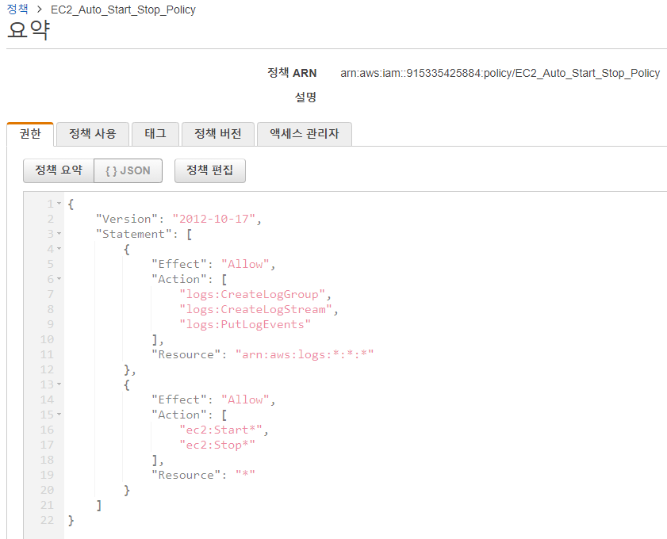
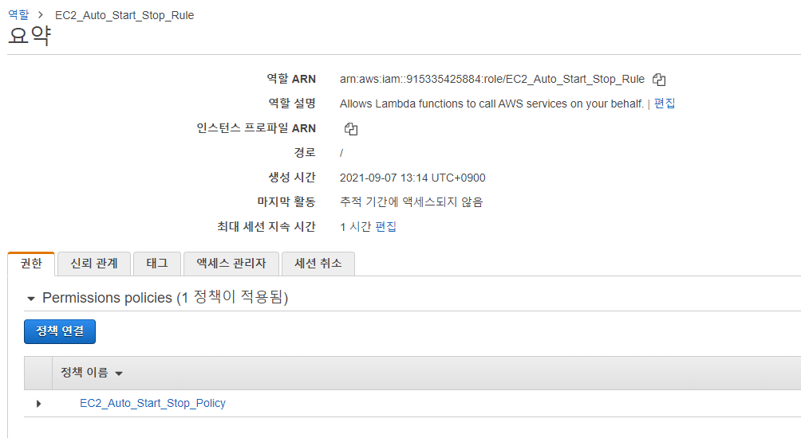
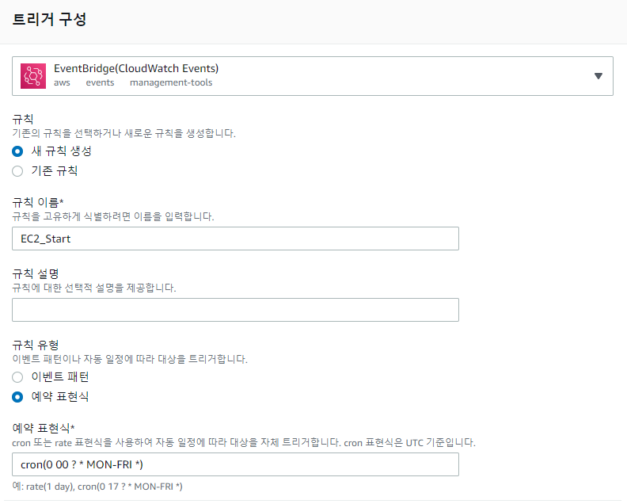
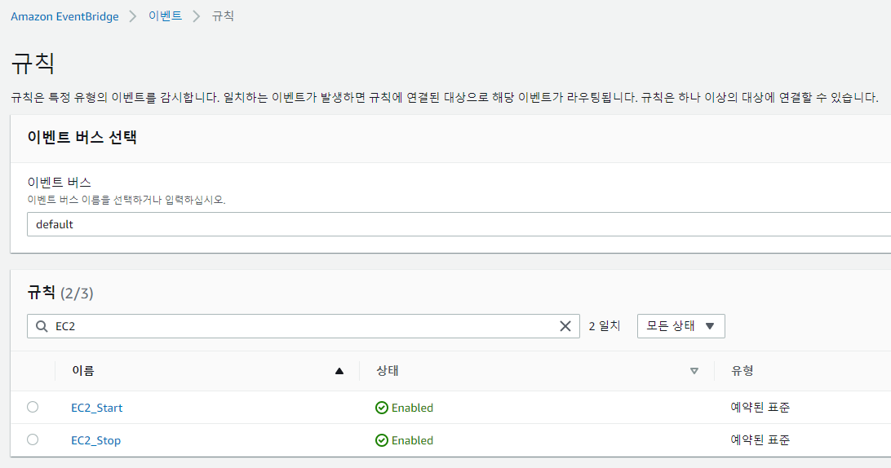

[Lambda를 사용하여 EC2 인스턴스를 정기적으로 중지 및 시작하기 (amazon.com)](https://aws.amazon.com/ko/premiumsupport/knowledge-center/start-stop-lambda-cloudwatch/)

위 문서를 참고하여 진행하였으며, 순서는 다음과 같다.

1. Lambda 함수에 대한 AWS Identity and Access Management(IAM) 정책 및 실행 역할을 생성합니다.
2. EC2 인스턴스를 중지 및 시작하는 Lambda 함수를 생성합니다.

3. 예약에 따라 함수를 트리거하는 Amazon EventBridge 규칙을 생성합니다.

---

#### 1. IAM 정책 및 역할 생성

1-1. EC2_Auto_Start_Stop_Policy 정책 생성



1-2. EC2_Auto_Start_Stop_Rule 역할 생성 - 위에서 생ㅅ어한 정책을 연결해준다.



```json
{
  "Version": "2012-10-17",
  "Statement": [
    {
      "Effect": "Allow",
      "Action": [
        "logs:CreateLogGroup",
        "logs:CreateLogStream",
        "logs:PutLogEvents"
      ],
      "Resource": "arn:aws:logs:*:*:*"
    },
    {
      "Effect": "Allow",
      "Action": [
        "ec2:Start*",
        "ec2:Stop*"
      ],
      "Resource": "*"
    }
  ]
}
```

----

#### 2. EC2 인스턴스 중지 및 시작하는 Lambda 함수 생성

* 생성시 Python 3.8 버전을 선택하고, 전 단계에서 생성한 IAM 역할을 지정


* 이후 Stop 함수와 Start 함수를 각각 만들어 준 뒤 각각 아래의 코드를 넣는다.</br>
  이때, **region**과 **instances**는 올바르게 변경해주어야 한다.

2-1. Stop 함수 생성.

```python
import boto3
region = 'ap-northeast-2' # modify 1
instances = ['i-02bc4dc26b3d938eb', 'i-091d8aec6ceeb16f8'] # modify 2
ec2 = boto3.client('ec2', region_name=region)

def lambda_handler(event, context):
    ec2.stop_instances(InstanceIds=instances)
    print('stopped your instances: ' + str(instances))
```

2-2. Start 함수 생성.

```python
import boto3
region = 'ap-northeast-2'
instances = ['i-02bc4dc26b3d938eb', 'i-091d8aec6ceeb16f8']
ec2 = boto3.client('ec2', region_name=region)

def lambda_handler(event, context):
    ec2.start_instances(InstanceIds=instances)
    print('started your instances: ' + str(instances))
```

---

#### 3. Amazon EventBridge 생성 및 테스트




* UTC 기준으로 계산하여 월요일 - 금요일 아침 9시에 인스턴스가 시작될 수 있도록</br>
  Cron식에 Start는`cron(0 00 ? * MON-FRI *)` Stop은 `cron(0 09 ? * MON-FRI *)`를 입력해준다.  </br>

  해당 내용은 다음을 참조 [Schedule Expressions for Rules - Amazon CloudWatch Events](https://docs.aws.amazon.com/AmazonCloudWatch/latest/events/ScheduledEvents.html)

* 생성된 EventBridge

