### VPC

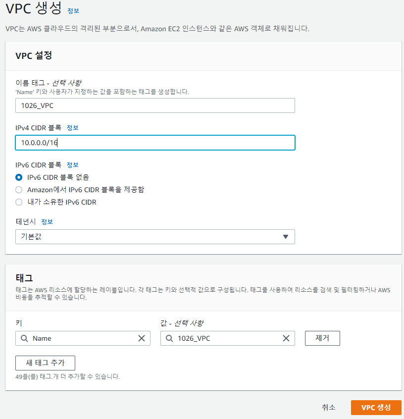

* VPC(Virtual Private Cloud) : 사용자의 AWS 계정 전용 가상 네트워크로, 사용자가 정의한 가상 네트워크로 AWS 리소스를 시작할 수 있다.

---

### Subnet

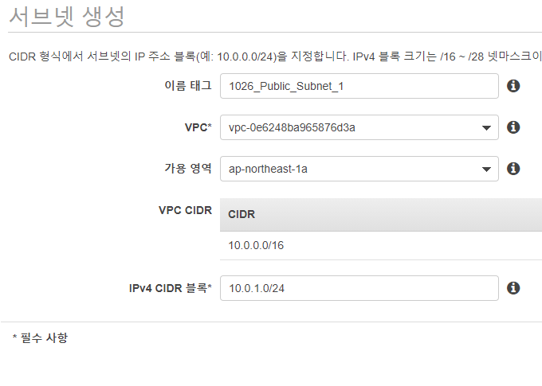

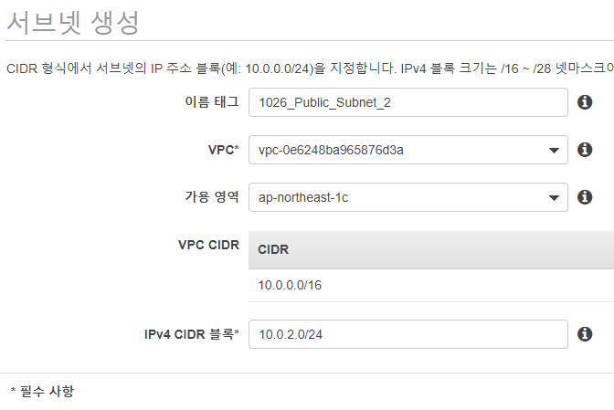

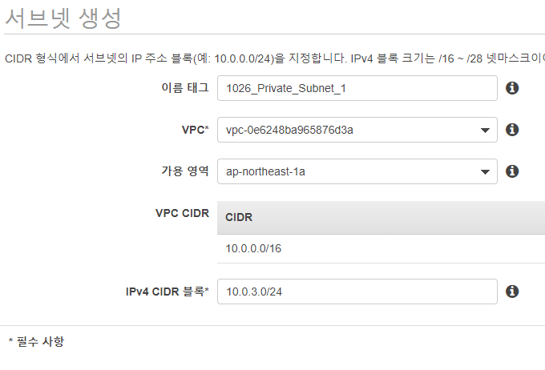

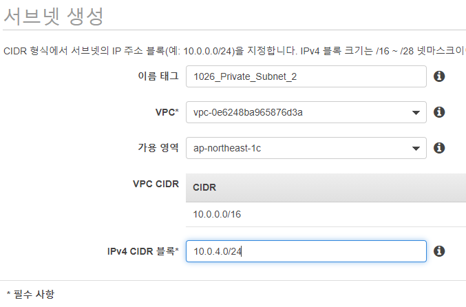

* Subnet : VPC의 IP 주소 범위.
* public, private 2개씩 생성.(홀수는 가용영역 1a / 짝수는 가용영역 1c)

---

### Internet Gateway

* 인터넷 게이트웨이를 VPC에 연결하여, VPC와 인터넷과의 통신을 활성화한다.
* VPC의 리소스와 인터넷 간의 통신을 활성화 하기 위해.

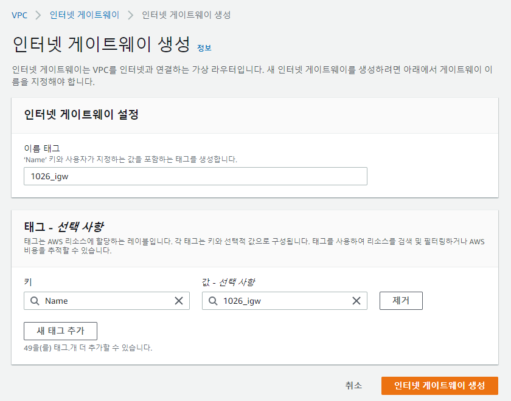

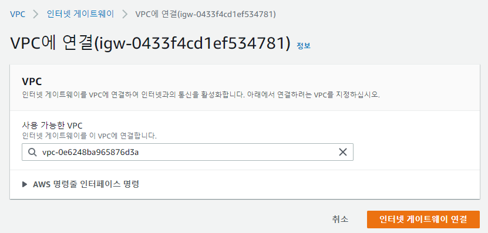

---

### NAT

* NAT 게이트웨이를 생성하고 탄력적 IP 주소를 할당합니다.
* NAT 게이트웨이를 생성한 후, 인터넷 트래픽이 NAT 게이트웨이를 가리키도록 프라이빗 서브넷의 라우팅 테이블을 업데이트합니다.
* Private Subnet 내의 웹 서버들이 외부로 통신을 하기 위해서 보통 NAT 서버를 Public Subnet 안에 구축하여 NAT를 통해 외부로 통신을 합니다.

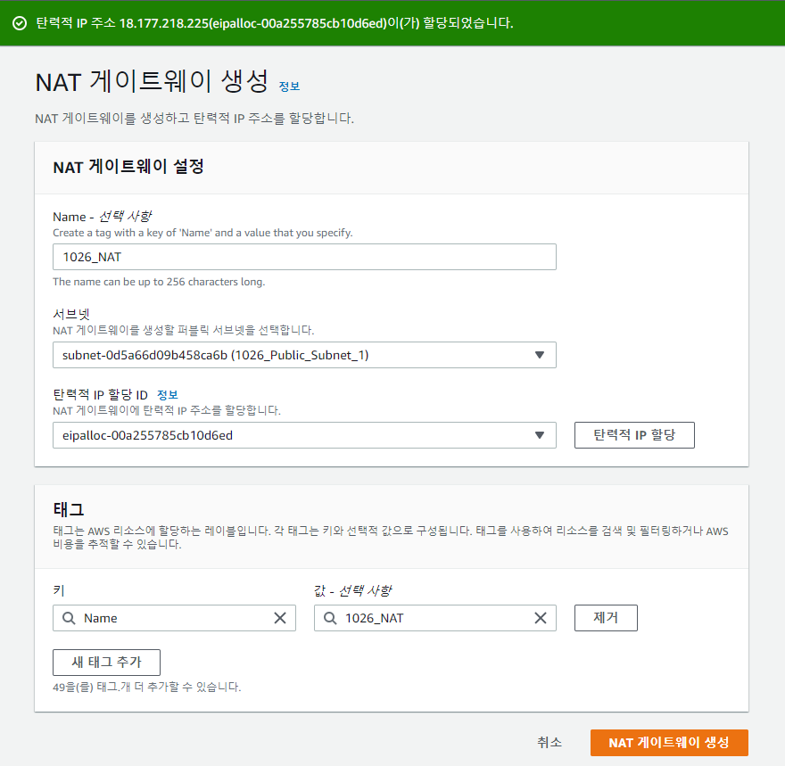

---

### Routing Table

* 라우팅 테이블은 서브넷 또는 게이트웨이의 네트워크 트래픽이 전송되는 위치를 결정.

#### 1. Public Routing - IGW

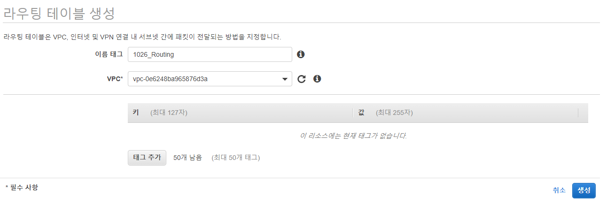

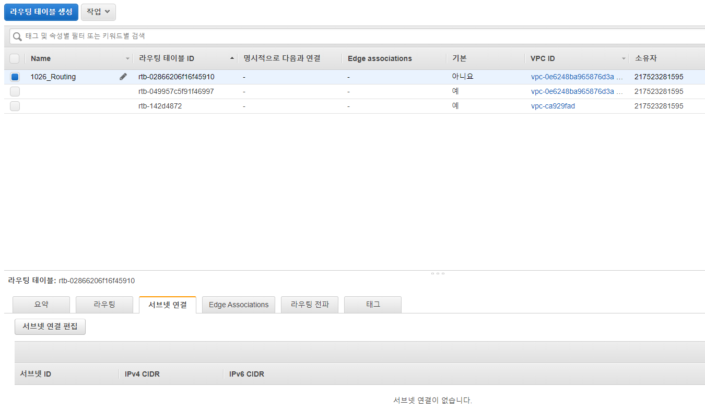

* '서브넷 연결' - 서브넷 연결 편집.

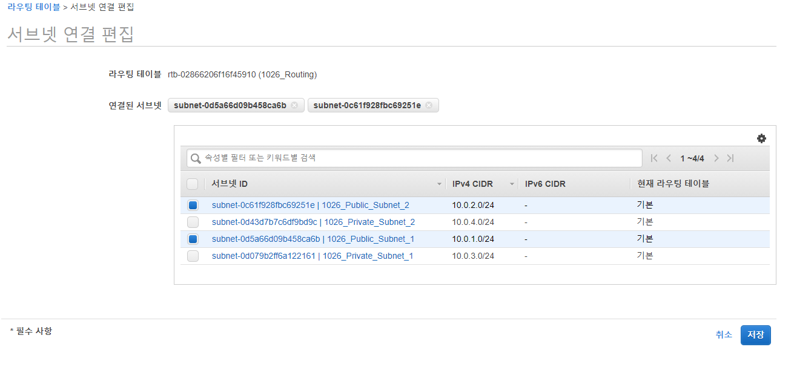

* Public Subnet 연결.

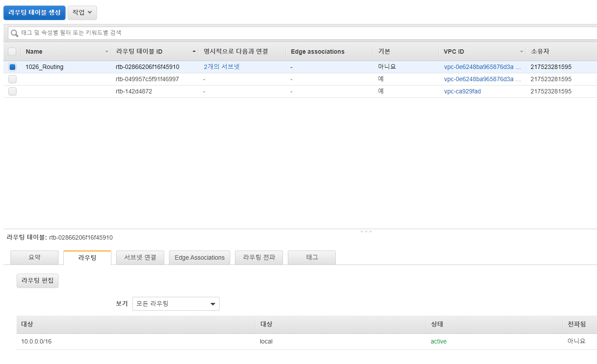

* '라우팅' - 라우팅 편집.

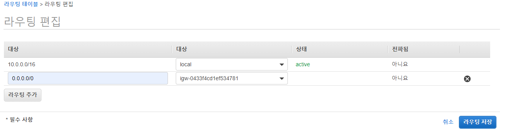

* 서브넷이 인터넷 게이트웨이를 통해 인터넷에 액세스 할 수 있도록 서브넷 라우팅 테이블에 다음 라우팅을 추가.
* 이전에 생성한 **Internet gateway**를 잡는다.
  * 0.0.0.0/0은 모든 네트워크를 의미하며 인터넷과의 연결을 위한 것.

#### 2. Private Routing - NAT

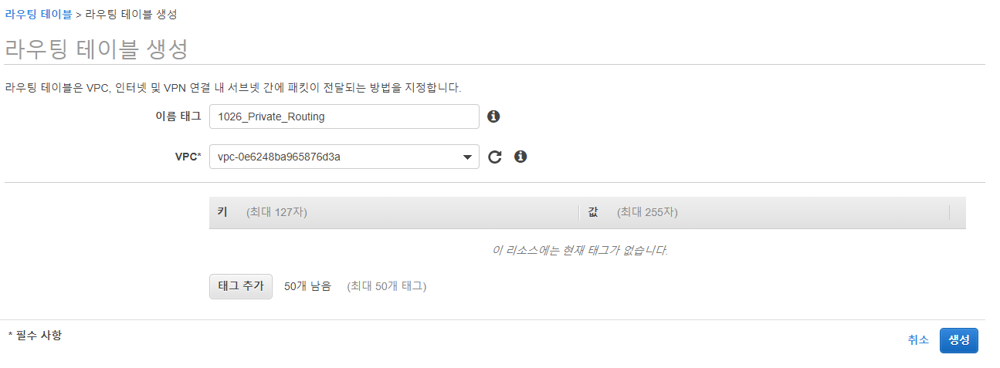

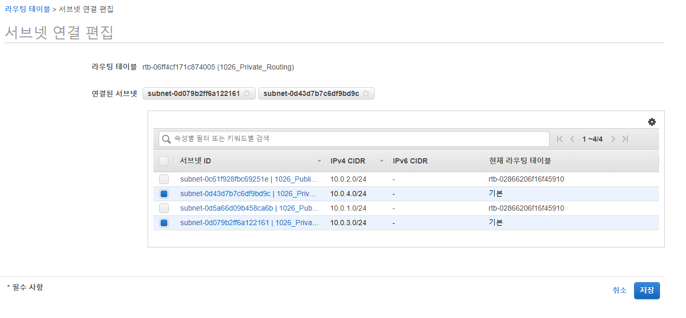

* Public과 동일하게 생성하고 서브넷 연결.

* '라우팅' - 라우팅 편집 - 이전에 생성한 **NAT**를 잡는다.

---

### EC2 인스턴스 생성

**Linux**

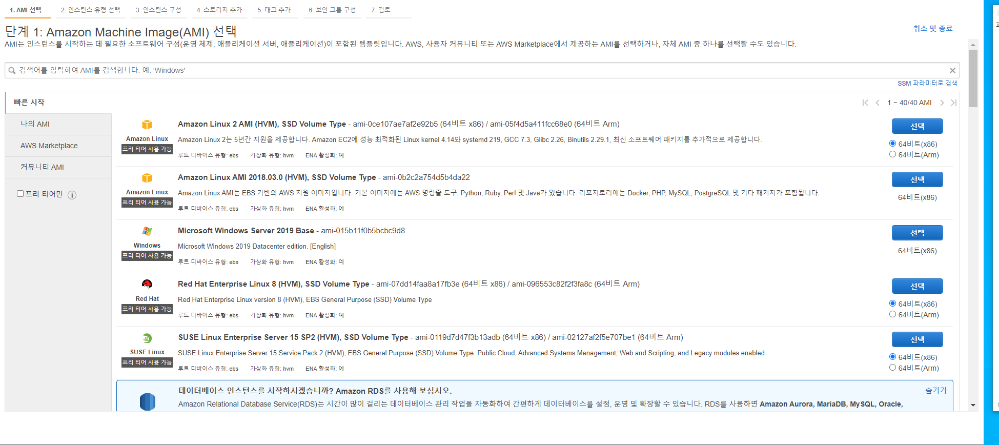

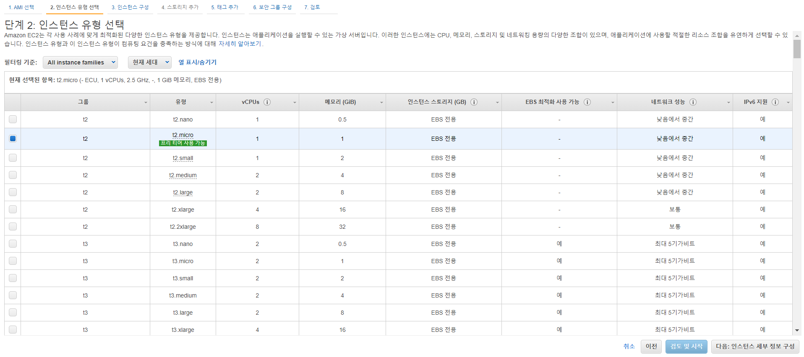

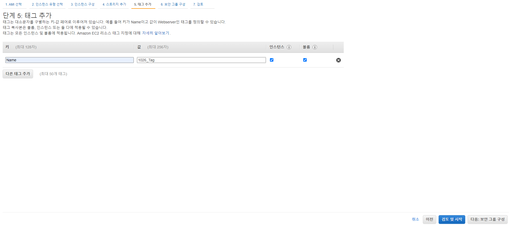

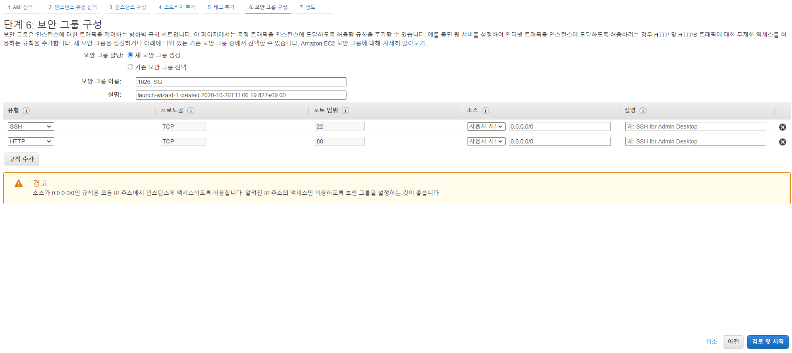

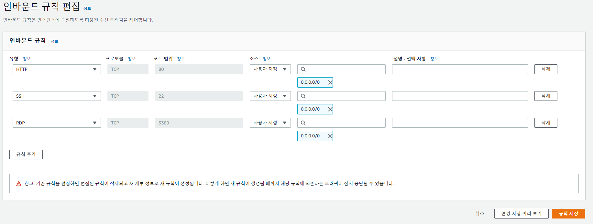

* 보안 그룹 추가 RDP 접속.

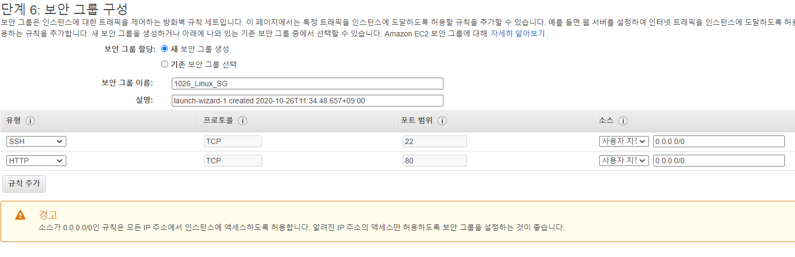

Linux 보안그룹

* Windows -> Linux 파일 전송

cmd로 다음 명령어 입력하여 서버에 pem키를 저장

scp -i "C:\1026_AWS\1026_Public_key.pem" 1026_Public_key.pem ec2-user@13.231.104.152:/upload
