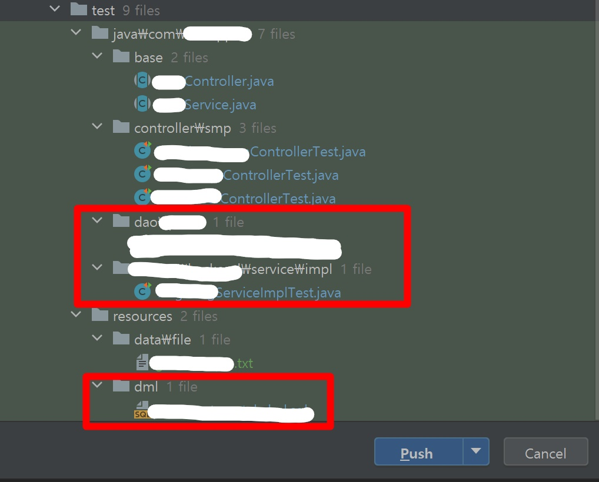

이전에 PR되었던 branch(delete 되지 않은)와 비슷한 내용으로 수정건이 생겨
develop에서 작업 후, 해당 branch로 checkout 하여 pull 및 commit push 하려니
내가 작업했던 것 보다 더 많은 내용이 push 되려는 것이 보인다.
이는 정상적인 반응이며
pull받은경우 dev와 동기화하려고 수정사항보다 많게 보이는 것
push하면 수정한 것만 보이게 된다.

