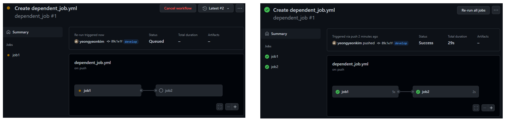
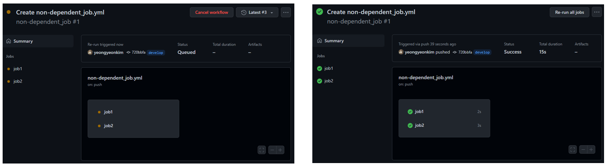
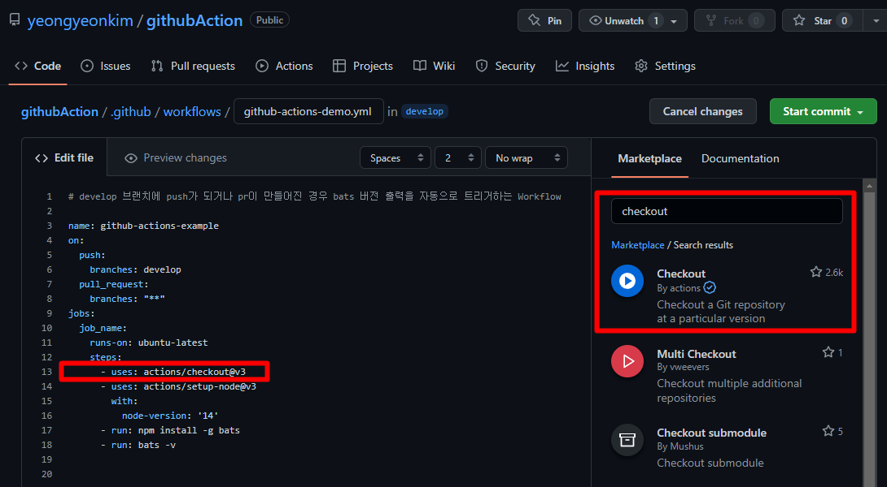
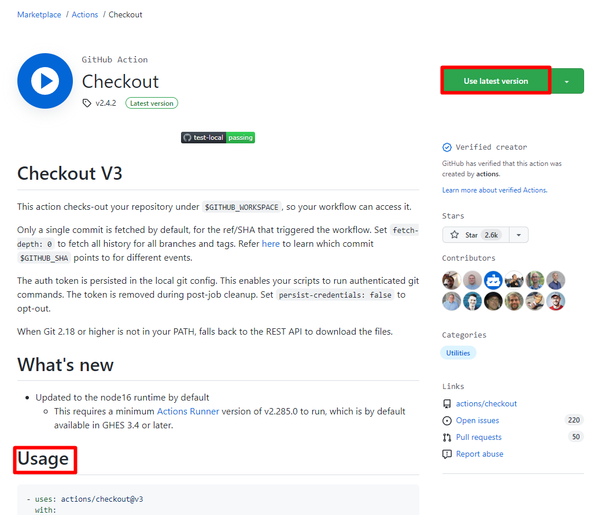
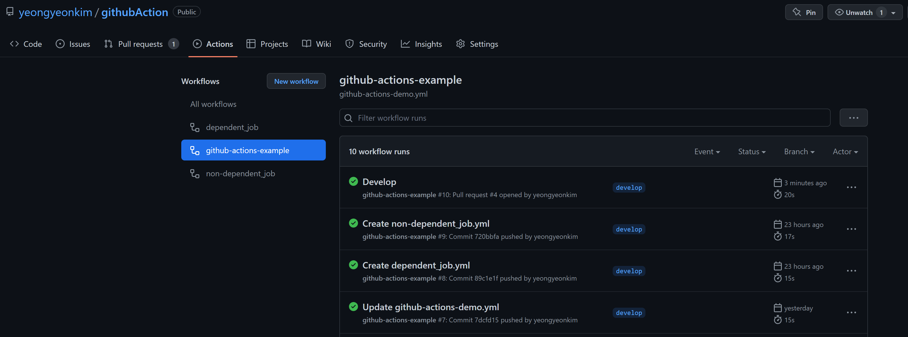
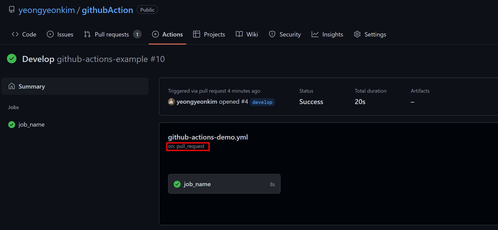
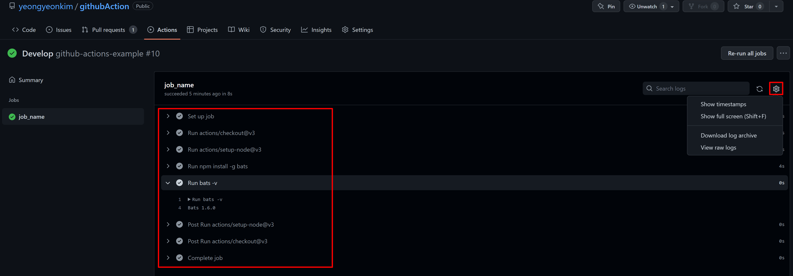

Github Actions의 개념 및 간단한 Workflow 생성

### Github Actions

- 소프트웨어 개발 Workflow(빌드, 테스트 및 배포 파이프라인 등)를 자동화할 수 있는 CI/CD 플랫폼이다.
- Pull Request 혹은 문제가 생기는 것과 같은 이벤트가 Repository에서 발생할 때 트리거 되도록 Github Action Workflow를 구성할 수 있다.
- Workflow에는 순차적으로 혹은 병렬로 실행할 수 있는 하나 이상의 job이 포함되어 있다.

---

### Github Actions 구성 요소

##### Workflow

* 하나 이상의 job을 실행하는 자동화된 프로세스.
* Repository의 `.github/workflows` 에 yaml 파일로 정의되며, Repository의 이벤트에 의해 트리거 될 때 실행되거나 정의된 일정에 맞게 트리거 될 수 있다.

##### Event

* pull request, push와 같은 Workflow를 트리거하는 Repository의 특정 활동
  * 이벤트의 전체 목록 - https://docs.github.com/en/actions/using-workflows/events-that-trigger-workflows

##### Job

* Workflow 실행은 기본적으로 병렬로 실행되는 하나 이상의 job으로 구성된다.

* 작업을 순차적으로 실행하려면 `jobs.<job_id>.needs` 키워드를 사용하여 다른 작업에 대한 종속성을 정의할 수 있다.

  * 종속 job이 필요한 경우

    ```yaml
    name: dependent_job
    on: [push, pull_request]
    jobs:
      job1:
        runs-on: ubuntu-latest
        steps:
          - uses: actions/checkout@v3
          - name: print
            run: echo job1
      job2:
        runs-on: ubuntu-latest
        needs: job1 # 종속성
        steps:
          - uses: actions/checkout@v3
          - name: print
            run: echo job2
    ```
    
    * job1이 완료되기 전까지 job2는 수행되지 않음.
    
      
    
  * 종속 job이 필요하지 않은 경우
  
    ```yaml
    name: non-dependent_job
    on: [push, pull_request]
    jobs:
      job1:
        runs-on: ubuntu-latest
        steps:
          - uses: actions/checkout@v3
          - name: print
            run: echo job1
      job2:
        runs-on: ubuntu-latest
        steps:
          - uses: actions/checkout@v3
          - name: print
            run: echo job2
    ```
    
    * job1, job2 동시에 수행된다.
    

##### Actions

* 자주 반복되는 작업을 수행하는 사용자 지정 응용 프로그램.
* 고유한 작업을 생성하고 공유하거나, Github Marketplace에서 Workflow에 사용할 작업을 찾을 수 있다.

##### Runner

* Workflow가 트리거 될 때 Workflow를 실행하는 서버.

* 각 Runner는 한 번에 하나의 작업을 실행할 수 있다.

* Github은 워크플로를 실행할 수 있는 ubuntu, windows 및 macOs 실행 환경을 제공한다.

  ```yaml
  runs-on: ubuntu-latest # (windows-latest, macos-latest)
  ```

* 다른 운영 체제가 필요하거나 특정 하드웨어 구성이 필요한 경우 자체 Runner를 호스팅할 수 있다.

  ```yaml
  runs-on: [self-hosted, linux]
  ```

---

### Workflow 생성 예제

* develop 브랜치에 push가 되는 경우 혹은 pr이 만들어졌을 때 bats 버전 출력을 자동으로 트리거 하는 Workflow 작성

```yaml
name: github-actions-example
on:
  push:
    branches: develop
  pull_request:
    branches: "**"
jobs:
  job_name:
    runs-on: ubuntu-latest
    steps:
      - uses: actions/checkout@v3 
      - uses: actions/setup-node@v3
        with:
          node-version: '14'
      - run: npm install -g bats
      - run: bats -v
```

* name : Workflow의 이름

* on : Workflow에 대한 트리거를 지정

* steps :  jobs에서 실행되는 모든 단계를 그룹화 한 것, 각각의 step은 독립적인 프로세스를 가진다.

* uses : 해당 step에서 사용할 action, `{owner}/{repo}@{ref}` 형식

  * 사용하고자 하는 action을 다음과 같이 marketplace에서 찾을 수 있다.

    

    

* run : Runner에서 명령을 실행하도록 job에 지시한다.

---

### Workflow 확인

* 저장소의 Actions 탭에서 확인하고자 하는 Workflow를 선택



* pull_request 에 의해 해당 job이 트리거 됨.



* 각 step의 과정 및 결과를 확인할 수 있다.



