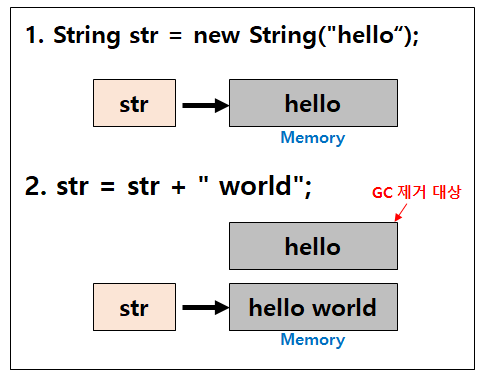

### String vs StringBuffer/StringBuilder

#### String

* String은 불변성(immutable)이다.

String 변수에 값을 할당하는 방법

* 리터럴 변수를 대입하는 방법
* new 키워드를 사용하는 방법

```java
String A = "abc";
String B = "abc";
String C = new String("abc");
String D = new String("abd");

System.out.println(A == B); // true
System.out.println(B == C); // false
System.out.println(C == D); // false
```

-> String을 리터럴 값으로 할당하는 경우 Heap 메모리 영역 안의 특별한 메모리 공간인 String constant pool에 저장된다. 이 pool 안에 존재하는 리터럴 값을 사용하면 새로운 값을 만드는 것이 아닌 존재하는 값을 사용하게 됨. (그래서 A와 C는 같은 주소 비교 값 결과가 나옴) [String A -> Heap -> String Constant Pool]

-> new 키워드는 일반적인 객체와 동일하게 Heap 영역에 동적으로 메모리 공간이 할당됨. 같은 값이어도 Heap 영역 안의 다른 메모리 공간을 참조하게 된다. [String C -> Heap]



* String 클래스의 참조변수 `str`이 "hello world"라는 값을 가지고 있는 **새로운 메모리 영역**을 가리키게 되고, 처음 선언했던 "hello" 값이 할당되어 있던 메모리 영역은 Garbage로 남아있다가 GC(Garbage Collection)에 의해 사라지게 되는 것. 새로운 String 인스턴스가 생성되는 것이다.
* 문자열 추가, 수정, 삭제 등의 연산이 빈번하게 발생하는 경우 String 클래스를 사용하면 힙 메모리에 많은 임시 Garbage가 생성되어 애플리케이션에 영향을 주게 된다. 이를 해결하기 위해 가변성을 가지는 StringBuffer/StringBuilder 클래스를 도입.

---

#### StringBuffer/StringBuilder

* `.append()` 등의 메서드를 이용하여 동일 객체내에서 문자열을 변경하는 것이 가능하다. (주소 값을 확인해보면 변경 전, 후 주소 값이 같음)
* StringBuffer vs StringBuilder
  * 동기화의 유뮤에서 차이가 난다.
  * StringBuffer는 동기화 키워드를 지원하여 멀티스레드 환경에서 안전하고,
    String 또한 불변성을 가지기 때문에 마찬가지로 멀티스레드 환경에서 안전하다.

---

##### [간단히]

**String**: 불변성, 문자열 연산이 적은 멀티스레드 환경에 적합

**StringBuffer**: 가변성, 멀티스레드 환경에서 적합

**StringBuilder**: 가변성, 단일스레드 환경에서 적합

##### [심화]

싱글 스레드로 접근한다는 가정하에선 "StringBuilder" 와 "StringBuffer" 의 성능이 똑같을까?

-> 거의 차이없다.

경쟁하지 않는 lock을 획득하기 위한 약간의 오버헤드가 생길 수 있지만

최신 JVM에서는 매우 적은 수준이다. Java SE 6 부터 바이어스 잠금을 통해 비경쟁 동기화 성능을 향상시켜 런타임 최적화를 해주고 있기 때문
