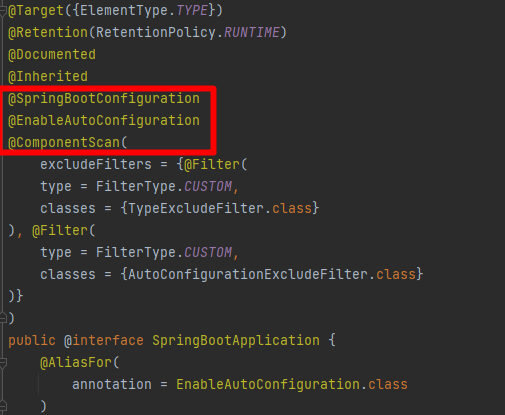
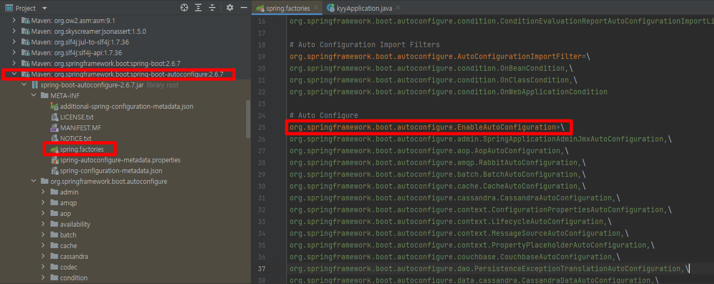
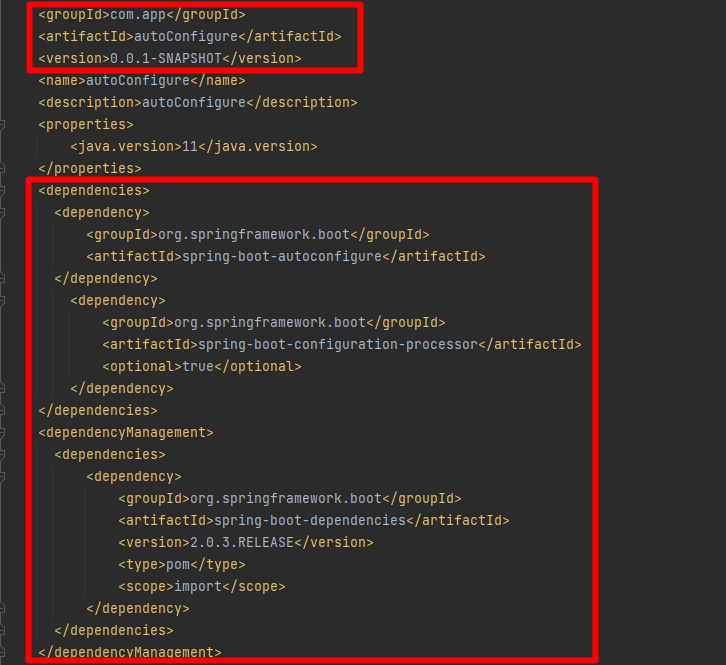
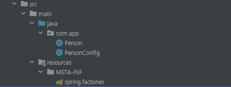
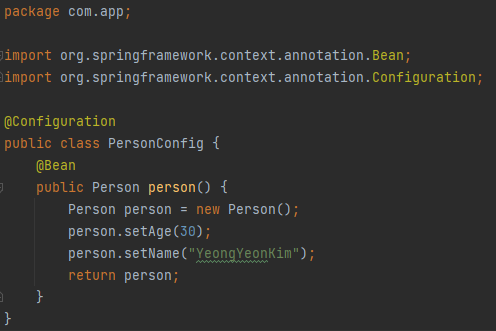
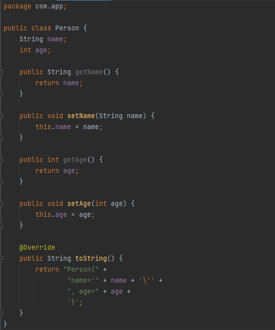
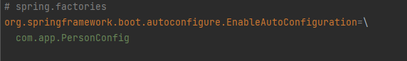
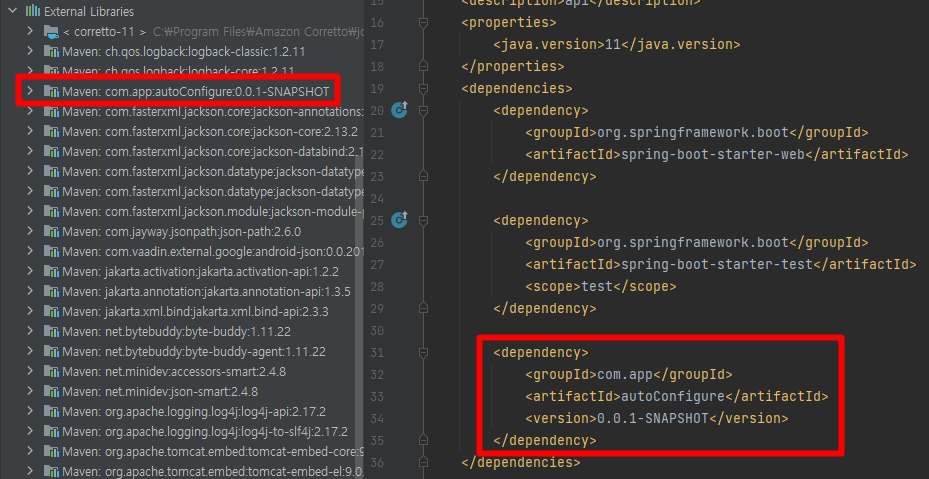
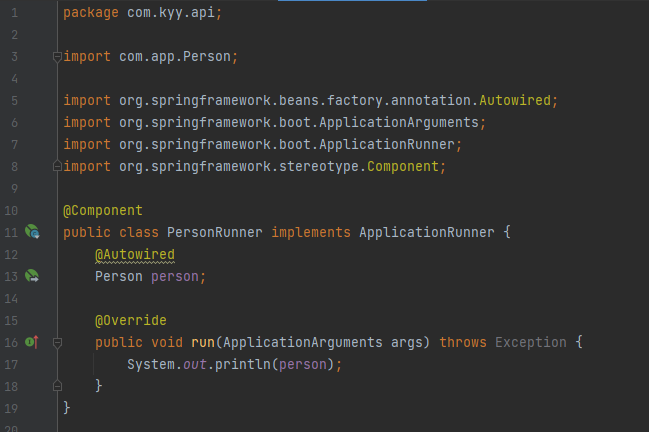
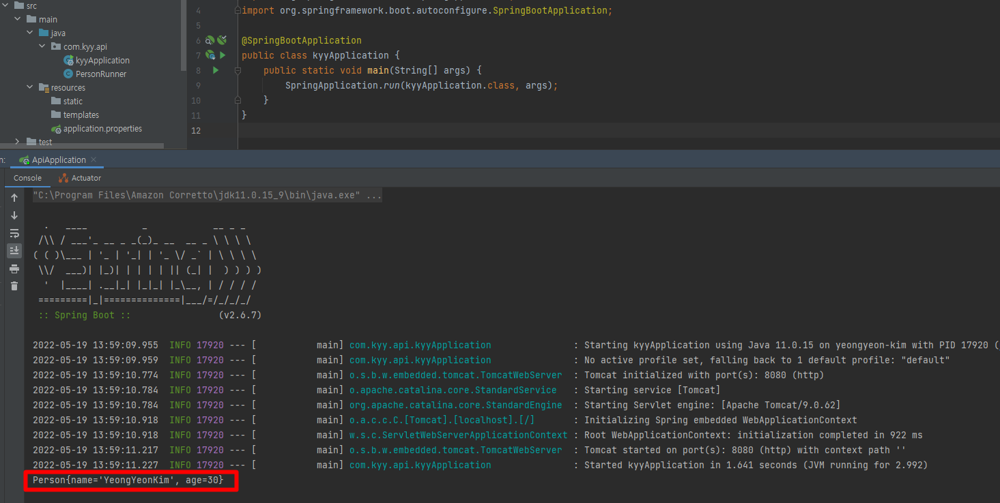

#### 자동 설정(Auto Configuration)이란?

* 스프링 부트는 애플리케이션을 만들 때 주로 사용하는 설정들을 자동으로 설정해준다.
* H2, JDBC 등 기본적으로 여러 자동 설정을 제공하며, 새로 추가되는 라이브러리(jar)는 스프링부트 자동설정 의존성에 따라 설정이 자동 적용된다.
  (e.g., H2 의존성이 Class Path에 존재하고, DB Connetion을 맺는 Bean을 수동으로 구성해주지 않았을 경우 스프링 부트가 자동으로 인 메모리 DB를 구성해준다. - Spring legacy에선 해주지 않았던 기능)
* 따라서, 초기 Bean 호출에 대한 신경을 쓰지 않아도 되며 버전 관리를 해줄 필요가 없어 개발 편의성이 증가하였다고 할 수 있다.

---

#### 작동 방식 및 구성 요소

기본적으로 Spring initializr를 사용하여 프로젝트를 생성 후 애플리케이션을 실행하면 
따로 Bean으로 등록하기 위한 그 어떤 행위를 하지 않더라도 Web Application이 실행된다. 

```java
@SpringBootApplication
public class kyyApplication {
    public static void main(String[] args) {
        SpringApplication.run(kyyApplication.class, args);
    }
}
```

그 이유는, 자동 설정 기능은 메인 애플리케이션에 붙는 `@SpringBootApplication` 어노테이션이 자동 설정을 도와주기 때문인데 해당 어노테이션 내부를 살펴보면 다음과 같이 `@SpringBootConfiguration`, `@EnableAutoConfiguration`, `@ComponentScan` 어노테이션이 있는 것을 확인할 수 있다.



* **@SpringBootConfiguration**
  * 컨텍스트에서 추가 Bean을 등록하거나 추가 구성 클래스를 가져올 수 있다.
    통합 테스트에서 구성 감지를 지원하는 Spring의 표준 @Configuration에 대한 대안이 되는 어노테이션.
* **@ComponentScan**
  * @ComponentScan이 붙은 클래스가 위치한 패키지 이하의 @Configuration, @Repository, @Service, @RestController 어노테이션을 가진 클래스들을 탐색하여 Bean으로 등록하는 기능.

* **@EnableAutoConfiguration**

  * 스프링 Bean을 자동적으로 컨테이너에 등록하는 어노테이션.

    * `META-INF/spring.factories `

      * 자동 설정의 대상이 될 클래스 목록
      * `org.springframework.boot.autoconfigure.EnableAutoConfiguration` 에 선언한다.

      

    * `org.springframework.boot.autoconfigure`
      
      * 미리 구현된 자동 설정 리스트.

---

#### Maven 프로젝트로 자동 설정(AutoConfiguration) 클래스를 직접 구현한 후 Bean을 호출하는지 테스트

* Maven 프로젝트로 @EnableAutoConfiguration 어노테이션에 의해 Bean으로 등록될 클래스 생성

1. 프로젝트 생성 후, `pom.xml`에 의존성 추가

   

2. 다음과 같이 프로젝트 구성을 한다.

   

   * PersonConfig 클래스

   

   * Person 클래스

   

   * `src/main/resources` 에 META-INF 디렉토리 생성 후, `spring.factories` 파일 생성.

     * 추후 메인 클래스 실행 시 `@EnableAutoConfiguration`에 의해 `spring.factories` 내용을 자동으로 가져오게 될 것.

     

3. 패키지 빌드 및 로컬 Repository에 등록

   $ `mvn package`  `mvn install` 하여 로컬 Repository에 패키지를 배포하여, 같은 Repository를 참고하는 다른 프로젝트들이 접근 가능하게 한다.

   * 만약 mvn 명령어가 듣지 않는 경우 `pom.xml` 에 
     `spring-boot-maven-plugin`이 있거나, 프로젝트에 JDK 버전이 잘 잡혀있지 않을 가능성이 있다.

---

* 메인 애플리케이션을 실행할 프로젝트(springboot)를 생성.

1. autoConfigure 설정 클래스를 사용하기 위해 `pom.xml`에 의존성을 추가

   

2. PersonRunner 클래스를 생성하여 ApplicationRunner 인터페이스를 구현한다.
   (스프링 부트가 컨테이너에 해당 Bean을 잘 등록했는지 확인하기 위해)

   - ApplicationRunner : Application 실행 후 특정 Bean을 실행하도록 하는 인터페이스.
     메소드는 run 뿐이며, ApplicationArguments를 받도록 되어있다.

   

3. Application 실행

   * Person 클래스가 등록되어 사용할 수 있는 것을 확인할 수 있다.

   

