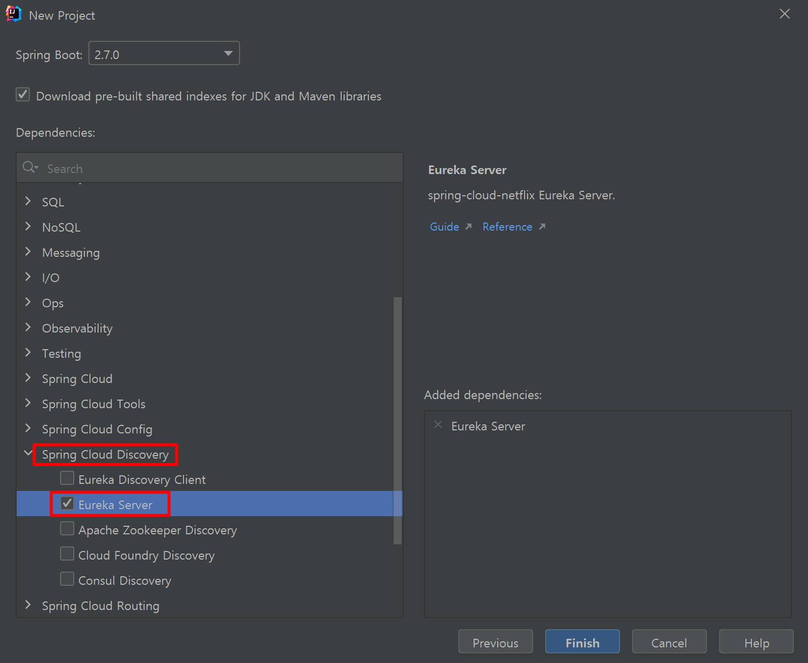
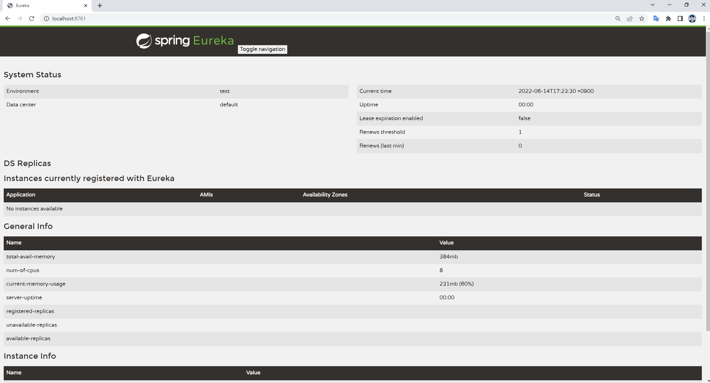
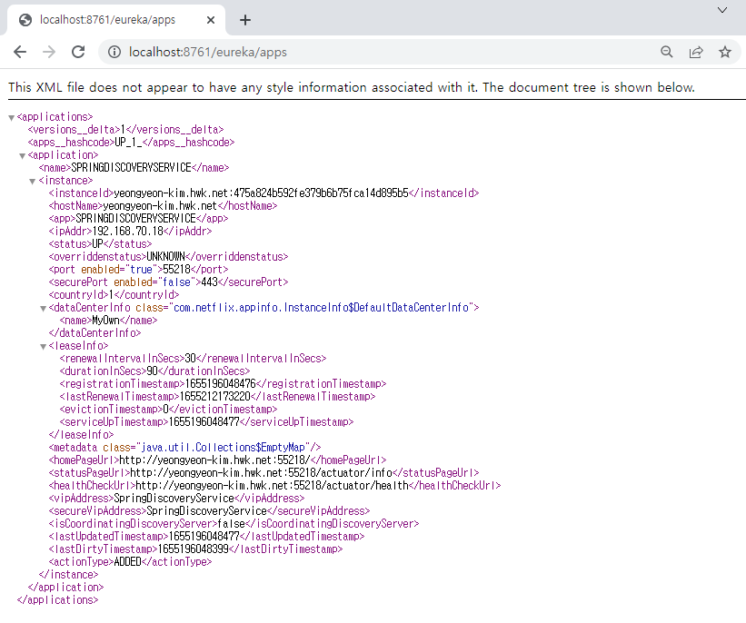
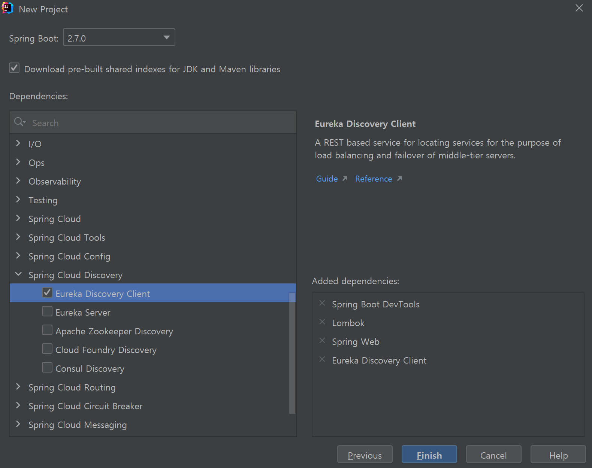
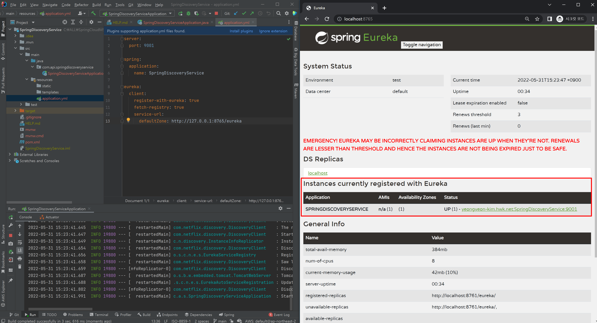
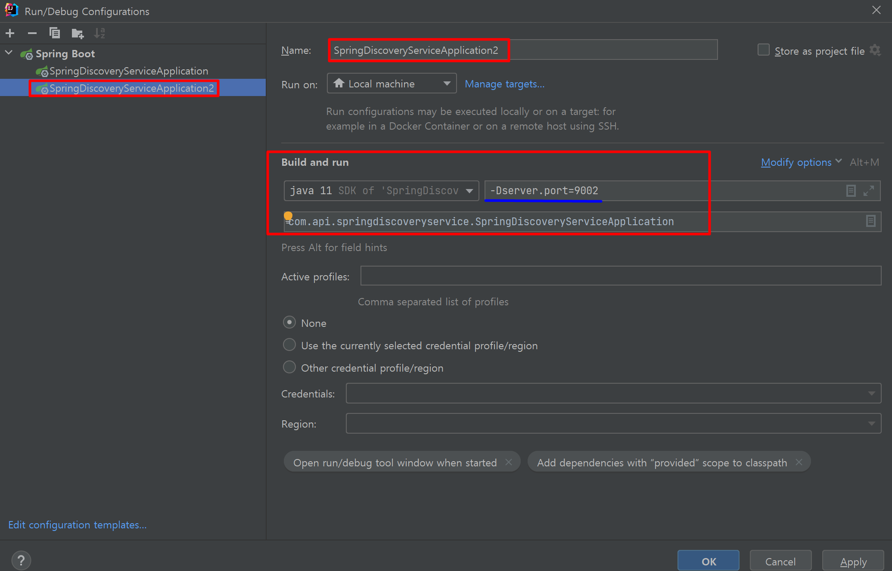
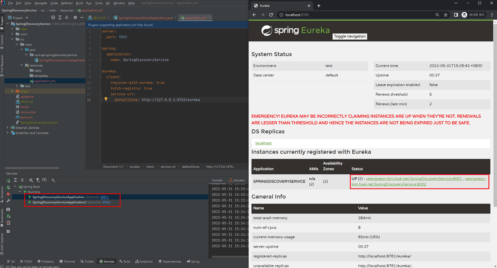
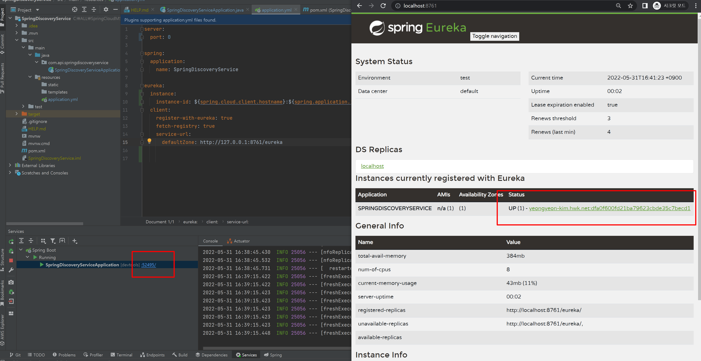

### Eureka

* Neflix에서 제공한 MSA를 위한 클라우드 오픈 소스

##### Eureka 탄생 배경

* MSA에서는 Service의 IP와 Port가 일정하지 않고 지속적을 변화한다. 따라서, Client에 Service의 정보를 수동으로 입력하는 것은 한계가 있어 Service Discovery의 역할이 필요해짐.

##### Service Discovery 

* MSA와 같은 분산 환경은 서비스 간의 원격 호출로 구성이 된다. 원격 서비스 호출은 IP 주소와 포트를 이용하는 방식. 
* 클라우드 환경이 되면서 서비스가 오토 스케일링 등에 의해서 동적으로 생성되거나 컨테이너 기반의 배포로 인해서, 서비스의 IP가 동적으로 변경되는 일이 잦아졌다. 
* 그래서 서비스 클라이언트가 서비스를 호출할 때 서비스의 위치 (즉 IP주소와 포트)를 알아낼 수 있는 기능이 필요한데, 이것을 바로 Service discovery 라고 한다.

---

### Service Discovery: Eureka Server

##### SpringDiscovery 프로젝트 생성

* Spring Cloud Discovery - Eureka Server 의존성 추가

  

* 메인 애플리케이션 (Eureka Server)

  ```java
  import org.springframework.boot.SpringApplication;
  import org.springframework.boot.autoconfigure.SpringBootApplication;
  import org.springframework.cloud.netflix.eureka.server.EnableEurekaServer;
  
  @SpringBootApplication
  @EnableEurekaServer // 유레카 서버 활성화
  public class SpringDiscoveryApplication {
  
      public static void main(String[] args) {
          SpringApplication.run(SpringDiscoveryApplication.class, args);
      }
  
  }
  ```

* `application.yml`

  ```yaml
  server:
    port: 8761
  
  spring:
    application:
      name: SpringDiscovery
  
  eureka:
    instance:
      hostname: localhost
    client:
      register-with-eureka: false
      fetch-registry: false
      serviceUrl:
        defaultZone: http://${eureka.instance.hostname}:${server.port}/eureka/
  ```

  * `spring.application.name`: MSA에서 이 서비스를 식별하는 id

  * `eureka.client.register-with-eureka`: 기본적으로 설정해주지 않는 경우 Eureka Server 자체를 registry에 등록하려 하기 때문에 false로 설정

  * `eureka.client.fetch-registry`: registry에 있는 정보를 가져올지 여부, Eureka Server는 사용하지 않으므로 false로 설정

* `localhost:8761` 

  * 애플리케이션 실행 후 해당 URL로 대시보드 확인

  

* `localhost:8761/eureka/apps`

  * Eureka 서버에 등록된 MSA 목록을 조회할 수 있다.

  

---

### Service Discovery: Eureka Client

* Eureka Client는 Server와 통신하여 자신을 등록하고 서비스 정보를 보낸다.
* 서버로부터 데이터를 가져와 캐싱하고 주기적으로 변경 사항을 확인한다.

##### SpringDiscoveryService 프로젝트 생성

* Spring Cloud Discovery - Eureka Discovery Client 의존성 추가

  

* 메인 애플리케이션 (Eureka Client)

  ```java
  import org.springframework.boot.SpringApplication;
  import org.springframework.boot.autoconfigure.SpringBootApplication;
  import org.springframework.cloud.client.discovery.EnableDiscoveryClient;
  
  @SpringBootApplication
  @EnableDiscoveryClient // netflix의 @EnableEurekaClient 또한 사용 가능하다.
  public class SpringDiscoveryServiceApplication {
  
      public static void main(String[] args) {
          SpringApplication.run(SpringDiscoveryServiceApplication.class, args);
      }
  
  }
  ```

* application.yml

  ```yaml
  server:
    port: 9001
  
  spring:
    application:
      name: SpringDiscoveryService
  
  eureka:
    client:
      register-with-eureka: true
      fetch-registry: true
      service-url:
        defaultZone: http://127.0.0.1:8761/eureka
  ```

  * `eureka.client.service-url.defaultZone`: 클라이언트와 통신할 디스커버리 서버 주소를 설정한다.

* Eureka 서비스 목록 확인

  ```java
  // 아래와 같은 로그가 찍힘
  INFO 20780 --- [nio-8761-exec-8] c.n.e.registry.AbstractInstanceRegistry  : Registered instance SPRINGDISCOVERYSERVICE/yeongyeon-kim.hwk.net:SpringDiscoveryService:9001 with status UP (replication=false)
  INFO 20780 --- [nio-8761-exec-6] c.n.e.registry.AbstractInstanceRegistry  : Registered instance SPRINGDISCOVERYSERVICE/yeongyeon-kim.hwk.net:SpringDiscoveryService:9001 with status UP (replication=true)
  ```
  
  

* 서비스 추가 등록 (방법 1 - Edit Configuration)

  

* 서비스 추가 등록 (방법 2 - terminal command)

  1. Maven 패키징 후

  2. `java -jar -Dserver.port=9003 ./target/SpringDiscoveryService-0.0.1-SNAPSHOT.jar`

* Eureka 서비스 목록에 추가된 것 확인

  

* 여러개의 Random Port 서비스 띄우기 (Client)

  ```yaml
  # application.yml
  server:
    port: 0
  
  spring:
    application:
      name: SpringDiscoveryService
  
  eureka:
    instance:
      instance-id: ${spring.cloud.client.hostname}:${spring.application.instance_id:${random.value}}
    client:
      register-with-eureka: true
      fetch-registry: true
      service-url:
        defaultZone: http://127.0.0.1:8761/eureka
  ```

  * `port: 0` 설정

* 랜덤 포트로 서비스 띄워진 것 확인

  

---

참고 Docs 

* https://cloud.spring.io/spring-cloud-netflix/multi/multi__service_discovery_eureka_clients.html
* https://cloud.spring.io/spring-cloud-netflix/multi/multi_spring-cloud-eureka-server.html

