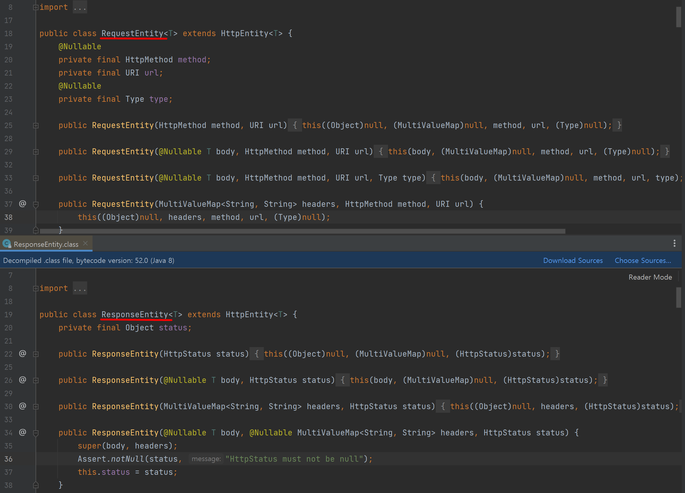

##### HttpEntity

* 스프링에서 제공하는 클래스
* Http Request/Response 시 Http Header와 Body를 포함하는 클래스

##### RequestEntity & ResponseEntity

* RestTemplate 및 @Controller 메서드에 사용하고 있다.
* HttpEntity를 상속받기 때문에 이 두 클래스 모두 Http Header, Body를 포함하고 있으며
  RequestEntity의 경우 method, url, type을 ResponseEntity의 경우 status를 각각 포함한다.

