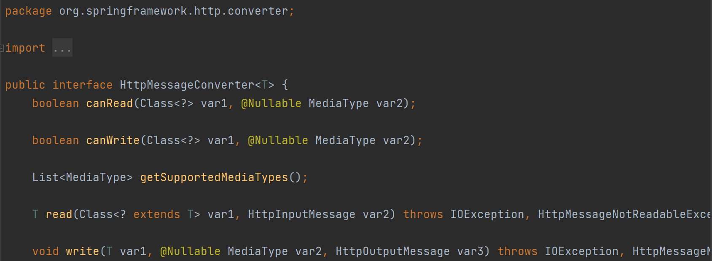

##### HttpMessageConverter

- Http request와 response를 변환하기 위해 HttpMessageConverter 인터페이스를 사용한다.
- 일반적으로 spring framework에서는 Spring MVC를 이용해서 컨트롤러에 값을 주고 받을 때는 HTTP 요청 프로퍼티를 분석하여 그에 따라 특정 클래스로 바인딩 되게끔 하고 특정 객체를 Model Object에 집어 넣어 View를 리턴하는 식으로 주고받게 된다.
- 그러나 메세지 컨버터는 그런 개념이 아니라 HTTP 요청 메세지 본문과 HTTP 응답 메세지 본문을 통째로 하나의 메세지로 보고 이를 처리한다. Spring MVC에서 이러한 작업을 하는데 사용되는 어노테이션이 바로 @RequestBody와 @ResponseBody이다.
- @ResponseBody를 이용하여 파라미터를 받으면 HTTP 요청 메세지 본문을 분석하는 것이 아닌 그냥 하나의 통으로 받아서 이를 적절한 클래스 객체로 변환하게 되고 @ResponseBody를 사용하여 특정 값을 리턴하면 View 개념이 아닌 HTTP 응답 메세지에 그 객체를 바로 전달할 수 있다.
- ResponseBody를 사용하게 되면 ViewResolver 대신 HttpMessageConverter가 동작하게 됨.

##### HttpMessageConverter Interface

* canRead(), canWrite() : MessageConverter가 해당 Class 혹은 Media-Type을 지원하는지 체크
* read(), write() : MessageConverter를 통해 메시지를 읽고 쓰는 기능 지원

##### 주로 사용하는 MessageConverter

1. ByteArrayHttpMessageConverter
   * byte[] 데이터 처리
   * 클래스 타입: `byte []`
     미디어 타입: `*/*`
   * HTTP Request : `@RequestBody byte[] exmaple`
   * HTTP Response : `@ResponseBody return byte[] (MediaType: application/octet-stream)`
2. StringHttpMessageConverter
   * String 문자열로 데이터 처리
   * 클래스 타입: `String`
     미디어 타입: `*/*`
   * HTTP Request : `@RequestBody String example`
   * HTTP Response : `@ResponseBody return example (MediaType : text/plain)`
3. MappingJackson2HttpMessageConverter
   * `application/json` 처리
   * 클래스 타입: 객체 or HashMap
     미디어 타입: `application/json`
   * HTTP Request : `@RequestBody Example example`
   * HTTP Response : `@ResponseBody return example (MediaType : application/json)`

참고

https://velog.io/@prayme/Spring%EC%9D%80-Http-Message-Body%EB%A5%BC-%EC%96%B4%EB%96%BB%EA%B2%8C-Java%EC%9D%98-%EA%B0%9D%EC%B2%B4%EB%A1%9C-%EC%97%AD%EC%A7%81%EB%A0%AC%ED%99%94%ED%95%A0%EA%B9%8C

https://jaimemin.tistory.com/1823