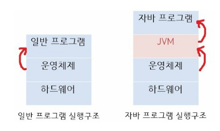

#### 시간복잡도란?

* 문제를 해결하는데 걸리는 시간과 입력의 함수 관계

* 빅-오 표기법을 사용하여 나타내며, 계수와 낮은 차수의 항을 제외시키는 방법이다.

  e.g. 크기 n의 모든 입력에 대한 알고리즘에 필요한 시간이 최대 `5n^3 + 3n`의 식을 가진다면, 이 알고리즘의 점진적 시간 복잡도는 `O(n^3)` 이라고 할 수 있다.

---

#### Index

RDBMS에서 대용량의 데이터(레코드)가 있을 때, 특정 데이터를 검색하기 위해 Full Scan하는 것이 아니라, 인덱스가 적용된 컬럼의 테이블(컬럼, 인덱스 주소)을 따로 파일로 저장해놓고 그것을 검색하여 검색 효율을 높이는 방법

---

#### Sequence 와 Max + 1 의 차이

---

#### 생성자 주입 사용 이유?

1. NPE 방지 + 테스트 코드 작성 용이- 의존 관계 설정이 되지 않으면 객체 생성 불가, 컴파일 타임에 인지 가능하기에
   * 필드 인젝션은 스프링의 IoC 컨테이너가 다 생성해서 주입해주는 방식으로 외부로 노출되어있는 것이 하나도 없어서 의존관계를 가지고 있는 메소드의 단위테스트를 작성하면 NPE가 발생한다.
2. 객체의 불변성 확보 - 의존성 주입이 필요한 필드를 final로 선언 가능
3. 순환 참조 방지 - 애플리케이션 구동 전 컴파일 에러로 예외 발생으로 알 수 있음.

---

#### 토큰 세션 차이 및 구현 방법

##### Session

* HttpServletRequest에서 Session을 가져와 해당 세션에 setAttribute 메서드로 세션의 속성 값을 지정. 이후 getAttribute 메서드를 통해 다른 요청을 처리하는 로직에서 값을 얻을 수 있음.

---

#### Redis Cache 적용 방법

---

#### Junit TC 방식

---

#### 효율개선 - 큐잉처리

---

##### N+1 문제 (JPA)

* 연관 관계에서 발생하는 이슈로 연관 관계가 설정된 엔티티를 조회할 경우에 조회된 데이터 갯수(N) 만큼 조회 쿼리가 추가로 발생하여 데이터를 읽어오는 것
* FetchType Eager와 Lazy 설정은 N+1 발생과는 관계가 없다. 단지 N+1 발생시점을 데이터 로드시점, 사용시점 가져오냐 차이일 뿐
* jpaRepository에 정의한 인터페이스 메서드를 실행하면 JPA는 메서드 이름을 분석해서 JPQL을 생성하여 실행하게 된다. JPQL은 SQL을 추상화한 객체지향 쿼리 언어로서 특정 SQL에 종속되지 않고 엔티티 객체와 필드 이름을 가지고 쿼리를 한다. 그렇기 때문에 JPQL은 findAll()이란 메소드를 수행하였을 때 해당 엔티티를 조회하는 `select * from `쿼리만 실행하게 되는것이다. JPQL 입장에서는 연관관계 데이터를 무시하고 해당 엔티티 기준으로 쿼리를 조회하기 때문이다. 그렇기 때문에 연관된 엔티티 데이터가 필요한 경우, FetchType으로 지정한 시점에 조회를 별도로 호출하게 된다

---

### [JAVA]

#### Java가 실행되는 과정

1. `.java` 소스코드를 javac라는 컴파일러가 컴퓨터가 이해할 수 있도록 기계어로 변경하기 위해 `.class` 바이트 코드로 변환한다. 
2. JVM을 구동시켜 `.class` 바이트 코드를 해석하여 자바 프로그램이 실행된다.

-> 바이트 코드는 JVM이 이해할 수 있는 언어로 변환된 코드로, JVM만 설치되어 있다면 어떤 운영체제에서라도 실행될 수 있다.

* 일반 프로그램은 OS가 프로그램을 실행시킨다. 반면 자바 프로그램은 운영체제가 JVM을 실행시키면 JVM이 `.class` 파일을 해석하여 자바 프로그램을 실행시킨다.

##### JVM

* `.class` 파일을 읽어 자바 프로그램을 실행함
* GC(Garbage Collection)을 수행한다.

---

#### Java에서 Static 사용을 지양해야하는 이유?

> 캡슐화, 재사용성 등의 측면에서 OOP 특징과 맞지 않아서.

* 객체 지향적이지 않다.
  * static은 전역 변수를 사용할 때 유용하다. 하지만 객체 지향 프로그래밍(OOP) 원칙에 따르면, 한 객체가 지닌 데이터는 외부에서 접근하여 수정할 수 없도록 해야함. **캡슐화** 원칙에 위반된다.
* 재사용성이 떨어진다.
  * static 메서드는 `interface` 구현하는데 사용될 수 없다. -> 객체지향적 설계에 방해될 수 있다.

---

#### 자바의 모든 클래스는 'Object' 클래스를 상속받는다. 그리고 이 'Object' 클래스는 equals()와 hashCode() 메소드가 선언되어 있다. 이 메소드들의 역할 및 차이점은?

* 

> 꼬리 질문: 'hashCode'를 잘못 오버라이딩하면 "HashMap" 등 hash 콜렉션의 성능이 떨어질 수 있다. 어떤 케이스일 때 그럴 수 있는지?
>
> * 

---

#### 싱글 스레드 환경에서 synchorinzed 사용하면 성능은 동일한가? 느리다면 어떻게?

* 거의 차이없다. 경쟁하지 않는 lock을 획득하기 위한 약간의 오버헤드가 생길 수 있지만

  최신 JVM에서는 매우 적은 수준이다. Java SE 6 부터 바이어스 잠금을 통해 비경쟁 동기화 성능을 향상시켜 런타임 최적화를 해주고 있기 때문이다.

---

#### 멀티 프로세스로 할 수 있는 작업을 하나의 프로세스에서 스레드로 나눠가며 하는 이유

* OS가 시스템 자원을 효율적으로 관리하기 위해 스레드를 사용한다.
* 멀티 프로세스로 실행되는 작업을 멀티 스레드로 실행할 경우, 프로세스를 생성하여 자원을 할당하는 **시스템 콜**이 줄어들어 자원을 효율적으로 관리할 수 잇다.
* 프로세스 간의 통신보다 스레드 간의 통신 비용이 적으므로 부담이 줄어든다.

---

#### 인스턴스를 방지하는 이유

-> 인스턴스는 객체마다 다른 속성 값을 가질 때 의미가 있는데, `java.util.Arrays`와 같은 정적 필드와 정적 메서드로만 구성된 (유틸리티 )클래스 들에 대해선 객체를 만드는 것이 의미가 없다. 메모리 상 낭비만 가져온다. 따라서 정적인 방식으로 만들어진 클래스는 인스턴스화를 막는 것이 좋다.

Static 키워드를 사용하면, 프로그램 실행 시 메모리에 할당되고 프로그램 종료 시까지 유지가 된다. 이러한 이유로 static 변수, 메서드들은 해당 클래스의 객체를 생성하지 않고도 접근할 수 있다.

* 

