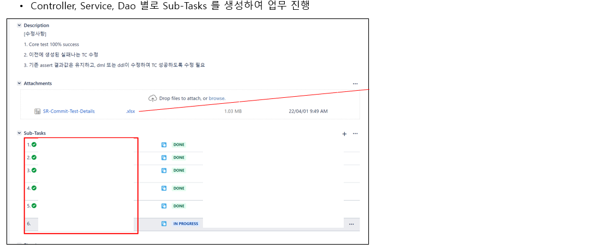
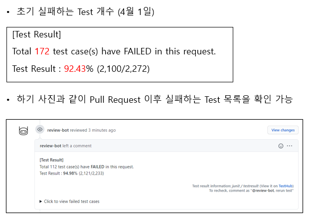
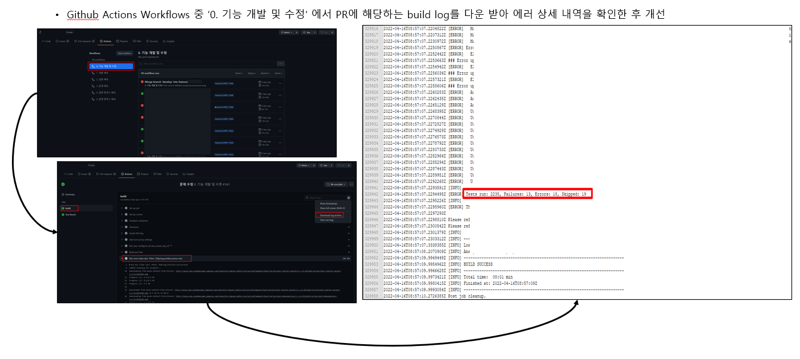

### JUnit Test 개선

##### 성과

1. 추후 개발된 코드가 수정되거나 기능이 추가될 때 생성해둔 Unit Test들로 빠르게 검증할 수 있다.
2. 유지보수 및 리팩토링을 할 때에도 안정성을 확보할 수 있다.
3. 최초 Test를 만들고 난 이후 개발 및 테스팅에 대한 시간과 비용을 절감할 수 있다.

##### 과정
<b>개선 전</b>: Circle CI에서 다운로드 받은 Build log로 에러 현황 파악

* 개선 전 실패하는 Test 개수

*  Build Log 확인 후 상세 내용을 확인하여 수정

* 모든 테스트를 정상적으로 수정하고, Test 결과가 100% 일 때만 Merge 버튼이 활성화될 수 있도록 하였음.

