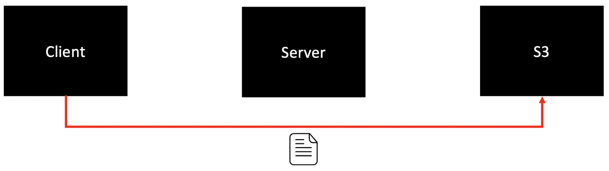
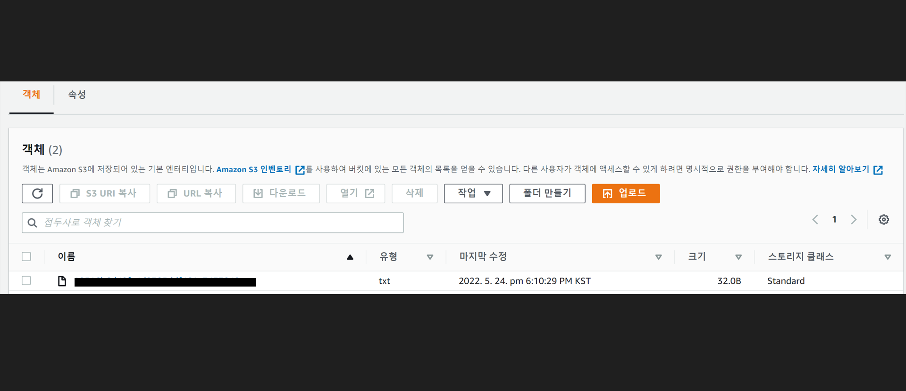

##### pre-signed URL 이란?

* '미리 서명된 URL'로 사전에 이미 AWS S3를 접근할 수 있는 권한을 가진 URL을 의미한다.
* 이미지 업로드와 같은 행위는 단순히 서버에게 정보를 요청하는 것이 아닌, 정보를 저장하는 행위이다. 따라서 이를 위한 **권한**이 필요하다.

----

##### pre-signed URL 적용 전


1. 이미지 업로드 요청 (Client -> Server)
2. 서버는 이 요청을 처리하기 위해 권한을 검증.

---

##### pre-signed URL 적용 후



* 서버에서 권한을 검증하는 행위가 이미 처리된 URL을 사용하기 때문에, 해당 URL을 사용하면 권한에 관계없이 누구나 업로드를 할 수 있다.

* 따라서, 클라이언트에서 바로 S3에 요청을 보낼 수 있어 서버의 부담을 줄인다.

---

##### 만료시간

* URL이 권한을 포함하여 누구나 사용 가능하다는 점은 장점이자 단점이 될 수 있다.
* 그래서 pre-signed URL은 만료시간이 존재하고 이것으로 해당 문제를 다소 보완할 수 있다.

---

##### 일회성 URL

* 하지만 만료시간이 지나기 전까지는 여러 번 사용 가능한 문제점이 있다

---

##### 구현

upload 버튼클릭

-> /presigned-url

```java
// Controller
getPresignedUrl(request, loginAccountDto)
```

```java
// ServiceImpl
private long PRESIGNED_URL_EXPIRATION_TIME = 1000 * 60 * 15;

@Value("${bucket}")
private String bucket;

@Value("${region}")
private String region;
    
@Value("${accesskey}")
private String accesskey;

@Value("${secretkey}")
private String secretkey;

public Object getPresignedUrl(HttpServletRequest request, LoginAccountDto loginAccountDto) {
	Date date = new Date();
	date.setTime(date.getTime() + PRESIGNED_URL_EXPIRATION_TIME);
	
	// 1. s3ObjectKey 생성
	String s3ObjectKey = makePresignedUrlS3ObjectKey(getAccountCode(request, loginAccountDto, isServerModeChina),
                UUID.randomUUID().toString().replace("-", ""));

	
	// 2. pre-signed URL 생성
	URL url = generatePresignedUrl(amazonS3Client(region), bucket, s3ObjectKey, expiration);
	
	// 3. pre-signed URL Dto 생성 및 return
   return new PresignedUrlDto(url.toString(), makeS3Path(bucket, s3ObjectKey), expiration.getTime());

}
```

1. s3ObjectKey 생성

```java
String s3ObjectKey = makePresignedUrlS3ObjectKey(getAccountCode(request, loginAccountDto, isServerModeChina),
        UUID.randomUUID().toString().replace("-", ""));
```

* UUID.randomUUID
  * Random하게 filename을 생성

```java
public static String makePresignedUrlS3ObjectKey(String accountCode, String fileName) {
    StringBuilder objectKey = new StringBuilder();
    objectKey.append(accountCode).append("/").append(fileName).append(".txt");
    return objectKey.toString();
}
// return 예시 ->  tmpAccountCode/8b87bc7b42f54fca.txt
```

2. pre-signed URL 생성

```java
// makeS3Client 함수
private AmazonS3 amazonS3Client(String region) {
	AWSCredentialsProvider awsCredentialsProvider = new AWSStaticCredentialsProvider(new BasicAWSCredentials(accesskey, secretkey));
	return AmazonS3ClientBuilder.standard()
		.withCredentials(awsCredentialsProvider)
		.withRegion(region)
		.build();
}
/*
☆프록시 서버 등을 둔 경우 해당 ClientConfiguration 설정 또한 가능한 듯☆
@Value("${proxy.host}")
private String proxyHost;

@Value("${proxy.port}")
private Integer proxyPort;
    
ClientConfiguration clientConfiguration = new ClientConfiguration();
clientConfiguration.setProtocol(Protocol.HTTPS);
clientConfiguration.setProxyHost(proxyHost);
clientConfiguration.setProxyPort(proxyPort);

	return AmazonS3ClientBuilder.standard()
		.withCredentials(awsCredentialsProvider)
		.withRegion(region)
		.withClientConfiguration(clientConfiguration)
		.build();
*/
```

```java
    public static URL generatePresignedUrl(AmazonS3 amazonS3, String bucket, String objectKey, Date expiration) {
        GeneratePresignedUrlRequest generatePresignedUrlRequest = new GeneratePresignedUrlRequest(bucket, objectKey)
                .withMethod(HttpMethod.PUT)
                .withExpiration(expiration);

        return amazonS3.generatePresignedUrl(generatePresignedUrlRequest);
    }
```

3. pre-signed URL Dto 생성 및 return

```java
@Getter
@AllArgsConstructor
public class PresignedUrlDto {

    String presignedUrl;

    String s3Path;

    long expiration;
}
```

```java
    public static String makeS3Path(String bucket, String s3ObjectKey) {
        StringBuilder s3Path = new StringBuilder();
        s3Path.append("s3://").append(bucket).append("/").append(s3ObjectKey);
        return s3Path.toString();
    }
```

* AWS S3 버킷 적재 확인



참고 자료 : https://jeffrey-oh.tistory.com/366

https://icthuman.tistory.com/entry/AWS-Java-SDK-S3-File-upload


