# Linux_구성요소, 기본설정

### Network

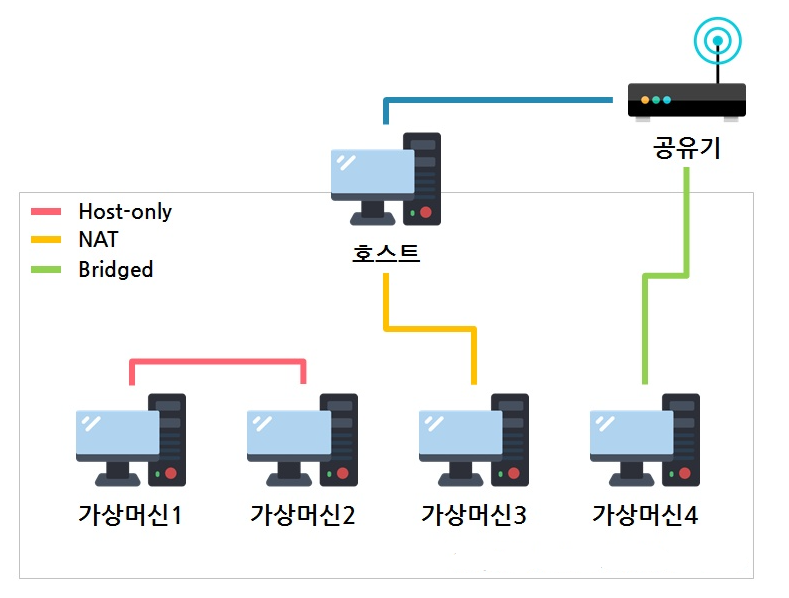

* **DHCP (Dynamic Host Configuration Protocol)**

* **NAT (Network Address Translation)**</br>

  -> 사설 IP 주소는 원칙적으로 외부와 통신할 수 없기 때문에</br>
  이를 공인 IP 주소로 중간에 변환해 주어 외부와 통신 할 수 있게 함.</br>

  ※ 사설 IP 범위

  - 10.0.0.0 - 10.255.255.255 (10/8 prefix)
  - 172.16.0.0 - 172.31.255.255 (172.16/12 prefix)
  - 192.168.0.0 - 192.168.255.255 (192.168/16 prefix)

* **Bridged Networking**</br>

  -> 공유기로부터 IP를 할당 받아, 호스트 PC와 동일한 네트워크 대역의 IP를 갖게 한다.</br>

  -> 공유기를 통해 외부 네트워크와 통신이 가능하다.</br>

----

### Network 설정

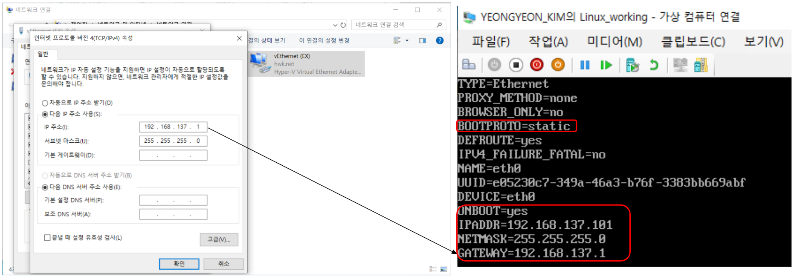

* **/etc/sysconfig/network-scripts/ifcfg-eth0**
  * BOOTPROTO="dhcp" -> "**static**" (ip 할당 방식 - 동적 or 정적)
  * ONBOOT="no" -> "**yes**" (부팅시에도 네트워크가 자동 실행되도록 함)
  * IPADDR, NETMASK, GATEWAY 내용 추가. (**Bridged** 방식으로 192.168.137. 동일한 대역폭을 가지고 진행)

---

### Network 연결하여 SSH 접속

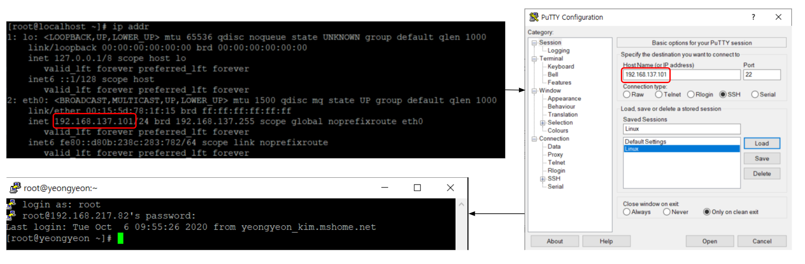

* **putty를 통해 해당 ip 주소로 ssh 원격 접속 확인**

```# ip addr```

* putty : 가상 단말기 프로그램. 물리적으로 떨어져 있어도 원격으로 접속하여 작업 가능.
* ssh : public network를 통해 서로 통신을 할 때 보안적으로 안전하게 통신하기 위해 사용하는 프로토콜.

---

### Root Login 중지

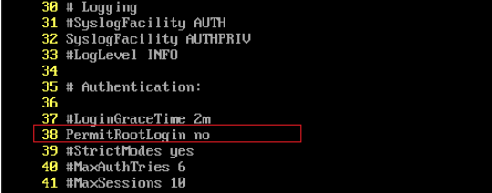

* **/etc/ssh/sshd_config**</br>
  PermitRootLogin **no** 변경. (:set nu)

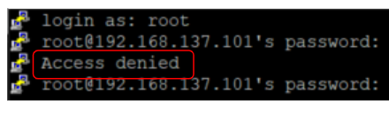

* root로 ssh 접근이 거부된 것을 확인 가능.

---

### User 계정 생성 이후 Root 접근 허용

* **su  - 명령 사용자 제한**

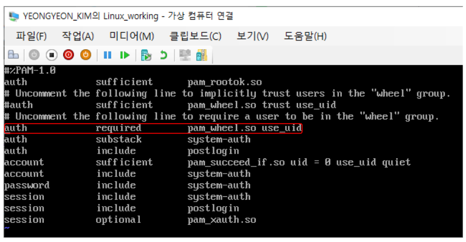

* **vi /etc/pam.d/su**</br>
  ``` # auth required pam_wheel.so use_uid ``` 주석 해제</br>
  -> su 명령어 사용을 wheel 그룹에 포함된 사용자로 제한.

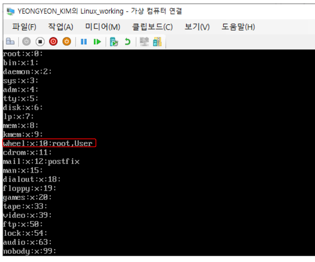

* **vi /etc/group**</br>

  ``` # wheel:x:10:{사용자} ```</br>
  그룹이름:비밀번호:그룹ID:그룹에 속한 사용자 이름

* **su 사용 그룹 권한을 wheel로 변경**</br>

  ``` # which su ```</br>
  ``` # chgrp wheel {su 위치} ```

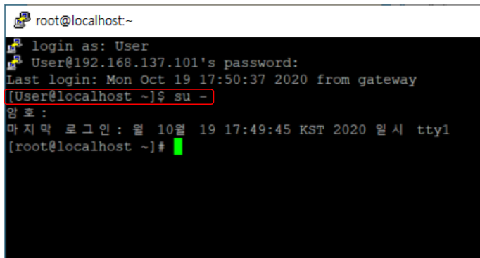

* **su - 명령어로 root 접근**

---

### 시간동기화 - ntpdate

* **ntpdate 명령어로 ntp 서버와 시간 동기화**</br>
  ``` # yum install -y ntpdate ```
* **ntpd 종료시키기**</br>
  -> ntpdate 명령어는 ntp 데몬이 실행 중일 때 사용할 수 없음.</br>
  ``` # systemctl stop ntpd ```

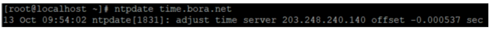

* **ntpdate 명령어로 ntp 서버와 시간동기화**</br>
  ``` # ntpdate time.bora.net ```</br>
  -> adjust time server ~ 메시지로 정상적으로 동기화됨을 확인.

※ ntpdate는 rdate에 비해 시간을 0.01초 이하의 오차로 맞출 수 있음.

---

### 시간동기화 - crontab

* 서버 시간은 서버에서 동작하는 여러 서비스에 영향을 주기 때문에 정확한 시간 정보 유지가 필요.

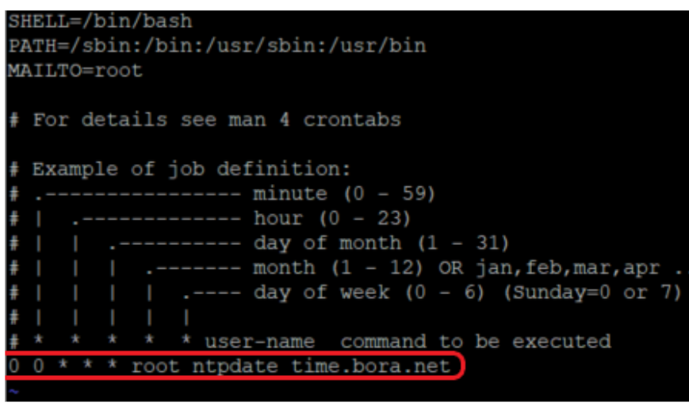

* **Crontab을 이용하여 주기적으로 시간 동기화**</br>
  -> 리눅스에서 주기적으로 특정 명령어를 실행시키기 위해 job scheduler로 crontab 기능을 이용.
* **/etc/crontab**</br>
  -> root 사용자로 cron을 등록한다.(ntpdate는 root 권한으로 가능하기에)</br>
  ``` # vi /etc/crontab ```</br>
  0 0 * * * root ntpdate time.bora.net 내용 추가. (매일 0분 0초 마다 실행하겠다.)

* **crontab 파일 수정 후, crond 서비스 재시작**</br>
  ``` # systemctl restart crond ```

---

### syslog 통합

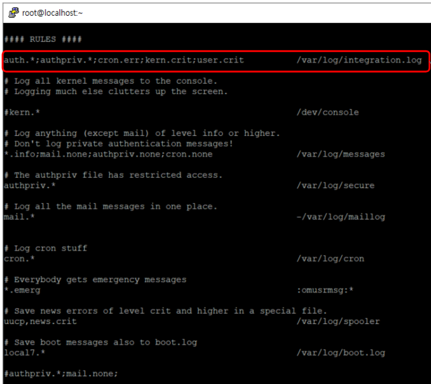

* **/etc/rsyslog.conf**</br>
  -> syslog를 이용하면 로그를 자신이 원하는 **위치**에 그리고 원하는 **레벨**에 따라 정보를 저장시킬 수 있다.
* **설정 파일의 구성**</br>
  **facility.priority;      action**</br>
  - facility : 메시지의 종류. 즉, 서비스의 종류
  - priority : 메시지의 우선순위. 즉, 우선순위로 설정된 priority 이상 위험도의 메시지를 보냄
  - action : 메시지를 보낼 대상.
    - A 서비스에 대하여 B의 경우에 C 로그파일에 기록을 남겨라.

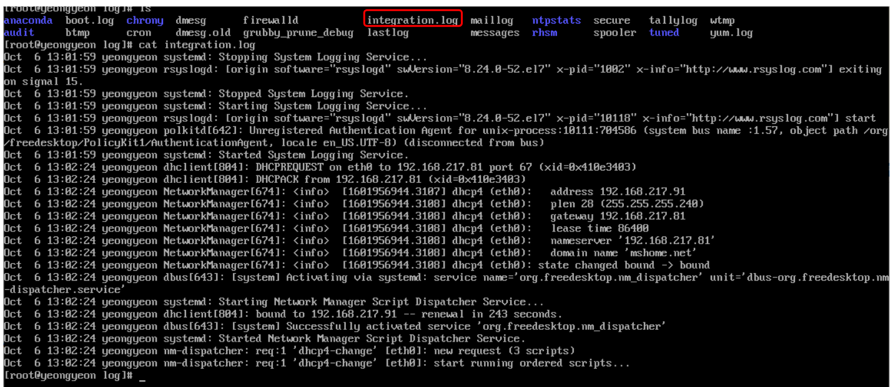

* **cat /var/log/integration.log**

---

### DNS 설정


* **/etc/resolv.conf 설정**</br>
  Google DNS 설정.

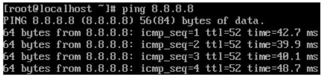

* **ping 8.8.8.8**</br>
  인터넷에서 호스트의 접근을 확인.

* 어떤 PC로 부터 도메인 주소를 IP로 알려달라는 요청이 오면 /etc/hosts 파일에서 찾아본다.</br>
  없으면 /etc/resolv.conf 파일에 정의된 nameserver에 쿼리한다.
* nameserver - 도메인 이름과 IP의 상호 변환을 가능하게 해주는 서버.</br>
  사용하고자 하는 DNS 서버의 IP 주소 입력

---

### 불필요한 서비스 비활성화


* **yum install -y ntsysv**
* **# ntsysv**</br>
  -> 리눅스의 부팅시 각 부팅 레벨에 따라서 실행시키거나 실행시키지 않을 서비스들을 설정하는 유틸리티.
* **비활성화의 필요성**
  1. 서버 자원 확보 : 사용하지 않는 애플리케이션이 서버 데몬으로 떠있으면 불필요한 자원 낭비.
  2. 시스템 보안성 향상 : 불필요한 포트의 열림으로 인해 해커들의 공격 경로로 사용될 수 있다.
* **불필요한 서비스 목록 정리 스크립트 예시**</br>
  ``` # systemctl disable auditd.service ```</br>
  ``` # systemctl disable chronyd.service ```</br>
  ``` # systemctl disable cups.service ```</br>
  ``` # systemctl disable postfix.service ```