# Linux_APM 설치

### MySQL - 필수 패키지 설치 & 유저 생성

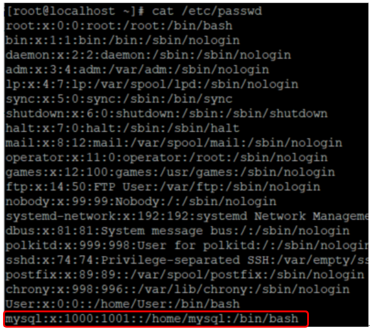

* **MySQL 컴파일 하기 위한 라이브러리 설치**</br>
  ``` # yum -y install cmake ```</br>
  ``` # yum -y install gcc-c++ ```
* **MySQL에서 사용할 계정 생성**</br>
  ``` # groupadd mysql ``` </br>
  ``` # useradd -g mysql mysql ``` </br>
  ``` # cat /etc/passwd ``` 

---

### MySQL - 옵션 설정 및 빌드와 설치

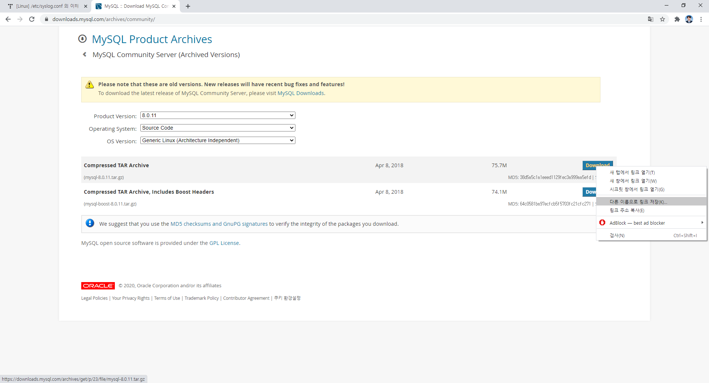

* **MySQL 8.0.11 설치**</br>
  ``` # cd /usr/local/src ``` </br>
  ``` # wget https://downloads.mysql.com/archives/get/p/23/file/mysql-8.0.11.tar.gz ``` </br>
  ``` # tar xvfz mysql-8.0.11.tar.gz ```</br>
  ``` # cd mysql-8.0.11 ```

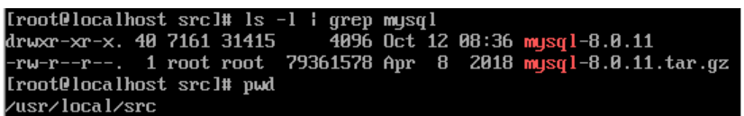

* **cmake 빌드 환경 구성**</br>
  ``` # cmake -DCMAKE_INSTALL_PREFIX=/usr/local/mysql -DMYSQL_DATADIR=/usr/local/mysql/data -DENABLED_LOCAL_INFILE=1 -DSYSCONFDIR=/etc -DDEFAULT_CHARSET=utf8 -DWITH_SSL=system -DMYSQL_TCP_PORT=3306 -DWITH_EXTRA_CHARSETS=all -DDEFAULT_COLLATION=utf8_general_ci -DDOWNLOAD_BOOST=1 -DWITH_BOOST=/usr/local/include/boost ```</br>
  ``` # make ```</br>
  ``` # make install ``` </br>
  ``` # make test ```
* **./configure** : 컴파일하고 설치하기 위한 소스 트리를 구성.
* **BOOST** : 각종 데이터 구조와 알고리즘을 모아둔 C++ 라이브러리

```
-DCMAKE_INSTALL_PREFIX=/usr/local/mysql - (설치디렉토리) 
-DMYSQL_DATADIR=/usr/local/mysql/data - (Data 놓일 위치)
-DENABLED_LOCAL_INFILE=1 - SQL 파일을 로드
-DSYSCONFDIR=/etc - (my.cnf 파일 기본 위치)
-DDEFAULT_CHARSET=utf8 - 기본 서버 문자 세트
-DWITH_SSL=system - 암호화된 연결 관련 작업 ssl 라이브러리 사용 / system : 시스템 OpenSSL 라이브러리를 사용하겠다.
-DMYSQL_TCP_PORT=3306 - 서버가 TCP / IP 연결을 인식하는 포트 번호
-DWITH_EXTRA_CHARSETS=all - 추가 문자 세트
-DDEFAULT_COLLATION=utf8_general_ci - 문자 치환, 정렬 / 서버데이터정렬
-DDOWNLOAD_BOOST=1 - (boost library가 없을시 다운로드)
-DWITH_BOOST=/usr/local/include/boost - (boost 디렉토리 위치)
```

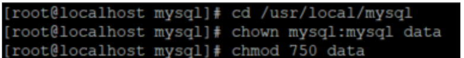

* **Data 소유권 / 디렉토리 권한 설정**</br>
  ``` # cd /usr/local/mysql ```</br>
  ``` # chown mysql:mysql data ```</br>
  ``` # chmod 750 data ```
  * cmke 빌드 환경시 /usr/local/mysql/data에 mysql 데이터들이 놓일 위치인 datadir을 설정해주었다. 그곳의 디렉토리 권한을 변경.(아무나 못 수정하도록)
  * chown : 소유권 변경.
  * chmod : 파일 권한 변경.

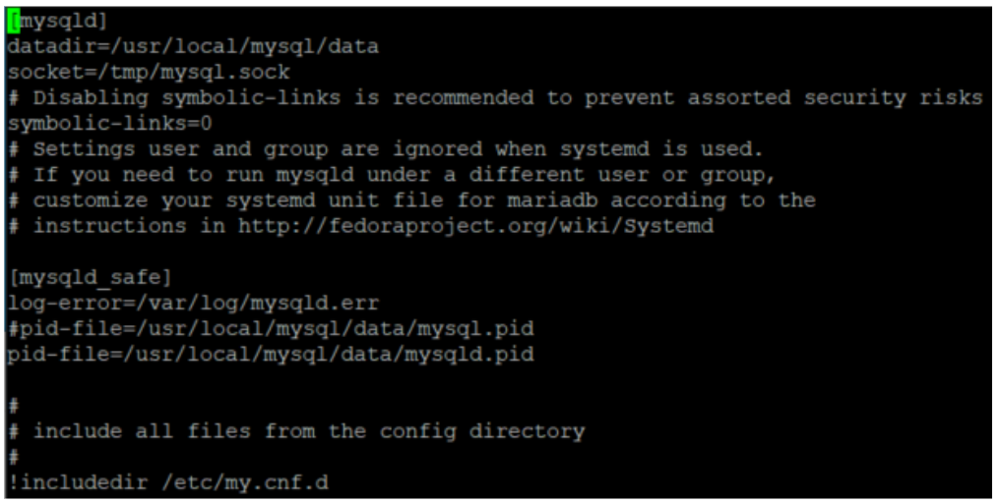

* **my.cnf 파라미터 설정**(MySQL 설정파일)</br>
  ``` # vi /etc/my.cnf ```

---

### MySQL - root 암호 생성 및 초기화

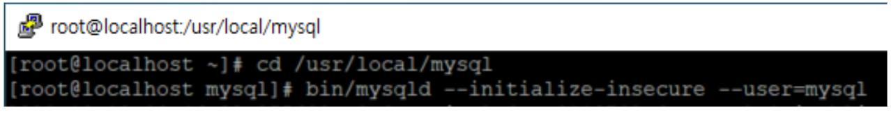

* **초기 root 암호 미생성 및 초기화**</br>
  ``` # cd /usr/local/mysql ```</br>
  ``` # bin/mysqld --initialize-insecure --user=mysql ```
  * insecure : 암호 **미**생성

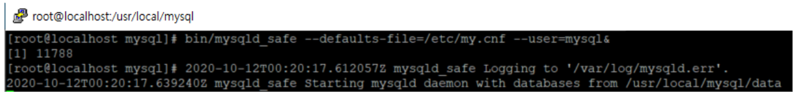

* **백그라운드로 MySQL 실행**</br>
  ``` # cd /usr/local/mysql ```</br>
  ``` # bin/mysqld_safe --defaults-file=/etc/my.cnf --user=mysql& ``` 
  * mysqld_safe : mysql 실행하기 위한 명령어
  * --defaults-file : 옵션 파일 경로

---

### MySQL - 실행

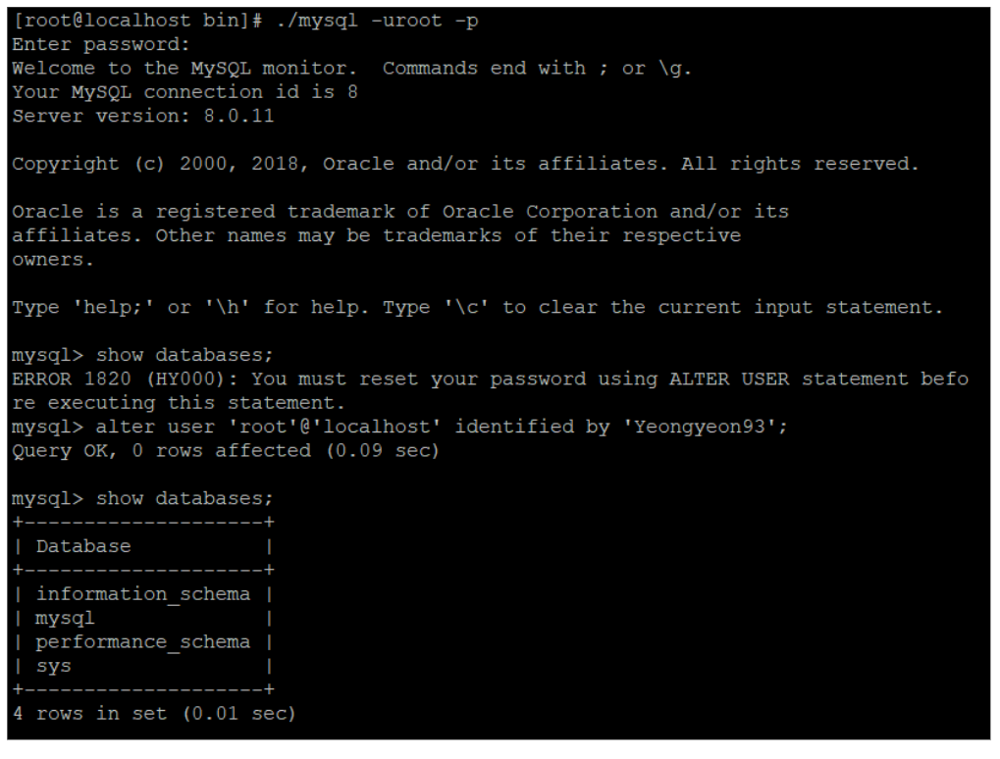

* **MySQL 접속**</br>
  ``` # cd /usr/local/mysql/bin ```</br>
  ``` # ./mysql -uroot -p ```</br>
  ``` # alter user 'root'@'localhost' identified by '비밀번호'; ```

---

### MySQL - Service 등록

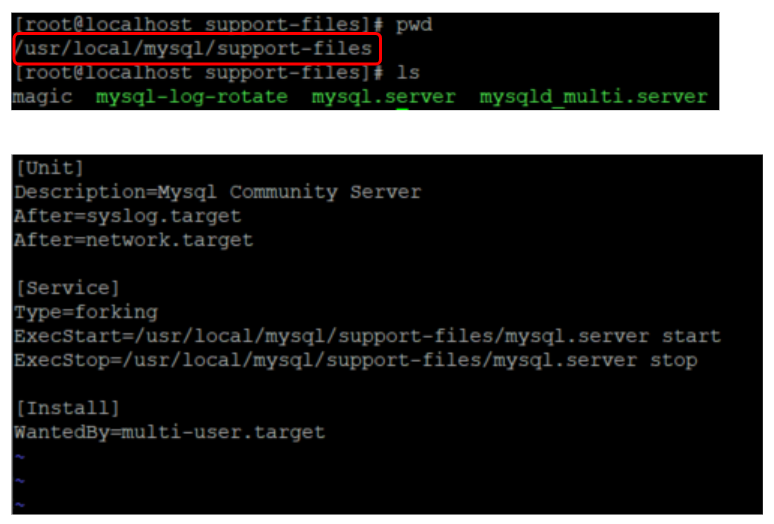

* **/usr/lib/systemd/system**</br>
  ``` # vi mysql.service ``` 파일 생성 후 위 처럼 작성

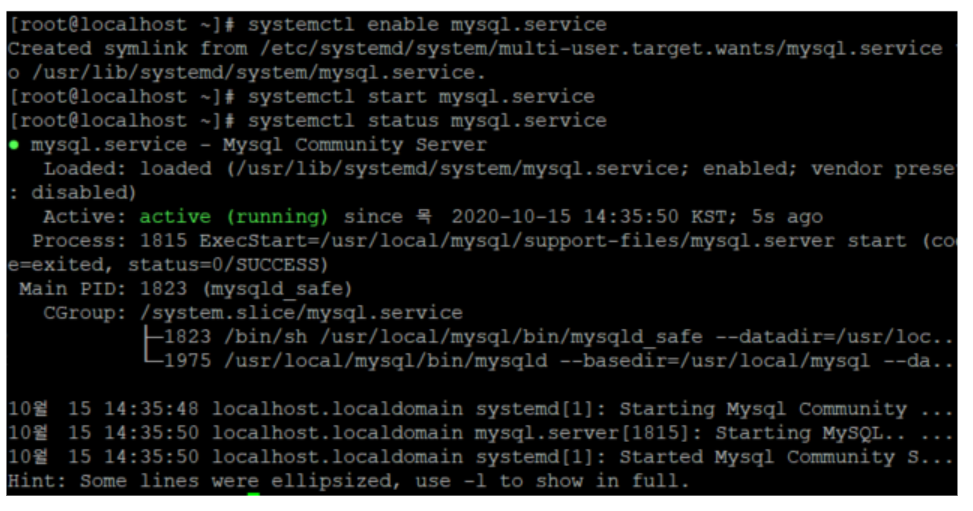

* **systemctl enable mysql.service**
* **systemctl start mysql.service**
* **systemctl status mysql.service**

---

### Apache - 필수 패키지 설치

* **pcre 설치**</br>
  ``` # mkdir -p /usr/local/src/apache ```</br>
  ``` # cd /usr/local/src/apache ```</br>
  ``` # wget https://ftp.pcre.org/pub/pcre/pcre-8.43.tar.gz ```</br>
  ``` # tar -xvzf pcre-8.43.tar.gz ```</br>
  ``` # cd pcre-8.43 ```</br>
  ``` # ./configure ```</br>
  ``` # make ```</br>
  ``` # make install ```

* **apr & apr-util 설치**

  * APR(Apache Portable Runtime) 휴대용 라이브러리.</br>
    고급 IO(sendfile, OpenSSL ..) 기능에 대한 접근을 포함하여 기본 프로세스 처리 등을 함.

* Apache 2.4 이상부터는 apr & apr-util이 필요.
  ``` # wget http://apache.mirror.cdnetworks.com/httpd/httpd-2.4.46.tar.gz ```</br>
  ``` # wget http://apache.mirror.cdnetworks.com/apr/apr-1.6.5.tar.gz ```</br>
  ``` # wget http://apache.mirror.cdnetworks.com/apr/apr-util-1.6.1.tar.gz ```

  ``` # tar -xvzf httpd-2.4.46.tar.gz ```</br>
  ``` # tar -xvzf apr-1.6.5.tar.gz ```</br>
  ``` # tar -xvzf apr-util-1.6.1.tar.gz ``` </br>

  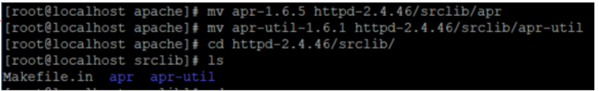

  apr & apr util을 httpd srclib폴더에 넣어준다. </br>
  ``` # mv apr-1.6.5 httpd-2.4.46/srclib/apr ```</br>
  ``` # mv apr-util-1.6.1 httpd-2.4.46/srclib/apr-util ```</br>

  apache를 설치합니다.</br>
  ``` # cd httpd-2.4.46 ```</br>
  ``` # ./configure --prefix=/usr/local/apache --enable-so --enable-ssl=shared --with-ssl=/usr/local/ssl --enable-rewrite ```</br>
  ``` # make ```</br>
  ``` # make install``` 

---

### Apache - 서비스 등록 & 실행

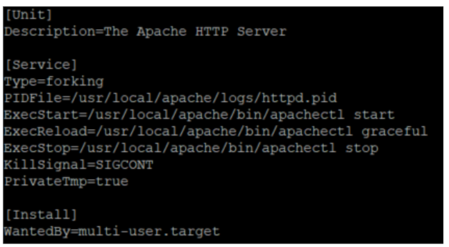

* **서비스(httpd.service)를 등록**</br>
  ``` # vi /usr/lib/systemd/system/httpd.service ```

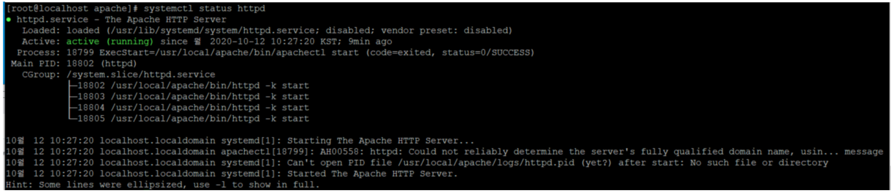

* **서비스(httpd.service)를 실행**</br>
  ``` # systemctl stop httpd ```</br>
  ``` # systemctl start httpd ```</br>
  ``` # systemctl status httpd ```

---

### Apache - 방화벽 설정

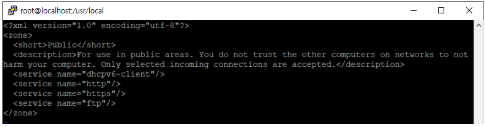

* **방화벽에서 웹 포트 열기**</br>
  ``` # vi /etc/firewalld/zones/public.xml ```</br>
  	```<service name="http">```</br>
  	```<service name="https">```</br>
  ``` # firewall=cmd --reload ```

---

### Apache -실행

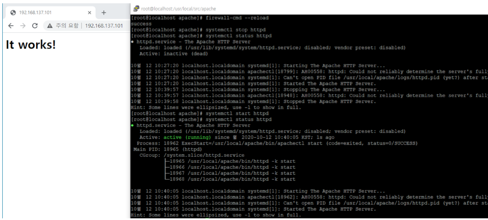

* **IP 주소에서 Apache 확인**

---

### PHP - 필수 패키지 설치

* **PHP는 일단 configure할 때 많은 속성들을 넣어주고 값을 수정하는 방향으로 가는 것이 좋다.**

* **Perl 의존성**</br>
  ``` # yum install libxml2-devel ```</br>
  ``` # yum install perl ```
* **php7.4 설치**</br>
  ``` # wget https://www.php.net/distributions/php-7.4.11.tar.gz```</br>
  ``` # ./configure --prefix=/usr/local/php \ --enable-mysqlnd \```</br>
  ```    --with-pdo-mysql \ --with-pdo-mysql=mysqlnd \```</br>
  ```    --with-pdo-pgsql=/usr/bin/pg_config \ --enable-bcmath \```</br>
  ```    --enable-fpm \ --with-fpm-user=www-data \```</br>
  ```    --with-fpm-group=www-data \ --enable-mbstring \```</br>
  ```    --enable-phpdbg \ --enable-shmop \ --enable-sockets \```</br>
  ```    --enable-sysvmsg \ --enable-sysvsem \ --enable-sysvshm \```</br>
  ```    --enable-zip \ --with-libzip=/usr/lib/x86_64-linux-gnu \```</br>
  ```    --with-zlib \ --with-curl \ --with-pear \ --with-openssl \```</br>
  ```    --enable-pcntl \ --with-readline ```


* **perl 실행 경로 재설정**
  ``` # vi /{아파치 설치 경로}/apache/bin/apxs ```</br>
  ``` #!/replace/with/path/to/perl/interpreter -w (초기 설정 삭제) ```</br>
  ``` #!/usr/bin/perl -w (perl 실행 경로로 수정) ```

---

### PHP - 빌드 및 설정 값 수정

* **Build**</br>
  ``` # make & make install ```

* **PHP 설정 파일을 복사**</br>
  **(/etc/my.cnf 를 참고하여 socket 경로를 일치)**</br>
  ``` # cp /usr/local/src/php-7.4.11/php.ini-development /usr/local/apache/conf/php.ini ```</br>

  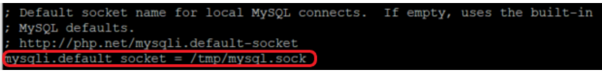</br>

  * php 설치 때 만들어진 php.ini-development - 개발용 설정이 디폴트.

* ``` # vi /usr/local/apache/conf/php.ini ```</br>
  ``` # mysqli.default_socket = {경로} ```


* **아파치 설정 값 수정**</br>
  ``` # vi /usr/local/apache/conf/httpd.conf ```</br>
     ``` AddType application/x-httpd-php .php .html. html .inc ```</br>
     ``` AddType application/x-httpd-php-source .phps ```
  * AddType application/x-httpd-php {.확장자} : {확장자}인 경우에도 php 인식하도록 한다.

---

### PHP - 실행

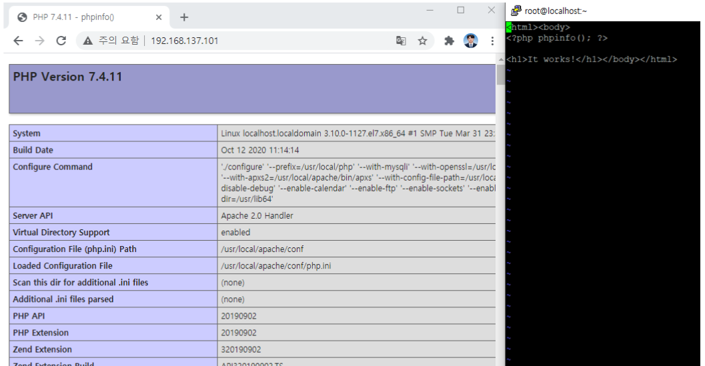

* **vi /usr/local/apache/htdos/index.html**</br>
  ``` <?php phpinfo(); ?> ``` </br>
  이후 IP 주소를 입력하여 웹 페이지 확인</br>
  htdocs - 웹 페이지가 저장된 홈 디렉토리. 그래서 {IP주소}.{php 이름} 하면, php 파일을 이 디렉토리 안에서 찾음.
* **vi /etc/php.ini**</br>
  ``` # short_open_tag = On ```</br>
  ``` <? phpinfo(); ?> ``` 형식으로 가능

---

### PHP & MySQL 연동 확인

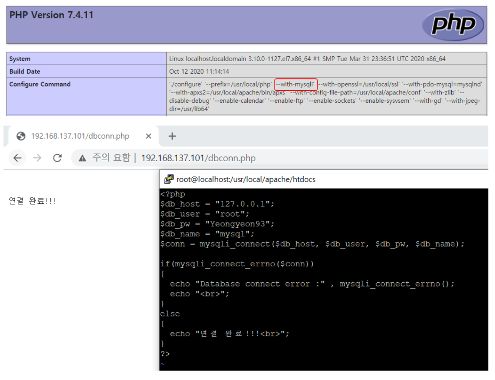

* **./configure 부분으로 인해 연동이 이미 된 상태**
  * mysqli - mysql 함수를 개선한 것으로 prepared statement를 사용할 수 있다.(php5, php7)
* **vi /usr/local/apache/htdocs/dbconn.php** 파일 생성

```
<?php
$db_host = "localhost";
$db_user = "아이디";
$db_pw = "비밀번호";
$db_name = "데이터베이스 이름";
$conn = mysqli_connect($db_host, $db_user, $db_pw, $db_name);

if(mysqli_connect_errno($conn))
{
  echo "Database connect error :" , mysqli_connect_errno();
  echo "<br>";
}
else
{
  echo "연결 완료!!!<br>";
}
?>
```

* **{IP 주소}/{db.php}**

