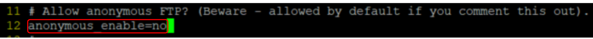
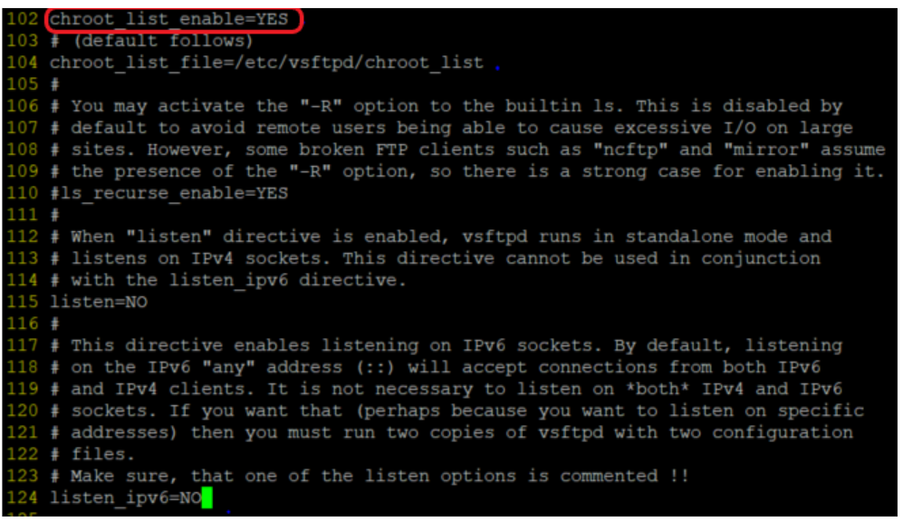
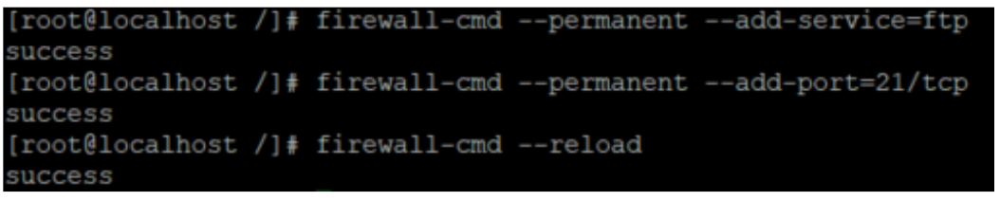
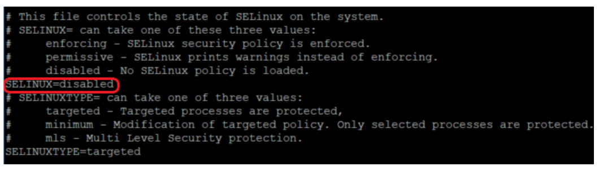
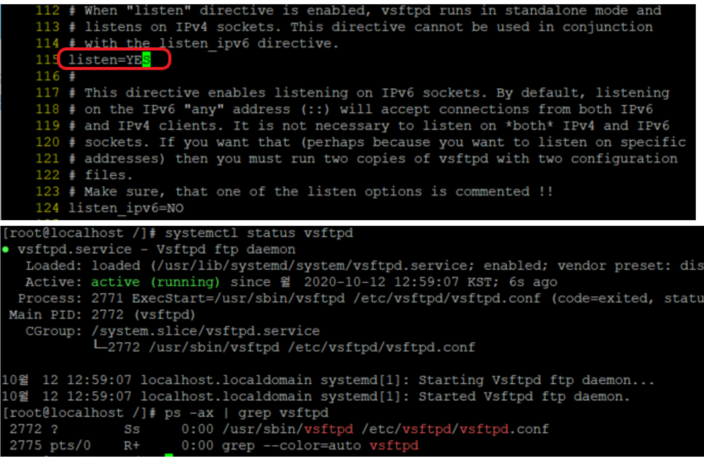
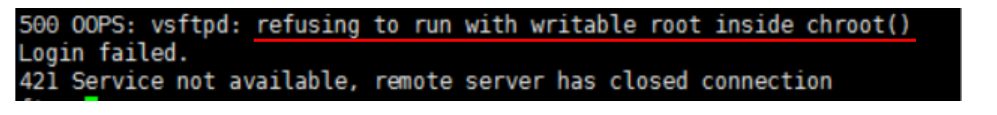
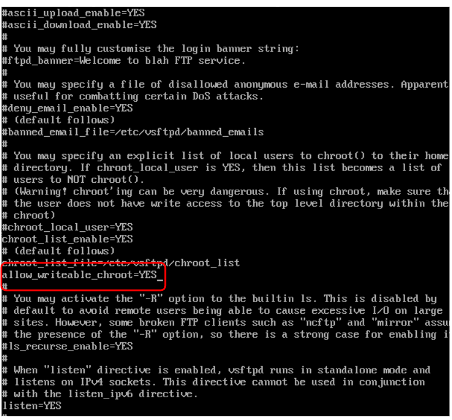
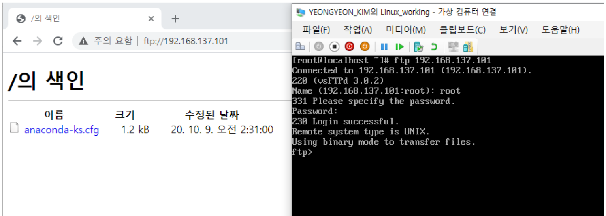

# Linux FTP

### FTP - 필수 패키지 설치 & 계정 허용



* **proFTP 보다 '보안'이 강화된 vsftpd(very secure)**
  * vsftpd : Linux를 포함한 유닉스 계열 FTP 서버
* **vsftpd 패키지 설치**</br>
  ``` # yum -y install vsftpd ```



* **사용자 접속 허용 여부 설정**</br>
  ``` # vi /etc/vsftpd/vsftpd.conf ```</br>
  ``` # anonymous_enable=no ```</br> - 사용자의 접속 허용 여부.
  ``` # chroot_list_enable=YES ``` - 특정 사용자만 상위 디렉토리로 이동할 수 있도록 설정.
  * vsftpd에서 chroot는 접속자들이 상위 디렉토리를 볼 수 없도록 하는 설정.
* **허용할 계정 추가**</br>
  ``` # vi /etc/vsftpd/chroot_list ``` </br>
  ``` # root ```

---

### FTP - 방화벽 설정



* **방화벽 설정**</br>
  ``` # firewall-cmd --permanent --add-service=ftp ```</br>
  ``` # firewall-cmd --permanent --add-port=21/tcp ```</br>
  ``` # firewall-cmd --reload ```
  * firewall-cmd - 즉시적용(o), 재부팅시 정책 지속(x)
  * firewall-cmd --permanent - 즉시적용(x), 재부팅시 정책 지속(o)



* **SELINUX 해제**</br>
  ``` # vi /etc/selinux/config ```</br>
  SELINUX=**disabled**
  * SELINUX : Linux의 보안을 강화해 주는 보안 강화 커널.(해제하여 보안의 영역을 최소화 후 작업.)

---

### FTP - 서비스 설정



* **vsftpd.conf 내용 수정**</br>
  ``` # vi /etc/vsftpd/vsftpd.conf ```</br>
  listen=**YES** (=ipv4)</br>
  listen_ipv6=**NO**
* **데몬 재시작**</br>
  ``` # systemctl enable vsftpd ```</br>
  ``` # systemctl restart vsftpd ```



* **500 vsftpd 오류 발생**



* **vi /etc/vsftpd/vsftpd.conf**</br>
  ``` # allow_writeable_chroot_YES ```
  * vsftpd.conf에서 chroot가 쓰기 권한을 갖도록 설정.
  * 보안상 chroot가 적용된 디렉토리는 사용자가 임의로 쓰는 것(Writeable)이 금지된다.(chroot 내에 쓰기 권한이 없음.)

---

### FTP - 실행

* **FTP Client 설치**</br>
  ``` # yum -y install ftp ```



* **FTP 접속**</br>
  ``` # ftp://{IP 주소} ```
