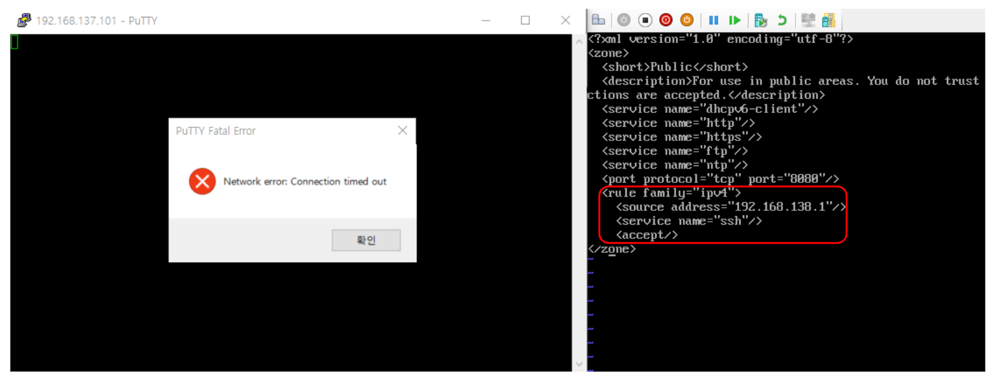
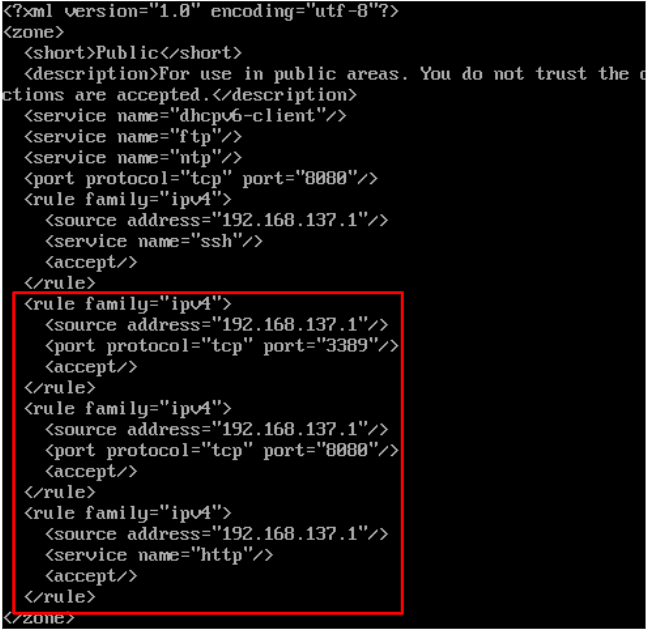
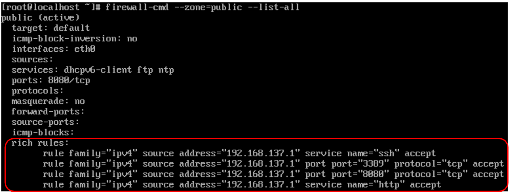

# Linux 방화벽

### 방화벽 설정

* **vi /etc/firewalld/zones/public.xml**
  * rule을 추가하여 특정 Port 혹은 서비스를 특정 IP만 접근 가능하도록 함.
  * 192.168.13**8**.1로 설정하고 난 뒤 사무실 IP(192.168.13**7**.1)로 ssh 접근이 되지 않는 상황.

* **vi /etc/firewalld/zones/public.xml**
  * 192.168.137.1 에서만 SSH, RDP(3389), HTTP 접근 가능하도록 설정.
* **firewall-cmd --reload**
  * 방화벽 다시 로드.

* **firewall-cmd --list-all**
  * 사용 가능한 서비스/포트 출력.