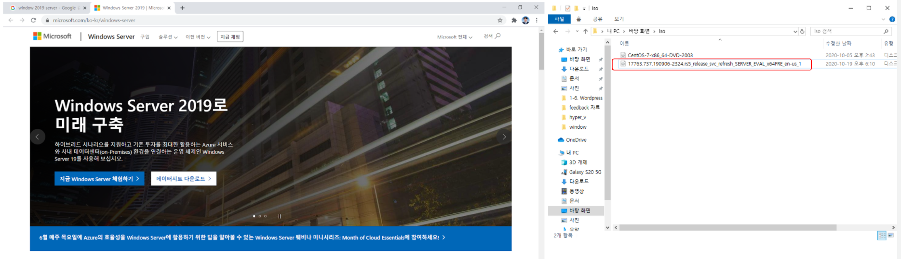
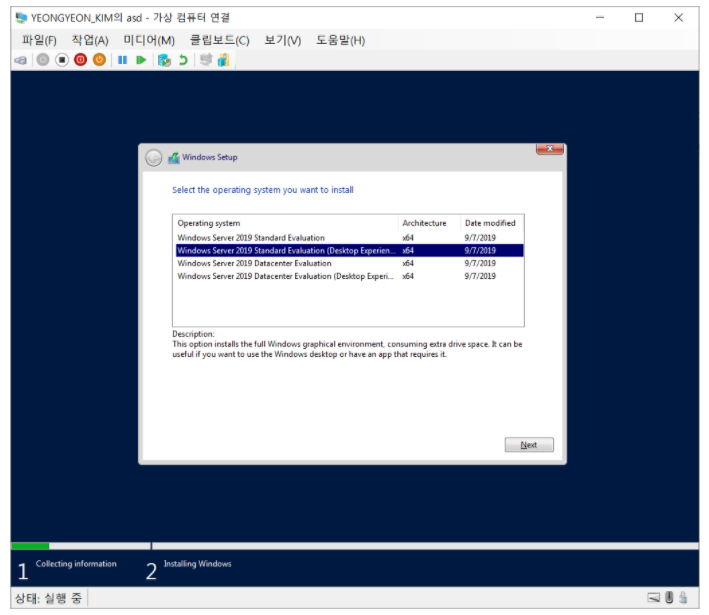
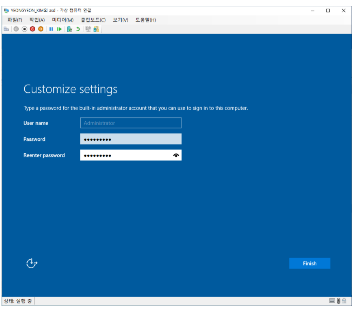
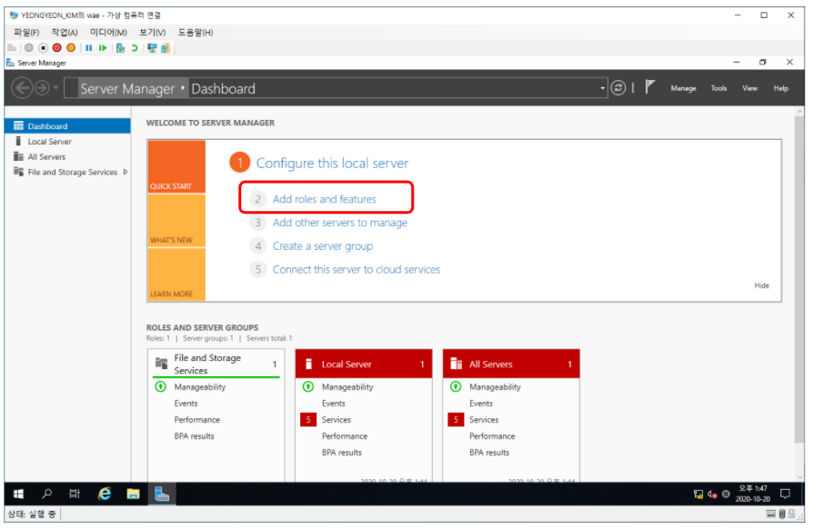
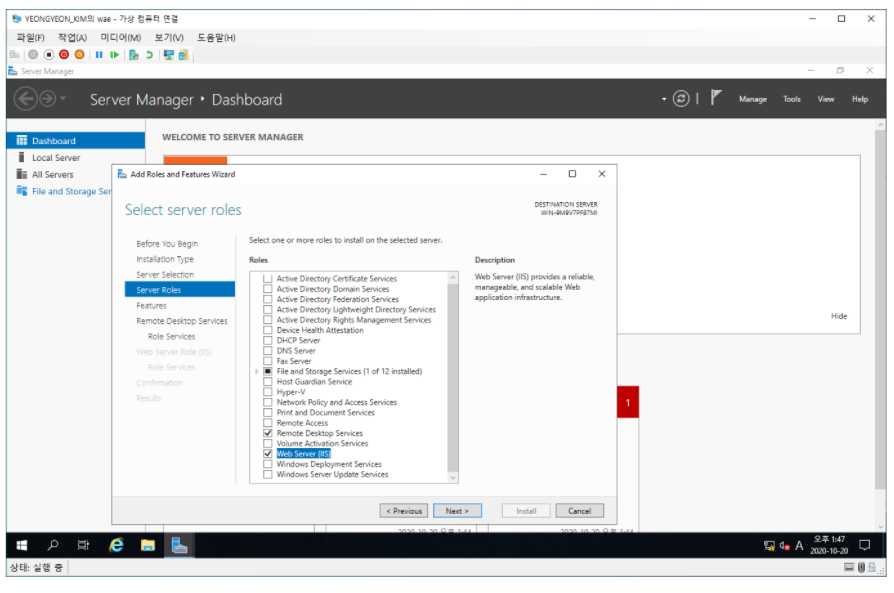
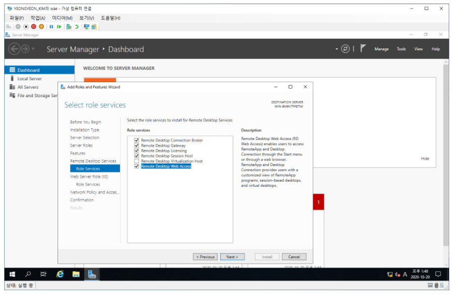
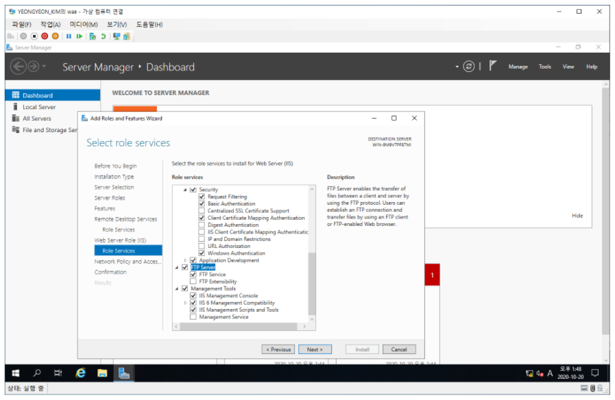
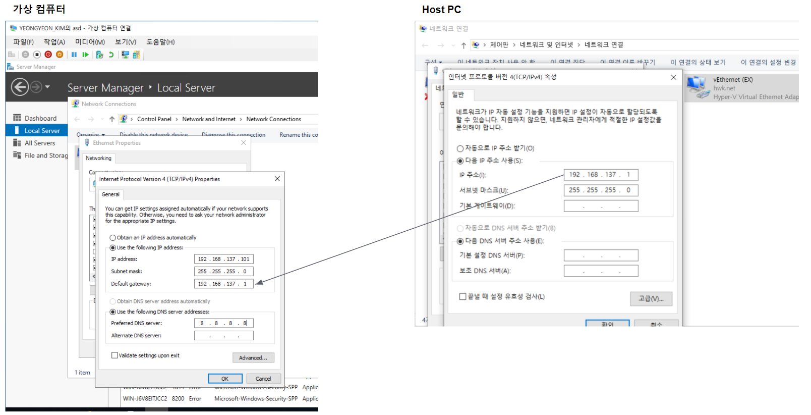
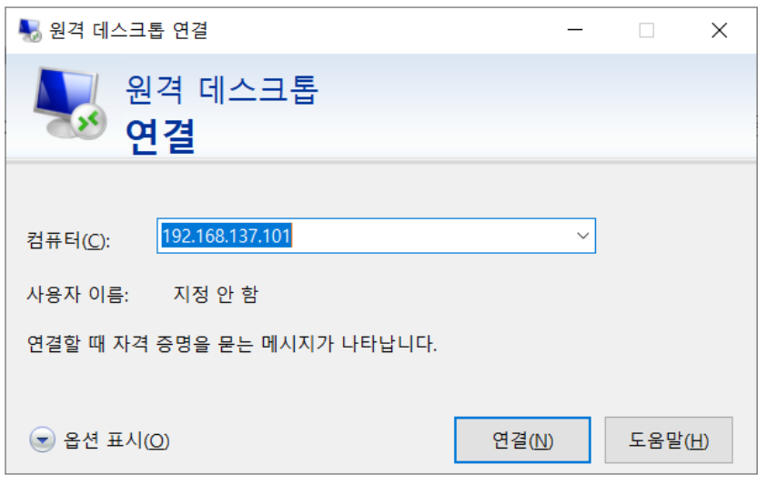
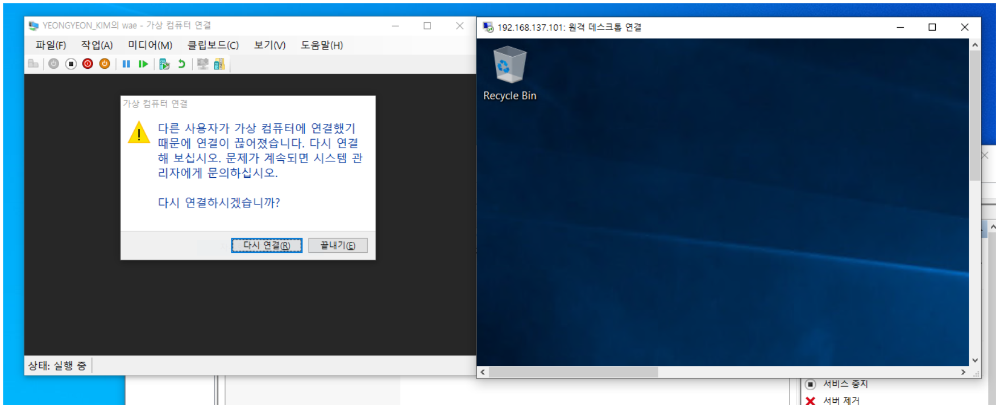

# Windows_구성요소, 기본설정

### Install

* **Window 2019 Server 디스크 이미지 파일을 다운로드**

* **Desktop 버전으로 설치**

* **Password를 설정**

---

### Server Manager 설정

* **Server Manager 화면**
  * Add roles and features 클릭

* **Remote Desktop Services 체크**
* **Web Service(IIS) 체크**

* **Remote Desktop Services**
  * Role Services 항목들 체크(without Virtual)

* **Web Service Role**
  * Role Service - [FTP Server] 항목 체크

---

### Network 연결

* **가상 컴퓨팅 OS의 IP, DNS 주소 설정**

---

### 원격 데스크톱 연결

* **원격 데스크톱 연결 - [가상 컴퓨터 IP] 입력**
* **다른 옵션 사용 클릭**
  * 사용자 : Administrator
  * 비밀번호 : 설정한 비밀번호 입력 후 연결

* **원격 데스크톱 연결**