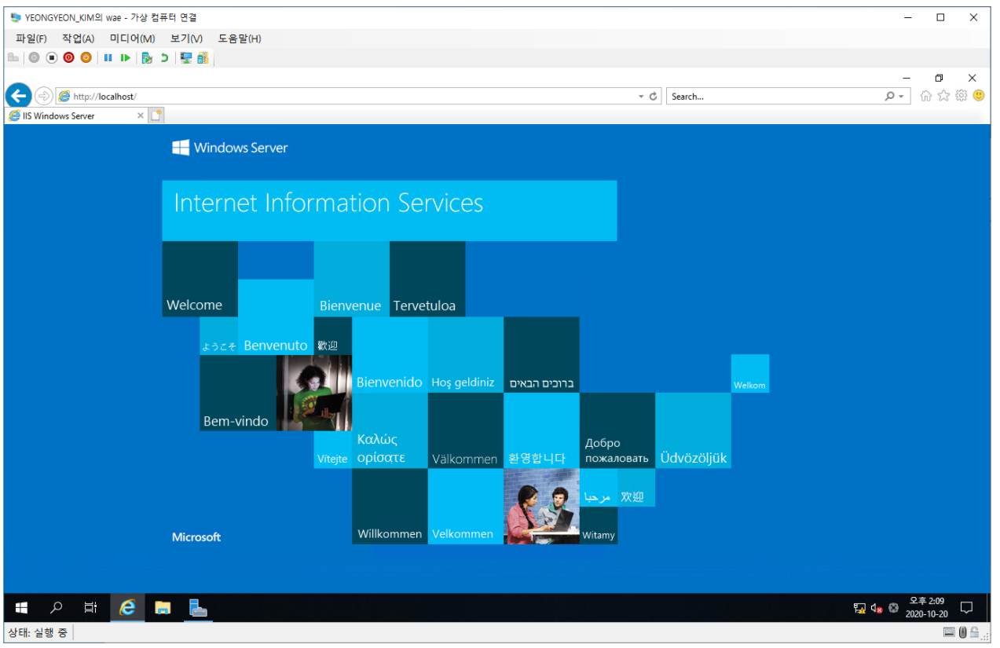
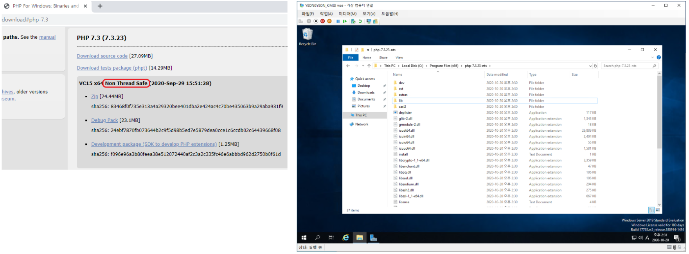
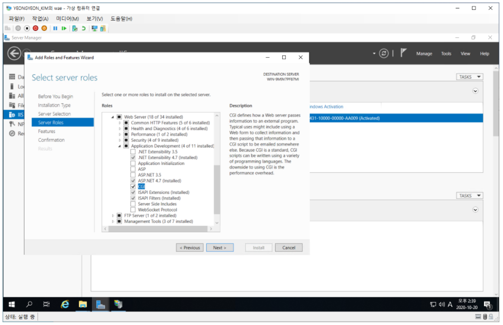
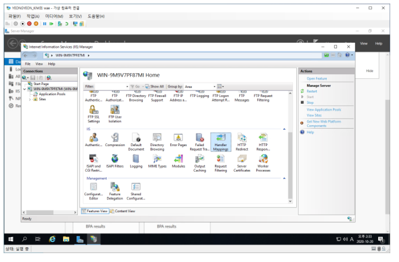
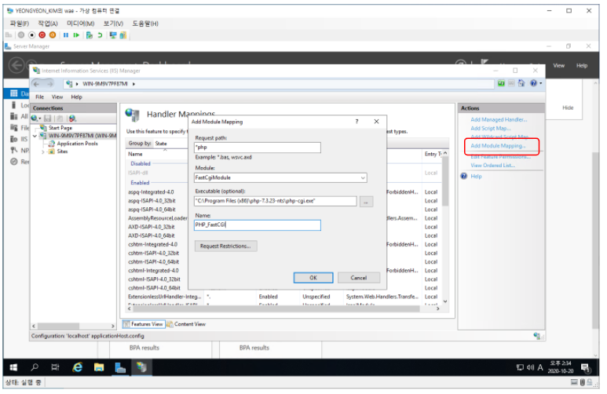
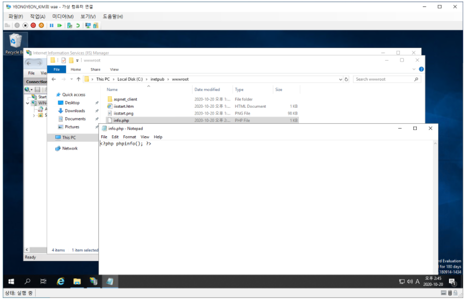
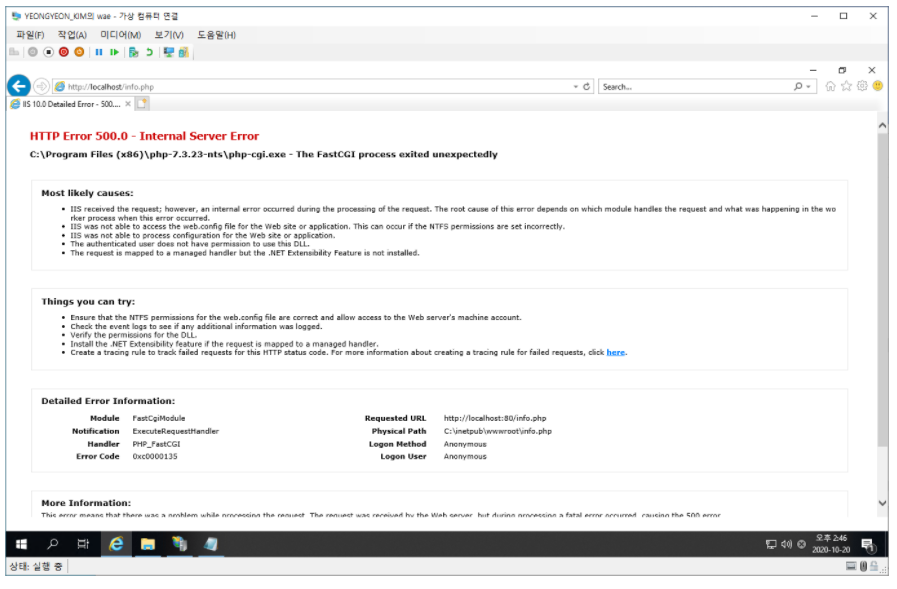
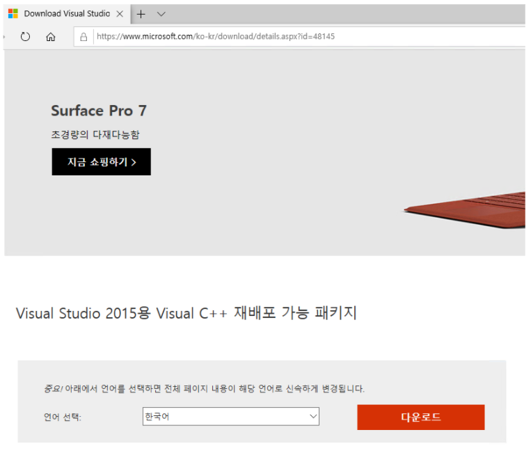
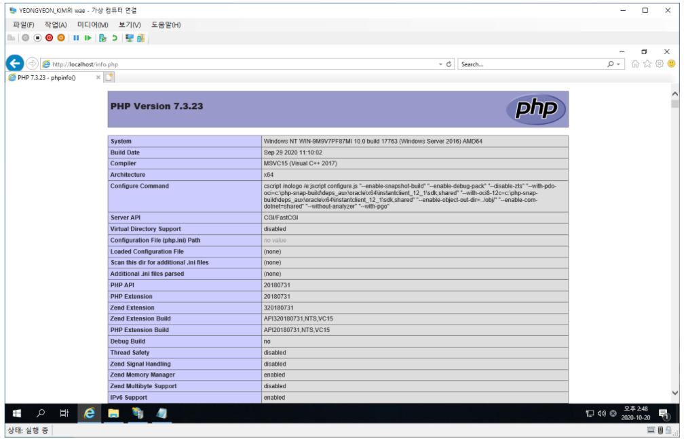

# Windows IIS + PHP(FastCGI)

### IIS 웹서버

* **http://localhost**
  * IIS 웹 서버 실행.

---

### IIS + PHP(FastCGI) 연동

* **FastCGI를 사용하기 위해 Non Thread Safe 버전을 다운로드.**
  * FastCGI : 대부분의 웹 서버에서 응용프로그램을 호출할 때의 방법인 CGI의 속도를 증진시키기 위한 프로그래밍 인터페이스.

* **CGI 등록**.
* **Server Manager - 'CGI' Roles install**

* **IIS에 PHP 확장자를 처리하도록 'Handler Mapping'을 추가**.

* **'Add Module Mapping' 클릭**.
  * 요청 경로 : ***php**
  * 모듈 : **FastCgiModule**
  * 실행 파일 : **{PHP 설치 경로}\php-cgi.exe**
  * 이름 : PHP_FastCGI

* **C:inetpub\wwwroot 경로에 'info.php' 파일을 만든다.**
  * 웹 서버가 기본적으로 찾는 디렉토리 '**홈 디렉토리**'이다.

* **MSVCR MSVCP VCRUNTIME dll 오류가 발생.**

* **Visual C++ 재배포 패키지를 다시 설치.**
  * 사람마다 PC 환경, 사양이 제각기이기에 여러 오류가 있을 수 있다.
  * 원인은 보통 DLL 파일의 누락 혹은 고장일 확률이 크다. -> 재배포 다시 설치.

* **이후 웹 브라우저로 'info.php' 파일을 요청.**