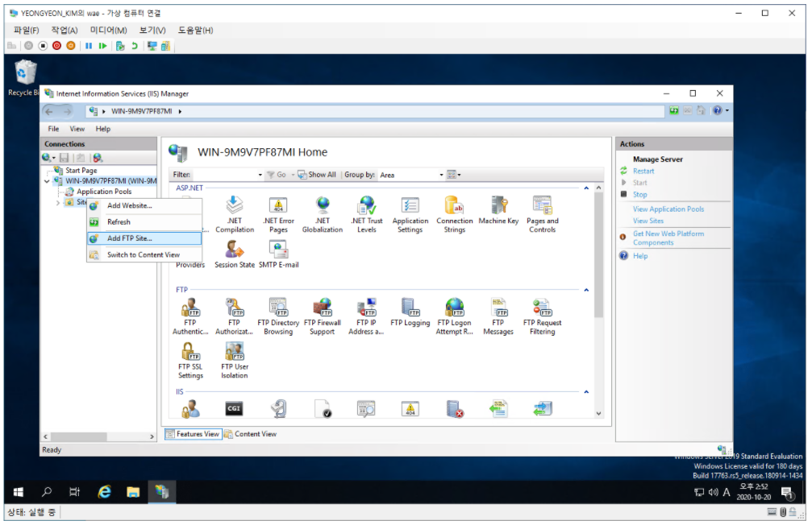
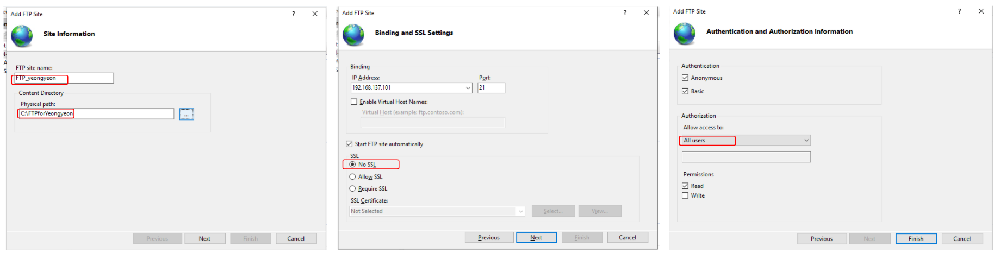
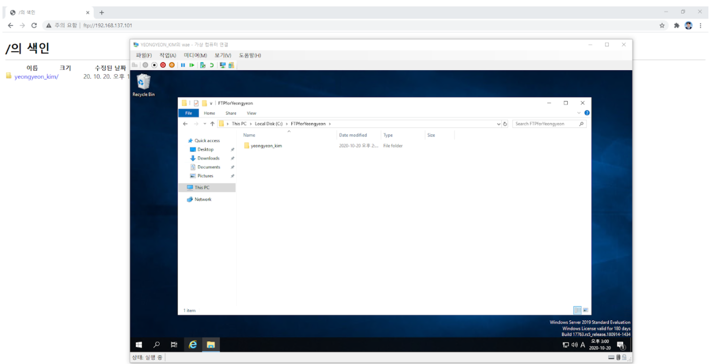

# Windows FTP

### FTP 설정

* **IIS 관리자 - 'Site' 우클릭 - 'Add FTP Site' 클릭.**
  * FTP : 인터넷으로 보다 빠르게 파일을 공유.

* **FTP 정보 입력**
  * 'FTP site name', 'Physical path'를 지정.
  * 'No SSL' 체크.
  * Allow access to - 'All users'로 설정.

* **ftp://{설정 IP 주소}**