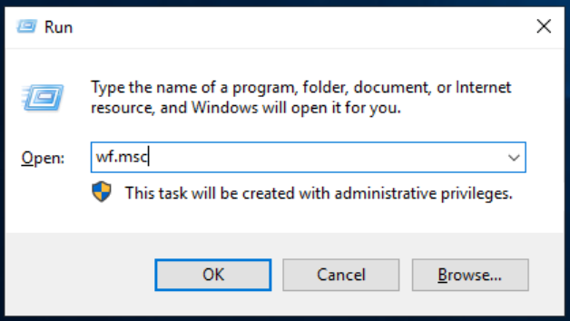
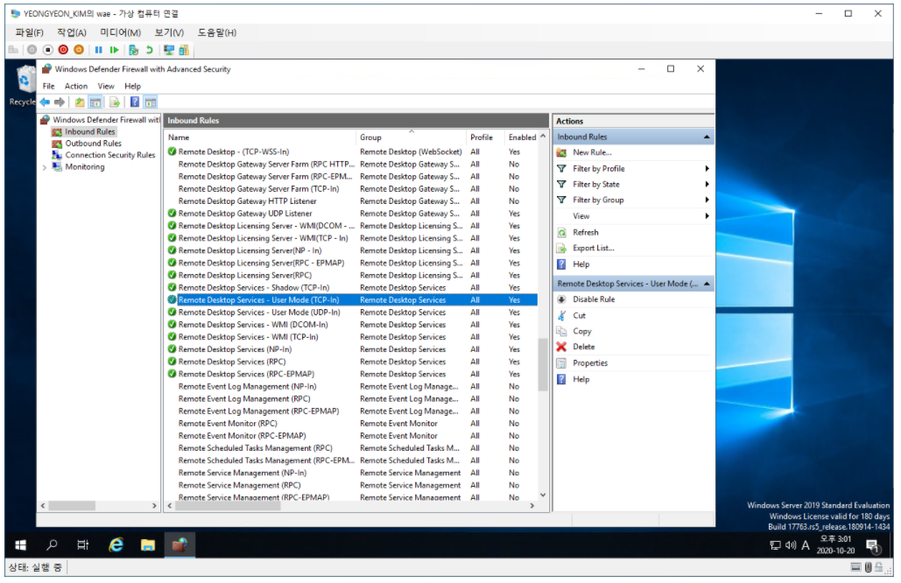
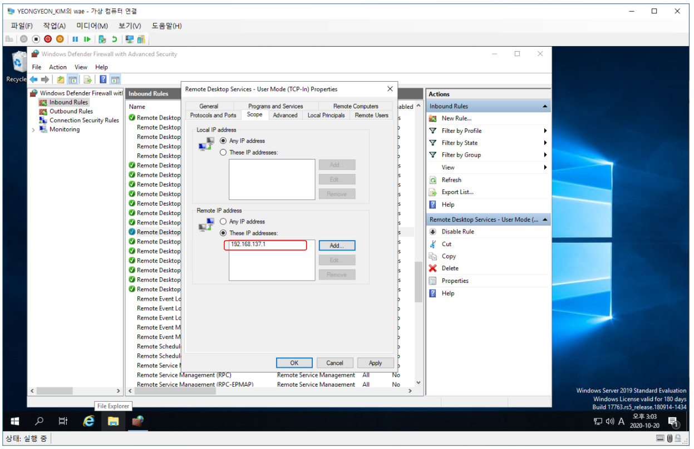

# Windows 방화벽

### 방화벽 설정 - 특정 IP 접근 허용

* **cmd - 'wf.msc' 입력.**

* **Inbound Rules - Remote Desktop Services - User Mode(TCP-In) 클릭.**
  * 방화벽 설정은 인바운드의 경우 기본적으로 **차단**이고, 아웃바운드의 경우 기본적으로 **허용**이기 때문에 인바운드(서버로 들어오는)만 방화벽 설정을 해준다.

* **Remote IP address - These IP address - 사무실 IP를 등록.**