# Hyper-V

### hyper-v 활성화

* Window OS에서 하드웨어를 가상화하고 **가상 컴퓨터(가상 머신)**을 만들고 OS를 설치하여 호스트 OS에서 여러 OS를 동작시키는 기능.
* Window 10 Pro 버전임을 확인.

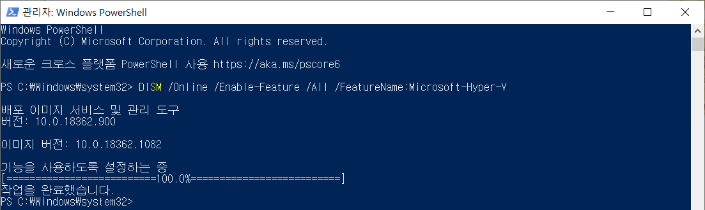

* PowerShell을 관리자 권한으로 실행하여 **명령어** 입력 후 Hyper-V 사용하도록 설정.
* Windows 기능에서 Hyper-V 역할 활성화.

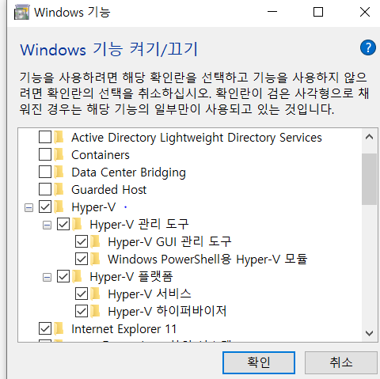

-----

### image Download

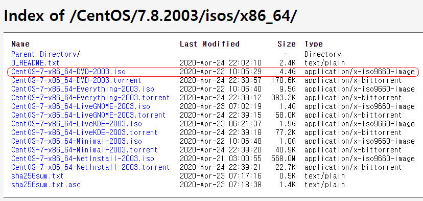

* CentOS 7부터 2세대를 지원 (Linux : 2 Gen, 2 Mem, Disk 20GB)

----

### Linux 가상 컴퓨터 생성

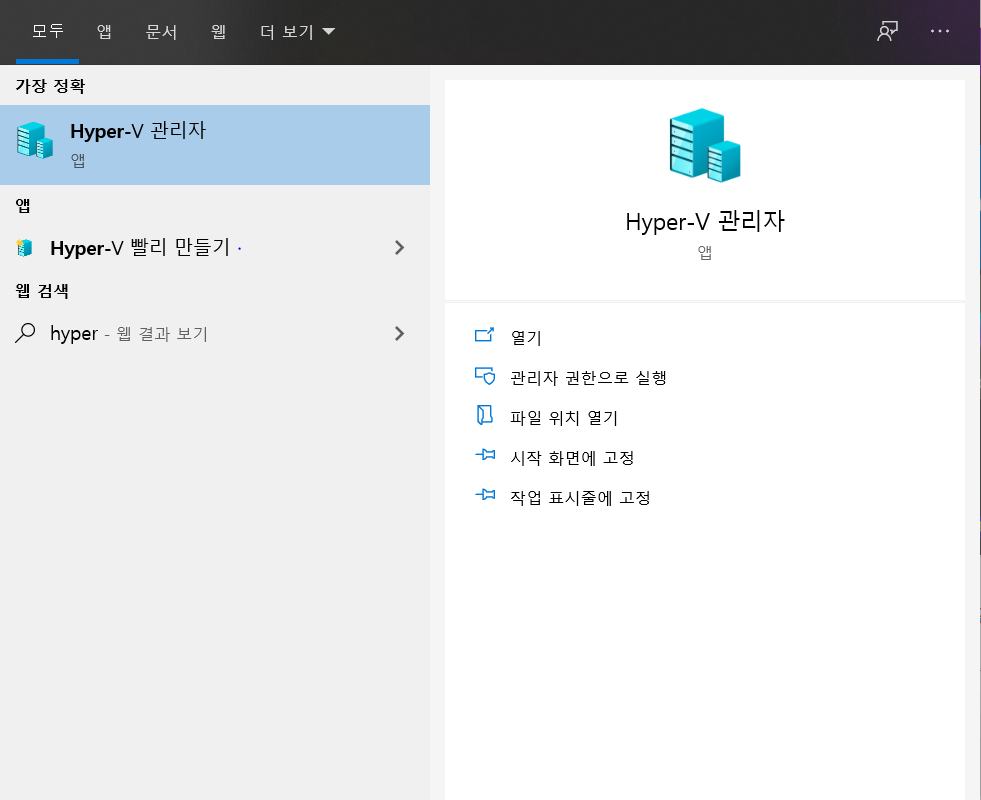

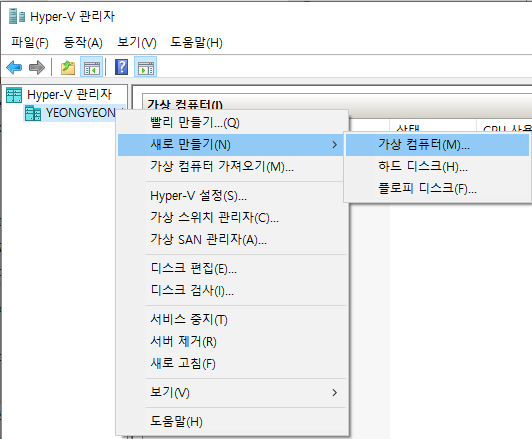

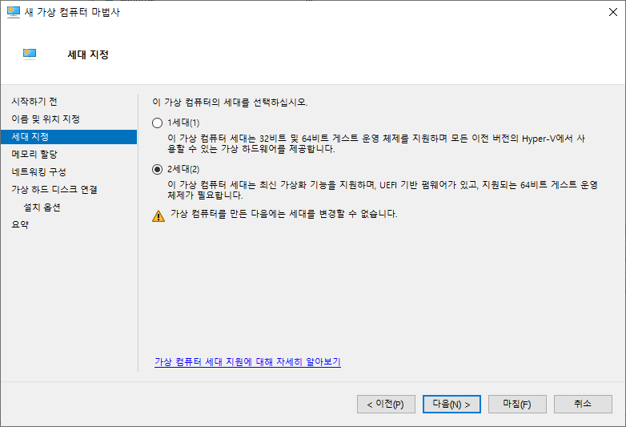

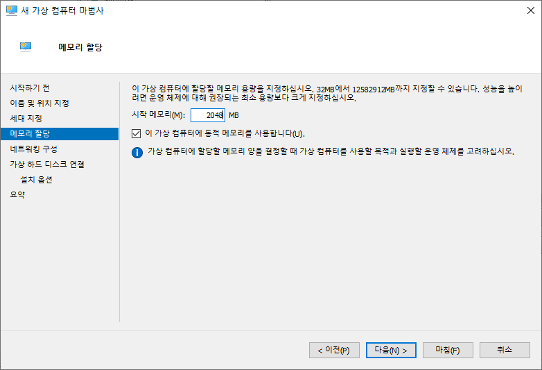

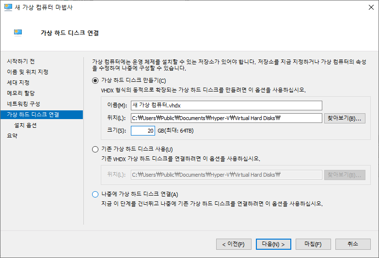

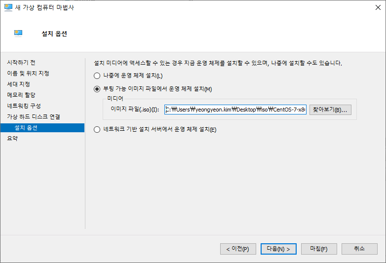

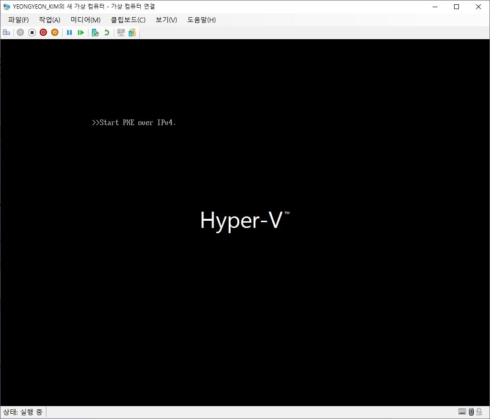

* Centos 7 - pxe start over ipv4 오류
* Hyper-V 관리자 - [설정] - [보안] 탭 - [보안 부팅 사용] 체크 해제 혹은 **UEFI **템플릿 설정.
  ※ 보안 부팅 : 권한 없는 펌웨어, OS가 부팅 시 실행되지 않도록 함. -> 오류 유발하므로 해제.
  2세대에서는 기본적으로 활성화되어 있다.

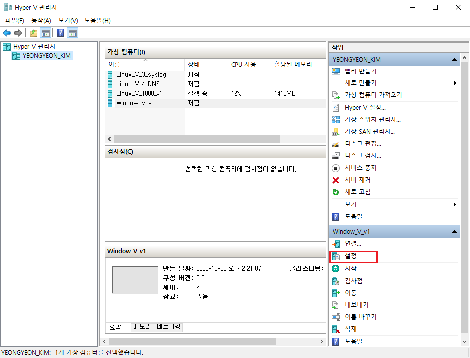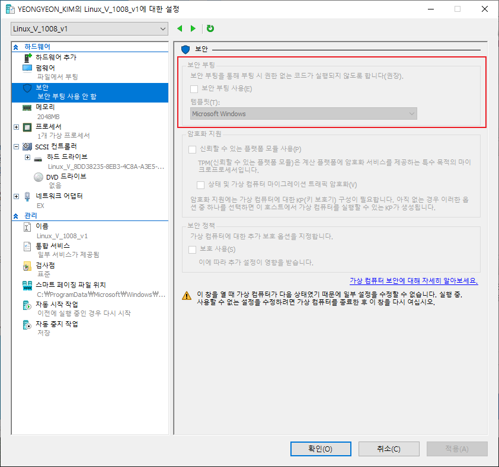
